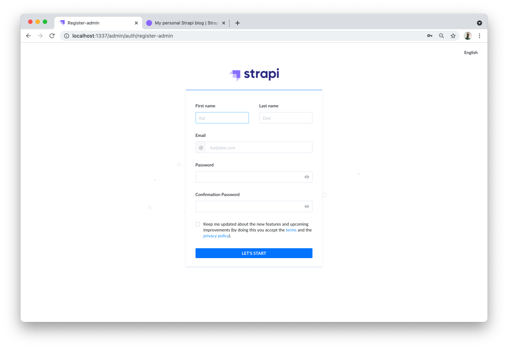
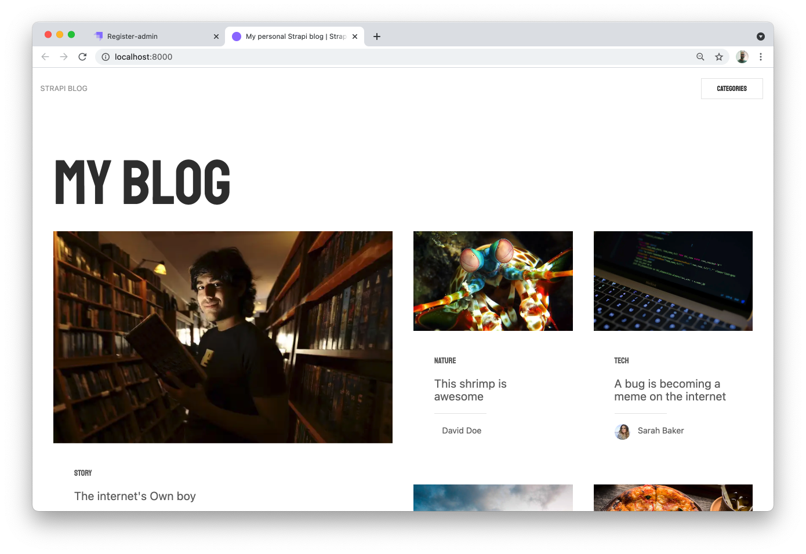
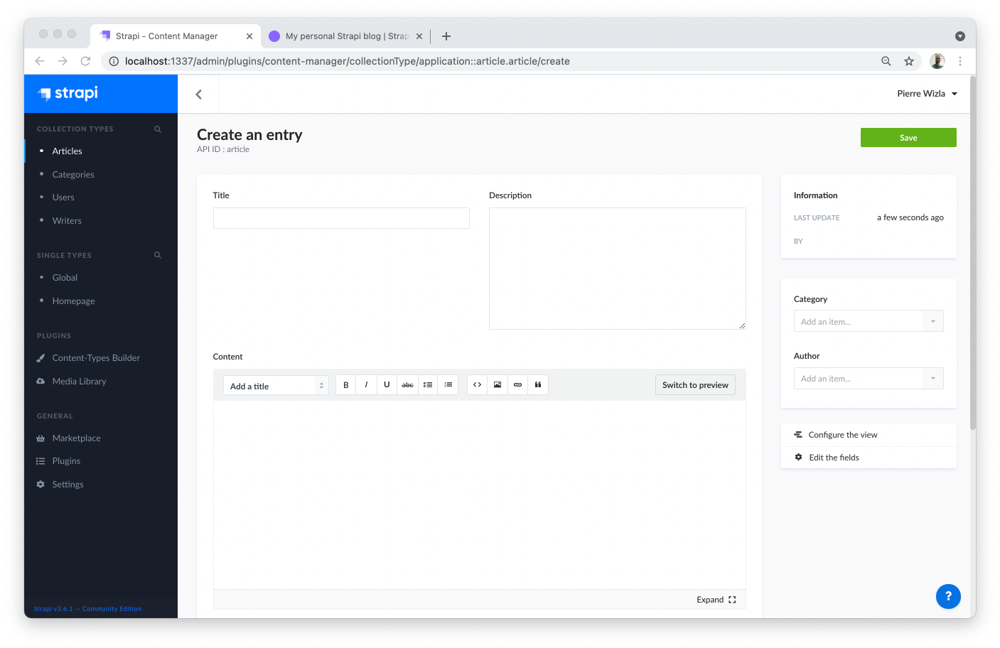
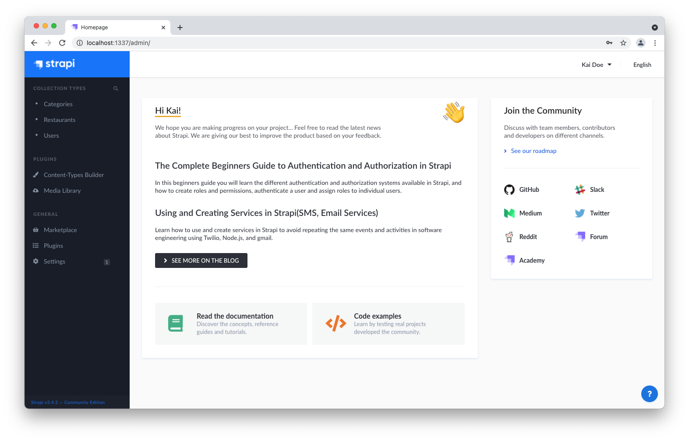

# Quick Start Guide

<!-- We use the vuepress-plugin-tabs plugin but customize tabs to look more like buttons -->

<style lang="scss" scoped>
  h2 {
    padding-top: 2em;
  }
  h3, h4 {
    padding-top: 1.5em
  }
  h4 {
    font-size: 115%;
  }
  ul li, ol li {
    padding-bottom: .5em;
  }
  blockquote {
    border-left-color: #42b983;

    p {
      color: #888;
    }
  }

  ol li {
    margin-left: 1em;
    padding-left: .3em;

    &::marker {
      font-weight: bold;
    }
  }

  .custom-block.warning {
    background-color: #f8f8f8;
    border-left-width: .25rem;
    margin-bottom: 2em;

    .custom-block-title, p, li {
      color: rgb(44, 62, 80);
    }

    a {
      color: #007eff
    }
  }

  .custom-block.congrats,
  .custom-block.tip {
    /* background-color: #ebf9f2; */
    background-color: #f3fbf7;
    border-left-width: .25rem;
  }
</style>

<style lang="scss">
  .el-tabs--card > .el-tabs__header {
    padding-top: 2em;
  }

  .el-tabs--card > .el-tabs__header,
  .el-tabs--card > .el-tabs__header .el-tabs__nav {
    border: none;
  }

  .el-tabs--card > .el-tabs__header .el-tabs__item {
    border-radius: 8px;
    border: solid 1px rgba(129,107,250,.2);
    font-size: 125%;
    height: 60px;
    line-height: 60px;
  }

  .el-tabs--card > .el-tabs__header .el-tabs__item:first-child {
    border-left: solid 1px rgba(129,107,250,.2);
    margin-right: 20px;
  }

  .el-tabs--card > .el-tabs__header .el-tabs__item.is-active {
    background-color: rgba(129,107,250,0.9);
    color: white !important;
    font-weight: bold;
    border-color: rgb(129,107,250);
  }

  .el-tabs--card .el-tabs__content {
      /* padding-top: 2em; */
  }
</style>

Strapi offers a lot of flexibility. Whether you want to go fast and quickly see the final result, or would rather dive deeper into the product, we got you covered.

:::warning REQUIREMENTS
* First, make sure [Node.js and npm are properly installed](/developer-docs/latest/setup-deployment-guides/installation/cli.md#step-1-make-sure-requirements-are-met) on your machine.
* Optionally, you can also [install the Yarn package](https://yarnpkg.com/en/).
:::

👇 Let's get started! Using the big buttons below, please choose between:

- the **Starters** path for the quickest way to spin up a fullstack application powered by a Strapi backend,
- or the **Hands-on** path for a more DIY approach to run your project.

::::: tabs type:card
<!-- we need 5 colons or it will conflict with the tip markup -->

:::: tab Starters

## 🚀 Part 1: Create a new project with Strapi starters

Strapi [starters](https://strapi.io/starters) are the fastest way to kickstart your project. We offer starters for various use cases (blog, e-commerce solution, corporate website, portfolio) and technologies (Gatsby, Gridsome, Next, Nuxt).

From now on, in this whole guide, we will use the Gatsby blog starter as an example.

### Step 1: Run the installation script

To create a [Gatsby](https://www.gatsbyjs.com/) blog using Strapi, run the following command in a terminal:

<code-group>
<code-block title="NPM">

```bash
npx create-strapi-starter my-project gatsby-blog
```

</code-block>
<code-block title="YARN">

```bash
yarn create strapi-starter my-project gatsby-blog
```

</code-block>
</code-group>

When terminal asks `Choose your installation type`, press Enter to select the default `Quickstart (recommended)` option, and let the magic happen!

### Step 2: Register & have a look at your blog

Once the installation is complete, your browser automatically opens 2 tabs.

The first tab ([http://localhost:1337/admin/auth/register-admin](http://localhost:1337/admin/auth/register-admin)) is the Admin Panel, it's for the backend of your app.

Complete the form to create the first Administrator user:



The second tab ([http://localhost:8000](http://localhost:8000)) is for the frontend of your app, and you can already see the Gatsby blog in action:




<!-- ::: tip CONGRATULATIONS! 🥳 
Your blog is ready! You can start playing with Strapi and discover the product by yourself using our [User Guide](/user-docs/latest/getting-started/introduction.html), or proceed to [part 2](/developer-docs/latest/getting-started/quick-start-step2.md) to continue the Quick Start Guide.

Writing a blog is not your cup of tea? You can leave this guide and play with other [Starters](https://strapi.io/starters) on your own.
::: -->

<!-- TODO: convert to VuePress Component -->
<div class="custom-block tip congrats">
  <p class="custom-block-title" style="background-color: #f3fbf7;
    border-left-width: .25rem;">
    CONGRATULATIONS! 🥳
  </p>
  <p>
    Your blog is ready! You can start playing with Strapi and discover the product by yourself using our <a href="/documentation/user-docs/latest/getting-started/introduction.html">User Guide</a>, or proceed to part 2 below.</p>
    <p>
      Writing a blog is not your cup of tea? You can leave this guide and play with other <a  href="https://strapi.io/starters" target="_blank" rel="noopener noreferrer">Starters<span> <svg xmlns="http://www.w3.org/2000/svg" aria-hidden="true" focusable="false" x="0px" y="0px" viewBox="0 0 100 100" width="15" height="15" class="icon outbound"><path fill="currentColor" d="M18.8,85.1h56l0,0c2.2,0,4-1.8,4-4v-32h-8v28h-48v-48h28v-8h-32l0,0c-2.2,0-4,1.8-4,4v56C14.8,83.3,16.6,85.1,18.8,85.1z"></path> <polygon fill="currentColor" points="45.7,48.7 51.3,54.3 77.2,28.5 77.2,37.2 85.2,37.2 85.2,14.9 62.8,14.9 62.8,22.9 71.5,22.9"></polygon></svg> <span class="sr-only">(opens new window)</span></span></a> on your own.</p>
</div>

## 🎨 Part 2: Play with your content

Strapi [starters](https://strapi.io/starters) build a full stack application and a data structure for you, so you can start playing with your content faster. You already have the admin panel for your blog running at [http://localhost:1337/admin](http://localhost:1337/admin). Now what?

:::tip TIP
If the servers are not already running, in your terminal, `cd` into the `my-project` folder and run `npm run develop` (or `yarn develop`) to launch it.
:::

<!-- other considered emojis for this section: 🎠 🎡 🧸  -->

### Step 1: Add yourself as a writer

You have several ideas for great articles in mind. But first, the world needs to know who you are!

Navigate to [_Collection Types > Writers_](http://localhost:1337/admin/plugins/content-manager/collectionType/application::writer.writer?page=1&pageSize=10&_sort=name:ASC) in the left-hand menu, and click the **+ Add New Writers** button.


1. Add your **Name** and **Email** in the corresponding fields.
2. Drag and drop your favorite selfie in the **Picture** field.
3. Click **Upload 1 asset to the library** then **Finish** (saying 'Cheese!' during the process is optional 😄).
4. Finally, click **Save**.

### Step 2: Write & publish your first article

#### Create a new entry for the `Articles` collection type

Navigate to [_Collection Types > Articles_](http://localhost:1337/admin/plugins/content-manager/collectionType/application::article.article?page=1&pageSize=10&_sort=title:ASC) in the left-hand menu, and click the **+ Add New Articles** button.



#### Give your article a title, a description, and some content

1. Type `Hello World!` in the **Title** field.
2. Type `My very first article with Strapi` in the **Description** field. 
3. Write a few lines in the **Content** field. If you're lacking some inspiration, just type `This is my first blog article with Strapi and using it feels like a breeze!`.
4. Scroll down, pick a date in the **PublishedAt** field.
5. Finally, add a picture in the **Image** field. You can do this either by drag & drop, or by selecting a file from the Strapi assets library.

#### Choose an author and a category for your article

In the sidebar on the right, choose your name in the **Author** dropdown. 🥳 You have just signed your first article with Strapi. Take a few seconds to contemplate this historic moment!

While there, you might also want to choose a **Category** for your article (or add your own) from the list.

#### Turn your draft into a publication

By default, your new article would be saved as a draft. Let's not be too shy and publish it right away:

1. From the **Status** dropdown at the bottom of the page, choose **published**.
2. Click on **Save** at the top of the window.


You've just created and published your first article, `Hello World!`. You can find it in the [_Collection Types > Articles_](http://localhost:1337/admin/plugins/content-manager/collectionType/application::article.article?page=1&pageSize=10&_sort=title:ASC) view.

### Step 3: Update the `Homepage` single type

It's time to make this blog a bit more yours.

Navigate to [_Single Types > Homepage_](http://localhost:1337/admin/plugins/content-manager/singleType/application::homepage.homepage) in the left-hand menu. Let's edit this homepage:

1. Hover the picture in the **ShareImage field** and click the **Edit** icon <Fa-PencilAlt />. 
2. Click on **Replace Media** and upload an image from your computer. This image will represent your blog when sharing an article on social medias. 
3. Click **Finish** twice.
4. At the bottom of the page, update the **Title** to `My Wonderful Strapi Blog` in the **Hero** field group.
5. Finally, click **Save**.

### Step 4: Restart the server to reflect latest changes

Gatsby is a static-site generator. It means that you need to restart the server for changes to appear on the frontend:

1. In your terminal, press `Ctrl-C` to stop the servers.
2. Restart the servers by typing `yarn develop` (or `npm run develop`) and press `Enter`.

After a few moments, you should see your blog with its updated title running at [http://localhost:8000](http://localhost:8000). The `Hello World!` article you have just created is also visible at the bottom of the page.


:::tip CONGRATULATIONS! 🥳
Now you know how to use Strapi to create and update your blog. Keep on creating amazing content!
:::

## ⏩ Where to go next?

The beauty of using Strapi [starters](https://strapi.io/starters) is that the Strapi backend comes with a frontend ready out-of-the-box. Now you probably want to show your shiny new website to the world! The next step is then to deploy both the Strapi backend and the frontend on the platforms of your choice:

👉 For the Strapi backend, we offer various deployment options — see our [Deployment guides](/developer-docs/latest/setup-deployment-guides/deployment.md).

👉 Deploying the frontend mostly depends on the technology it's based on. The easiest way to deploy your Gatsby blog frontend is probably [to deploy on Gatsby Cloud](https://support.gatsbyjs.com/hc/en-us/articles/360052324714-Connecting-to-Strapi).

:::tip TO GO FURTHER
This is only the beginning of an exciting journey with Strapi! We encourage you to:
- Read more about the [starters CLI](https://strapi.io/blog/announcing-the-strapi-starter-cli) on our blog.
- Start another project! We have lots of other [Starters](https://strapi.io/starters) you can use to kickstart your blog, e-commerce, corporate website, or portfolio project.
- Have a look at the [Tutorials](https://strapi.io/tutorials) to deep dive into Strapi.
- Get help on [our community forum](https://forum.strapi.io).
- Read the [source code](https://github.com/strapi/strapi), [contribute](https://github.com/strapi/strapi/blob/master/CONTRIBUTING.md) or [give a star](https://github.com/strapi/strapi) on GitHub.
- Follow us on [Twitter](https://twitter.com/strapijs) to get the latest news.
- [Join the vibrant and active Strapi community](https://discord.strapi.io) on Discord.
:::

::::

:::: tab Hands-on

## 🚀  Part 1: Create a new project with Strapi

### Step 1: Run the installation script

Run the following command in a terminal:

<code-group>
<code-block title="NPM">

```bash
npx create-strapi-app my-project --quickstart
```

</code-block>
<code-block title="YARN">

```bash
yarn create strapi-app my-project --quickstart
```

</code-block>
</code-group>

### Step 2: Register the first administrator user

Once the installation is complete, your browser automatically opens a new tab.

Complete the form to create the first Administrator user, then click **Let's start**.

You now have access to the [admin panel](http://localhost:1337/admin):



::: tip CONGRATULATIONS! 🥳 
You have just created a new Strapi project! You can start playing with Strapi and discover the product by yourself using our [User Guide](/user-docs/latest/getting-started/introduction.md), or proceed to part 2 below.
:::

## 🛠 Part 2: Build your content

The installation script has just created an empty project. We will now guide you through creating a restaurants directory, based on our [FoodAdvisor](https://github.com/strapi/foodadvisor) example application.

The admin panel of Strapi runs at [http://localhost:1337/admin](http://localhost:1337/admin). This is where you will spend most of your time creating and updating content.

:::tip TIP
If the server is not already running, in your terminal, `cd` into the `my-project` folder and run `npm run develop` (or `yarn develop`) to launch it.
:::

### Step 1: Create collection types with the Content-Types Builder

#### Create a `Restaurant` collection type

Navigate to [_Plugins > Content-Types Builder_](http://localhost:1337/admin/plugins/content-type-builder) in the left-hand menu, and click on **+ Create new collection type**.

1. Type `restaurant` for the **Display name**, and click **Continue**.  
2. Click the **Text** field, then type `name` in the **Name** field.
3. Switch to the **Advanced Settings** tab, and check the **Required field** and the **Unique field** settings.
4. Click on **+ Add another Field**.
5. Choose the **Rich Text** field.
6. Type `description` under the **Name** field, then click **Finish**.
7. Finally, click **Save** and wait for Strapi to restart.


#### Create a `Category` collection type

Navigate to [_Plugins > Content-Types Builder_](http://localhost:1337/admin/plugins/content-type-builder) in the left-hand menu, and click on **+ Create new collection type**.

1. Type `category` for the **Display name**, and click **Continue**.
2. Click the **Text** field, then type `name` in the **Name** field.
3. Switch to the **Advanced Settings** tab, and check the **Required field** and the **Unique field** settings.
4. Click on **+ Add another Field**.
5. Choose the **Relation** field.
6. On the right side, click the **Category** dropdown and select **Restaurant**. 
7. In the center, select the icon that represents `many-to-many`. The text should read `Categories has and belongs to many Restaurants`.


8. Finally, click **Finish**, then the **Save** button, and wait for Strapi to restart.

### Step 2: Use the collection types to create new entries

#### Create an entry for the `Restaurant` collection type

Navigate to [_Collection Types > Restaurants_](http://localhost:1337/admin/plugins/content-manager/collectionType/application::restaurant.restaurant) in the left-hand menu, and click on **+ Add New Restaurants**.

1. Type `Biscotte Restaurant` in the **Name** field.
2. In the **Description** field, write `Welcome to Biscotte restaurant! Restaurant Biscotte offers a cuisine based on fresh, quality products, often local, organic when possible, and always produced by passionate producers.`
3. Click **Save**.  


The restaurant is now listed in the [_Collection Types > Restaurants_](http://localhost:1337/admin/plugins/content-manager/collectionType/application::restaurant.restaurant) view.

#### Add Categories

Navigate go to [_Collection Types > Categories_](http://localhost:1337/admin/plugins/content-manager/collectionType/application::category.category) in the left-hand menu. Let's create 2 categories:

1. Click on **+ Add New Categories**.
2. Type `French Food` in the **Name** field.
3. Select `Biscotte Restaurant` on the right in the **Restaurant (0)** dropdown.
4. Click **Save**.
5. Go back to _Collection Types > Categories_, then click again on **+ Add New Categories**.  
6. Type `Brunch` in the **Category** field, then click **Save**.


The `French Food` and `Brunch` categories are now listed in the[_Collection Types > Categories_](http://localhost:1337/admin/plugins/content-manager/collectionType/application::category.category) view.

#### Add a Category to a Restaurant

Navigate to [_Collection Types > Restaurants_](http://localhost:1337/admin/plugins/content-manager/collectionType/application::restaurant.restaurant) in the left-hand menu, and click on `Biscotte Restaurant`.

In the right sidebar, under **Categories (1)**, click on **Add an item…** and select `Brunch`.  Click **Save**.

### Step 3: Set Roles & Permissions

Navigate to _General > Settings_ in the left hand menu. There, under _Users & Permissions Plugin_, choose [**Roles**](http://localhost:1337/admin/settings/users-permissions/roles).

1. Click the **Public** role.
2. Scroll down under **Permissions**.
2. In the **Application** tab, find **Restaurant**. 
3. Click the checkboxes next to **find** and **findone**.
4. Repeat with **Category**: click the checkboxes next to **find** and **findone**.
5. Finally, click **Save**.


### Step 4: Publish the content

By default, any content you create is saved as a draft. Let's publish our entries in the collection types.

Navigate to [_Collection Types > Categories_](http://localhost:1337/admin/plugins/content-manager/collectionType/application::category.category).

1. From there, click the **Draft** button on the `Brunch` category.
2. On the next screen, click **Publish**.
3. In the **Please confirm** dialog, click **Yes, publish**.  

Go back to the Categories list and repeat for the `French food` category.

To publish your `Biscotte Restaurant`, navigate to [_Collection Types > Restaurants_](http://localhost:1337/admin/plugins/content-manager/collectionType/application::restaurant.restaurant), click the **Draft** button for the entry, and **Publish** the restaurant entry.


:::tip CONGRATULATIONS! 🥳 
Now your content is created and you can request it through the API. Since you've setup roles & permissions and published your content, the list of restaurants is accessible at [http://localhost:1337/restaurants](http://localhost:1337/restaurants).
<!--  -->
:::

## ⏩ Where to go next?
### Consume your API

You can learn how to consume your API with your favorite frameworks, frontend or backend programming languages by choosing one in the list below.

<style lang="scss" scoped>
/* .integration-links {
  display: flex;
  flex-wrap: wrap;
  flex-direction: row;
}
.install-link__wrapper {
  flex-basis: 30%;
  margin-right: 20px;
  max-width: 200px;
} */
</style>

<IntegrationLinksAlt>
<style lang="scss" scoped>
</style>
</IntegrationLinksAlt>

### Deploy your project

The next step is to deploy both your Strapi backend and the frontend on the platforms of your choice.
We offer various deployment options for your Strapi backend — see our [Deployment guides](/developer-docs/latest/setup-deployment-guides/deployment.md).

:::tip TO GO FURTHER
This is only the beginning of an exciting journey with Strapi! We encourage you to:
- Have a look at the [Tutorials](https://strapi.io/tutorials) to deep dive into Strapi.
- Get help on [our community forum](https://forum.strapi.io).
- Read the [source code](https://github.com/strapi/strapi), [contribute](https://github.com/strapi/strapi/blob/master/CONTRIBUTING.md) or [give a star](https://github.com/strapi/strapi) on GitHub.
- Follow us on [Twitter](https://twitter.com/strapijs) to get the latest news.
- [Join the vibrant and active Strapi community](https://discord.strapi.io) on Discord.
:::

::::

:::::
