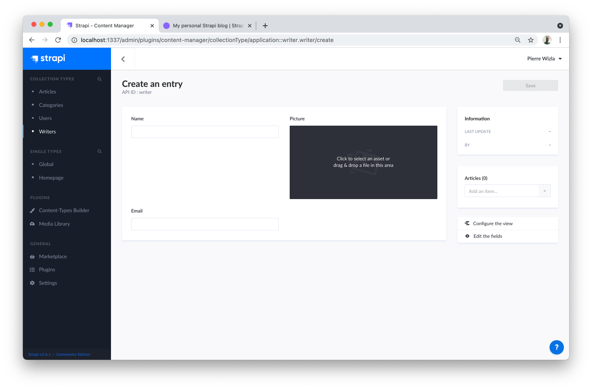
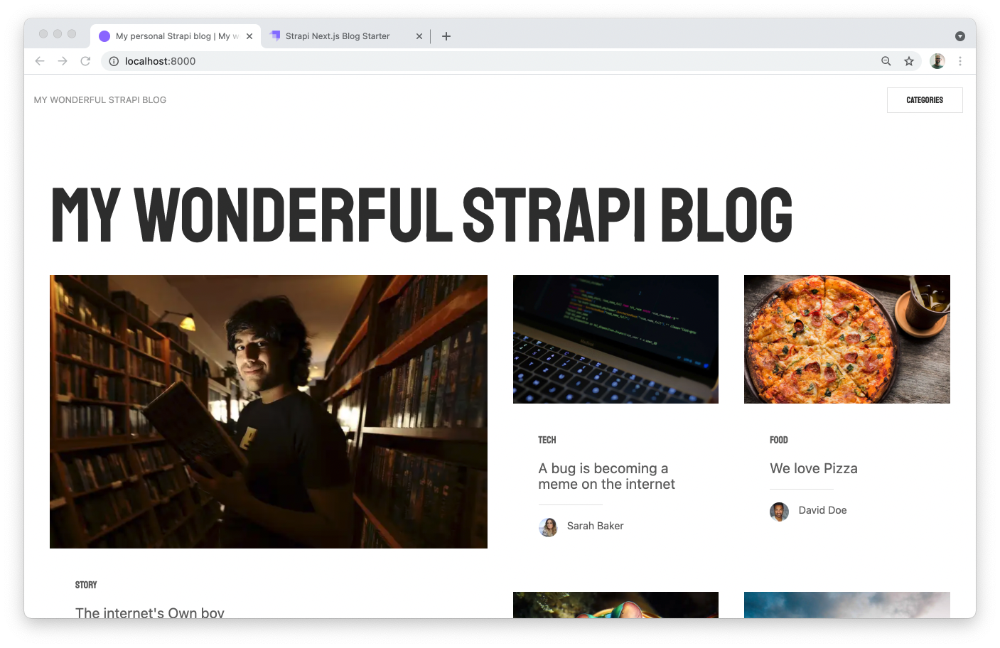
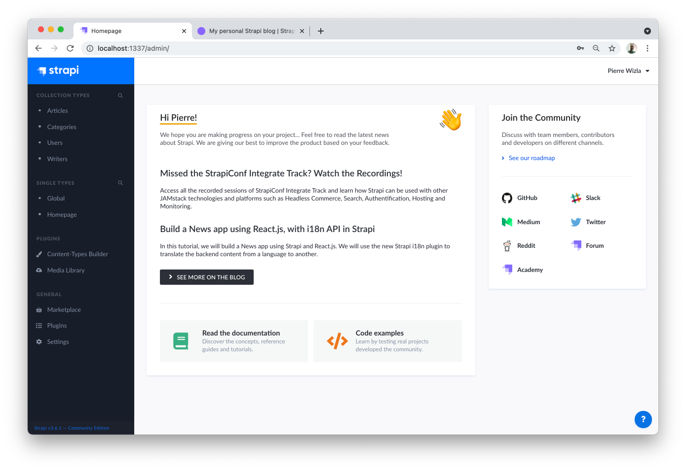

# Quick Start Guide

<style lang="scss" scoped>
  h2 {
    padding-top: 2em;
  }
  h3, h4 {
    padding-top: 1.5em
  }
  h4 {
    font-size: 115%;
  }
  ul li, ol li {
    padding-bottom: .5em;
  }
  blockquote {
    border-left-color: #42b983;

    p {
      color: #888;
    }
  }
</style>

Strapi offers a lot of flexibility. Whether you want to go fast and quickly see the final result, or would rather dive deeper into the product, we got you covered.

First, make sure [Node.js and npm are properly installed](/developer-docs/latest/setup-deployment-guides/installation/cli.md#step-1-make-sure-requirements-are-met) on your machine. Optionally, you can also [install the Yarn package here](https://yarnpkg.com/en/).

Then, using the buttons below, please choose between:

- the **Starters** path for the quickest way to spin up a fullstack application (blog, e-commerce solution, corporate website, portfolio…) powered by a Strapi backend,
- or the **Hands-on** path for a more DIY approach to run your project.


::::: tabs type:card
<!-- we need 5 colons or it will conflict with the tip markup -->

:::: tab Starters

<!-- We use the vuepress-plugin-tabs plugin but customize tabs to look more like buttons -->
<style lang="scss">
  .el-tabs__header {
    padding-top: 2em;
  }

  .el-tabs--card > .el-tabs__header,
  .el-tabs--card > .el-tabs__header .el-tabs__nav {
    border: none;
  }

  .el-tabs--card > .el-tabs__header .el-tabs__item {
    border-radius: 8px;
    border: solid 1px rgba(129,107,250,.2);
    font-size: 100%;
  }

  .el-tabs--card > .el-tabs__header .el-tabs__item:first-child {
    border-left: solid 1px rgba(129,107,250,.2);
    margin-right: 8px;
  }

  .el-tabs--card > .el-tabs__header .el-tabs__item.is-active {
    background-color: rgba(129,107,250,0.9);
    color: white !important;
    font-weight: bold;
    border-color: rgb(129,107,250);
  }

</style>

## 🚀 Step 1: Create a new project with Strapi Starters

To create a Gatsby blog using Strapi, run one of the following commands in a terminal:

<code-group>
<code-block title="NPX">

```bash
npx create-strapi-starter my-project gatsby-blog
```

</code-block>
<code-block title="YARN">

```bash
yarn create strapi-starter my-project gatsby-blog
```

</code-block>
</code-group>

When terminal asks "Choose your installation type", press Enter to select the default "Quickstart (recommended)" option. After a few moments, your web browser opens 2 tabs.

The first tab ([http://localhost:1337/admin/auth/register-admin](http://localhost:1337/admin/auth/register-admin)) is the Admin Panel, it's for the backend of your app. Complete the form to create the first Administrator user:


The second tab ([http://localhost:8000](http://localhost:8000)) is for the frontend of your app, and you can already see the Gatsby blog in action:


::: tip CONGRATULATIONS! 🥳 
Your blog is ready! You can start playing with Strapi and discover the product by yourself using our [User Guide](/user-docs/latest/getting-started/introduction.html#accessing-the-admin-panel), or proceed to step 2 to continue the guided tour.

Writing a blog is not your cup of tea? You can leave this guide and play with other [Starters](https://strapi.io/starters) on your own.
:::

## 🎨 Step 2: Play with your content

Strapi Starters build a full stack app and a data structure for you, so you can start playing with your content right now.

<!-- other considered emojis for this section: 🎠 🎡 🧸  -->

### 1. Add yourself as a writer

1. Go to [_Collection Types > Writers_](http://localhost:1337/admin/plugins/content-manager/collectionType/application::writer.writer?page=1&pageSize=10&_sort=name:ASC) in the left sidebar.
2. Click the **+ Add New Writers** button.



3. Add your **Name** and **Email** in the corresponding fields.
4. Drag and drop your favorite selfie in the **Picture** field, then click **Upload 1 asset to the library** then **Finish**.
5. Finally, click **Save** and _voilà_! You've just added yourself as a writer! 🤓

### 2. Write & publish your first article

1. Go to [_Collection Types > Articles_](http://localhost:1337/admin/plugins/content-manager/collectionType/application::article.article?page=1&pageSize=10&_sort=title:ASC) in the left sidebar.
2. Click the **+ Add New Articles** button.


3. Give your entry a **Title**, a **Description**, and write your best story in the **Content** field.
4. In the right sidebar, choose your name in the **Author** dropdown. You might also want to choose a **Category** for your post (or add your own) from the list above.
5.  Scroll down, pick a date in the **PublishedAt** field, then add a picture in the **Image** field, either by drag & drop or by selecting a file from the Strapi assets library or from your computer.
6. From the **Status** dropdown, choose **published**. 
7. Finally, click on **Save** at the top of the window. You've just created and published your very first article! ✍️

### 3. Update the Homepage

1. Go to [_Single Types > Homepage_](http://localhost:1337/admin/plugins/content-manager/singleType/application::homepage.homepage) in the left sidebar. 
2. Update the **MetaTitle** and **MetaDescription** fields to optimize your blog SEO.
3. Hover the picture in the **ShareImage field** and click the **Edit** icon <Fa-PencilAlt />. Click on **Replace Media** and upload an image from your computer. This image will represent your blog when sharing an article on social medias. Click **Finish** twice.
4. Update the **Title** to "My Wonderful Strapi blog" in the **Hero** field group, then click **Save**.
5. In your terminal, press `Ctrl-C` to kill the servers and then restart them by running the `yarn develop` command. After a few moments, you should see your blog with its updated title running at [http://localhost:8000](http://localhost:8000). The article you created a few minutes ago is also visible at the bottom of the page 👀




:::tip CONGRATULATIONS! 🥳 
Now that you know how to use Strapi to create and update your blog content, you can keep on creating amazing content. Proceed to step 3 when you're ready to show it to the world!
:::

## 👀 Step 3: Show your content to the world

_introduction sentence_

_deployment guides links will go here_

::::

:::: tab Hands-on

## 🚀  Step 1: Create a new project with Strapi

Run one of the following commands in a terminal:

<code-group>
<code-block title="NPX">

```bash
npx create-strapi-app my-project --quickstart
```

</code-block>
<code-block title="YARN">

```bash
yarn create strapi-app my-project --quickstart
```

</code-block>
</code-group>

After a few moments, your web browser opens a tab. Complete the form to create the first Administrator user, then click **Let's start**. You'll then access the admin panel:



::: tip CONGRATULATIONS! 🥳 
You've just created a Strapi project! You can start playing with Strapi and discover the product by yourself using our [User Guide](/user-docs/latest/getting-started/introduction.html#accessing-the-admin-panel), or proceed to step 2 to continue the guided tour.
:::

## 🛠  Step 2: Build your content

### 1. Create Collection Types

- _Create a Restaurant Collection Type_

- _Create a Category Collection Type_

### 2. Use your Collection Types

- _Add content to the Restaurant Collection Type_

- _Add categories to Category Collection Type_

### 3. Set Roles & Permissions


### 4. Publish the content


:::tip CONGRATULATIONS! 🥳 
Now that your data structure is created and accessible through the API, you can start consuming it by yourself, or proceed to step 3 to learn how to integrate & deliver your content.
:::

## Step 3: Show your content to the world

### Consume your API

<IntegrationLinks></IntegrationLinks>

### Deploy your application

_deployment guides links will go here_

::::

:::::
