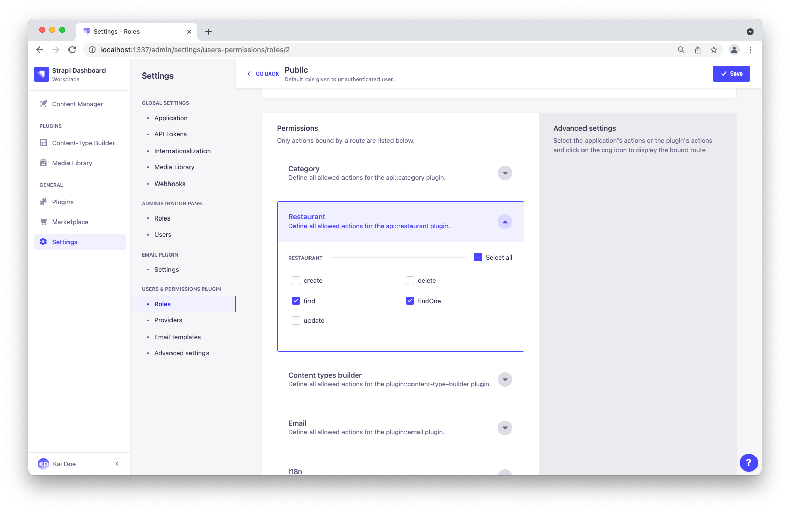

# Quick Start Guide

<style lang="scss" scoped>

  /*
    Some custom CSS tailored for this Quick Start Guide,
    so that the text can "breathe" a bit more.
  */  
  h2 {
    padding-top: 2em;
  }

  h3, h4 {
    padding-top: 1.5em
  }

  h4 {
    font-size: 115%;
  }

  ul li, ol li {
    padding-bottom: .5em;
  }

  ol li {
    margin-left: 1em;
    padding-left: .3em;
  }

  /*
    We override the :::warning and :::danger callouts for specific uses here.
    The CSS is scoped so this won't affect the rest of the docs.

    Eventually this will be turned into custom blocks or VuePress components,
    once I understand better how markdown-it and markdown-it-custom-block work.
  */
  .custom-block.congrats,
  .custom-block.warning,
  .custom-block.danger {
    border-left-width: .25rem;
  }

  .custom-block.warning {
    background-color: #f8f8f8;
    border-color: #bbbbba;
  }

  .custom-block.warning,
  .custom-block.danger {
    margin-top: 2em;
    margin-bottom: 2em;

    .custom-block-title, p, li {
      color: rgb(44, 62, 80);
    }
    a {
      color: #007eff;
    }
  }

  .custom-block.danger {
    background-color: rgba(129,107,250, .05);
    border-color: rgb(129,107,250);

    .custom-block-title {
      color: rgb(129,107,250);
      font-weight: bold;
    }
  }

  .custom-block.details {
      color: rgb(44, 62, 80);
  }

</style>

<!-- We use the vuepress-plugin-tabs plugin but customize tabs to look more like buttons -->
<!-- Not sure why I doesn't work if CSS is scoped 🤷  -->
<style lang="scss">
  .el-tabs--card > .el-tabs__header {
    padding-top: 2em;
  }

  .el-tabs--card > .el-tabs__header,
  .el-tabs--card > .el-tabs__header .el-tabs__nav {
    border: none;
  }

  .el-tabs--card > .el-tabs__header .el-tabs__item {
    border-radius: 8px;
    border: solid 1px rgba(129,107,250,.2);
    font-size: 125%;
    height: 60px;
    line-height: 60px;
  }

  .el-tabs--card > .el-tabs__header .el-tabs__item:first-child {
    border-left: solid 1px rgba(129,107,250,.2);
    margin-right: 20px;
  }

  .el-tabs--card > .el-tabs__header .el-tabs__item.is-active {
    background-color: rgba(129,107,250,0.9);
    color: white !important;
    font-weight: bold;
    border-color: rgb(129,107,250);
  }

  .image--50 {
    width: 50%;
  }
  .image--right {
    float: right;
  }
</style>

Strapi offers a lot of flexibility. Whether you want to go fast and quickly see the final result, or would rather dive deeper into the product, we got you covered.

:::warning REQUIREMENTS

Make sure [Node.js and npm are properly installed](/developer-docs/latest/setup-deployment-guides/installation/cli.md#step-1-make-sure-requirements-are-met) on your machine. It is also possible to use Yarn instead of npm (see [install the Yarn package](https://yarnpkg.com/en/)).

:::

👇 Let's get started! Using the big buttons below, please choose between:

* the **Starters** path for the quickest way to spin up a fullstack application powered by a Strapi back end,
* or the **Hands-on** path for a more DIY approach to run your project.

::::: tabs type:card
<!-- we need 5 colons or it will conflict with the callouts markup -->

:::: tab Starters

## 🚀 Part A: Create a new project with Strapi starters

Strapi [starters](https://strapi.io/starters) are the fastest way to kickstart your project. They cover many use cases (blog, e-commerce solution, corporate website, portfolio) and integrate with various technologies (Gatsby, Gridsome, Next, Nuxt).

This quick start guide has been specifically tailored to use the [Gatsby blog starter](https://strapi.io/starters/strapi-starter-gatsby-blog). We highly recommend you to follow along with this starter. Once you get a better understanding of Strapi, you will be able to play with other starters on your own.

### Step 1: Run the installation script

To create a [Gatsby](https://www.gatsbyjs.com/) blog using Strapi, run the following command in a terminal:

<code-group>
<code-block title="NPM">

```bash
npx create-strapi-starter my-project gatsby-blog
```

</code-block>
<code-block title="YARN">

```bash
yarn create strapi-starter my-project gatsby-blog
```

</code-block>
</code-group>

During the installation, when terminal asks `Choose your installation type`: select the default `Quickstart (recommended)` option by pressing Enter. The installation then resumes — just let the magic happen!

### Step 2: Register & have a look at your blog

Once the installation is complete, your browser automatically opens 2 tabs:

* The first tab ([http://localhost:1337/admin/auth/register-admin](http://localhost:1337/admin/auth/register-admin)) is the admin panel, it's for the back end of your application.
* The second tab ([http://localhost:8000](http://localhost:8000)) is for the front end of your application, and you can already see the Gatsby blog in action.


By completing the form in the first tab, you create your own account. Once done, you are the first administator user of this Strapi application. Welcome aboard, commander!

:::warning CONGRATULATIONS! 🥳 
Your blog is ready! You can start playing with Strapi and discover the product by yourself using our [User Guide](/user-docs/latest/getting-started/introduction.html), or proceed to part 2 below.

Writing a blog is not your cup of tea? You can leave this guide and play with other [Starters](https://strapi.io/starters) on your own.
:::

## 🎨 Part B: Play with your content

Strapi [starters](https://strapi.io/starters) build a full stack application and a data structure for you, so you can start playing with your content faster.

We are about to contribute to the blog we have just created. Let's play with your application, by adding yourself as a writer and creating your own article, updating the homepage, and restarting the servers to look at the final result.

:::tip TIP
If the Strapi server is not already running, in your terminal, `cd` into the `my-project` folder and run `npm run develop` (or `yarn develop`) to launch it.
:::

### Step 1: Add yourself as a writer

You have several ideas for great articles in mind. But first, the world needs to know who you are!

Click on [Collection types > Writers](http://localhost:1337/admin/plugins/content-manager/collectionType/application::writer.writer?page=1&pageSize=10&_sort=name:ASC) in the main navigation, and click the **Add New Writers** button.


1. Add your _Name_ and _Email_ in the corresponding fields.
2. Add your favorite selfie in the _Picture_ field. You can either drag and drop an image or click the field and upload a file. Saying 'Cheese!' during the process is optional 😄.
3. Click **Save**.

### Step 2: Write & publish your first article

To write an article, we just need to add a new entry to the "Articles" collection type and fill in a few fields.


Click on [Collection types > Articles](http://localhost:1337/admin/plugins/content-manager/collectionType/application::article.article?page=1&pageSize=10&_sort=title:ASC) in the main navigation, and click the **Add New Articles** button.

#### Give your article a title, a description, and add some content

1. Type `Hello World!` in the _Title_ field.
2. Type `My very first article with Strapi` in the _Description_ field.
3. Write a few lines in the _Content_ field. If you're lacking some inspiration, just type `This is my first blog article with Strapi and using it feels like a breeze!`.
4. Scroll down, pick a date in the _PublishedAt_ field.
5. Finally, add a picture in the _Image_ field.

#### Choose an author and a category for your article

In the sidebar on the right, choose your name in the _Author_ drop-down list. You have just signed your first article with Strapi. Take a few seconds to contemplate this historic moment!

While there, you might also want to choose a _Category_ for your article from the list.

#### Turn your draft into a publication

By default, your new article would be saved as a draft. Let's not be too shy and publish it right away:

1. From the _Status_ drop-down list at the bottom of the page, choose "published".
2. Click on **Save** at the top of the window.

You have just created and published your first article, `Hello World!`. You can find it in the [Collection types > Articles](http://localhost:1337/admin/plugins/content-manager/collectionType/application::article.article?page=1&pageSize=10&_sort=id:DESC) view.

### Step 3: Update the `Homepage` single type

It's time to make this blog a bit more yours.

Click on [Single Types > Homepage](http://localhost:1337/admin/plugins/content-manager/singleType/application::homepage.homepage) in the main navigation. Let's edit this homepage:

1. Replace the image in the _ShareImage_ field.
2. At the bottom of the page, update the _Title_ to `My Wonderful Strapi Blog` in the _Hero_ field group.
3. Click **Save**.

### Step 4: Restart the servers to reflect latest changes

Gatsby is a static-site generator. It means that you need to restart the servers for changes to appear on the front end:

1. In your terminal, press `Ctrl-C` to stop the servers.
2. Make sure you are in the `my-project` folder. If not, type `cd my-project` and press Enter.
3. Restart the servers by typing `npm run develop` (or `yarn develop`) and press Enter.

After a few moments, you should see your blog with its updated title running at [http://localhost:8000](http://localhost:8000). The "Hello World!" article you have just created is also visible at the bottom of the page.


:::warning CONGRATULATIONS! 🥳
Now you know how to use Strapi to create and update your blog. Keep on creating amazing content!
:::

## ⏩  What to do next?

The beauty of using Strapi [starters](https://strapi.io/starters) is that the Strapi back end comes with a front end ready out-of-the-box. Now you probably want to show your shiny new website to the world! The next step is then to deploy both the Strapi back end and the front end on the platforms of your choice:

👉 You can deploy the Strapi back end on various services: Amazon AWS, Microsoft Azure, DigitalOcean, Google App Engine, Heroku, and many more (see our [Deployment guides](/developer-docs/latest/setup-deployment-guides/deployment.md)).

👉 Deploying the front end mostly depends on the technology it's based on. The easiest way to deploy your Gatsby blog front end is probably to [deploy on Gatsby Cloud](https://support.gatsbyjs.com/hc/en-us/articles/360052324714-Connecting-to-Strapi).

:::danger 🤓  To go further with starters

* Read more about the [starters CLI](https://strapi.io/blog/announcing-the-strapi-starter-cli) on our blog.
* Start another project! We have lots of other [Starters](https://strapi.io/starters) you can use to kickstart your blog, e-commerce, corporate website, or portfolio project.

::::

:::: tab Hands-on

## 🚀  Part A: Create a new project with Strapi

### Step 1: Run the installation script

Run the following command in a terminal:

<code-group>
<code-block title="NPM">

```bash
npx create-strapi-app my-project --quickstart
```

</code-block>
<code-block title="YARN">

```bash
yarn create strapi-app my-project --quickstart
```

</code-block>
</code-group>

### Step 2: Register the first administrator user

Once the installation is complete, your browser automatically opens a new tab.

Complete the form to create the first administrator user, then click **Let's start**.

You now have access to the [admin panel](http://localhost:1337/admin):


:::warning 🥳 CONGRATULATIONS!
You have just created a new Strapi project! You can start playing with Strapi and discover the product by yourself using our [User Guide](/user-docs/latest/getting-started/introduction.md), or proceed to part 2 below.
:::

## 🛠 Part B: Build your content

The installation script has just created an empty project. We will now guide you through creating a restaurants directory, based on our [FoodAdvisor](https://github.com/strapi/foodadvisor) example application.

The admin panel of Strapi runs at [http://localhost:1337/admin](http://localhost:1337/admin). This is where you will spend most of your time creating and updating content.

:::tip TIP
If the server is not already running, in your terminal, `cd` into the `my-project` folder and run `npm run develop` (or `yarn develop`) to launch it.
:::

### Step 1: Create collection types with the Content-Types Builder

#### Create a "Restaurant" collection type

1. Go to [Plugins > Content-Types Builder](http://localhost:1337/admin/plugins/content-type-builder) in the main navigation.
2. Click on **Create new collection type**.
3. Type `restaurant` for the _Display name_, and click **Continue**.  
4. Click the Text field.
5. Type `name` in the _Name_ field.
6. Switch to the _Advanced Settings_ tab, and check the **Required field** and the **Unique field** settings.
7. Click on **Add another Field**.
8. Choose the Rich Text field.
9. Type `description` under the _Name_ field, then click **Finish**.
10. Finally, click **Save** and wait for Strapi to restart.


#### Create a "Category" collection type

1. Go to [Plugins > Content-Types Builder](http://localhost:1337/admin/plugins/content-type-builder) in the main navigation.
2. Click on **Create new collection type**.
3. Type `category` for the _Display name_, and click **Continue**.
4. Click the Text field.
5. Type `name` in the _Name_ field.
6. Switch to the _Advanced Settings_ tab, and check the **Required field** and the **Unique field** settings.
7. Click on **Add another Field**.
8. Choose the Relation field.
9. On the right side, click the _Category_ relational fields box and select "Restaurant".
10. In the center, select the icon that represents "many-to-many" . The text should read `Categories has and belongs to many Restaurants`.


9. Finally, click **Finish**, then the **Save** button, and wait for Strapi to restart.

### Step 2: Use the collection types to create new entries

#### Create an entry for the "Restaurant" collection type

1. Go to [Collection types > Restaurants](http://localhost:1337/admin/plugins/content-manager/collectionType/application::restaurant.restaurant) in the main navigation.
2. Click on **Add New Restaurants**.
3. Type `Biscotte Restaurant` in the _Name_ field.
4. In the _Description_ field, write `Welcome to Biscotte restaurant! Restaurant Biscotte offers a cuisine based on fresh, quality products, often local, organic when possible, and always produced by passionate producers.`
5. Click **Save**.  


The restaurant is now listed in the [_Collection types > Restaurants_](http://localhost:1337/admin/plugins/content-manager/collectionType/application::restaurant.restaurant) view.

#### Add Categories

Let's go to [Collection types > Categories](http://localhost:1337/admin/plugins/content-manager/collectionType/application::category.category) and create 2 categories:

1. Click on **Add New Categories**.
2. Type `French Food` in the _Name_ field.
4. Click **Save**.
5. Go back to _Collection types > Categories_, then click again on **Add New Categories**.  
6. Type `Brunch` in the _Name_ field, then click **Save**.


The "French Food" and "Brunch" categories are now listed in the [Collection types > Categories](http://localhost:1337/admin/plugins/content-manager/collectionType/application::category.category) view.

#### Add a Category to a Restaurant

Go to [Collection types > Restaurants](http://localhost:1337/admin/plugins/content-manager/collectionType/application::restaurant.restaurant) in the main navigation, and click on "Biscotte Restaurant".

In the right sidebar, under **Categories (1)**, click on **Add an item…** and select "Brunch".  Click **Save**.

### Step 3: Set Roles & Permissions

1. Click on _General > Settings_ at the bottom of the main navigation.
2. Under _Users & Permissions Plugin_, choose [Roles](http://localhost:1337/admin/settings/users-permissions/roles).
3. Click the **Public** role.
4. Scroll down under _Permissions_.
5. In the _Application_ tab, find _Restaurant_.
6. Click the checkboxes next to **find** and **findone**.
7. Repeat with _Category_: click the checkboxes next to **find** and **findone**.
8. Finally, click **Save**.



### Step 4: Publish the content

By default, any content you create is saved as a draft. Let's publish our entries in the collection types.

First, navigate to [Collection types > Categories](http://localhost:1337/admin/plugins/content-manager/collectionType/application::category.category). From there:

1. Click the "Brunch" entry.
2. On the next screen, click **Publish**.
3. In the _Please confirm_ window, click **Yes, publish**.  

Then, go back to the Categories list and repeat for the "French food" category.

Finally, to publish your "Biscotte Restaurant", go to [Collection types > Restaurants](http://localhost:1337/admin/plugins/content-manager/collectionType/application::restaurant.restaurant), click the restaurant entry, and **Publish** it.


### Step 5: Use the API

The list of restaurants is accessible at [http://localhost:1337/restaurants](http://localhost:1337/restaurants).

Try it now! The result should be similar to the example response below 👇.

::: details Click me to view an example of API response

```json
[
  {
    "id":1,
    "name":"Biscotte Restaurant",
    "description":"Welcome to Biscotte restaurant! Restaurant Biscotte offers a cuisine based on fresh, quality products, often local, organic when possible, and always produced by passionate producers.",
    "published_at":"2021-05-27T15:46:43.097Z",
    "created_at":"2021-05-27T15:40:01.290Z",
    "updated_at":"2021-05-27T15:46:43.110Z",
    "categories":[
      {
        "id":1,
        "name":"French Food",
        "published_at":"2021-05-27T15:46:14.704Z",
        "created_at":"2021-05-27T15:41:59.725Z",
        "updated_at":"2021-05-27T15:46:14.725Z"
      },
      {
        "id":2,
        "name":"Brunch",
        "published_at":"2021-05-27T15:46:02.015Z",
        "created_at":"2021-05-27T15:42:29.201Z",
        "updated_at":"2021-05-27T15:46:02.035Z"
      }
    ]
  }
]
```

:::

:::warning 🥳 CONGRATULATIONS!  
Now your content is created, published, and you have permissions to request it through the API.
Keep on creating amazing content!
:::

## ⏩  What to do next?

### Consume your API

You can learn how to consume your API with your favorite frameworks, front-end or back-end programming languages by choosing one in the list below.

<IntegrationLinksAlt></IntegrationLinksAlt>

### Deploy your project

The next step is to deploy both your Strapi back end and the front end on the platforms of your choice.

👉 We offer various deployment options for your Strapi back end — see our [Deployment guides](/developer-docs/latest/setup-deployment-guides/deployment.md).

::::

:::::
