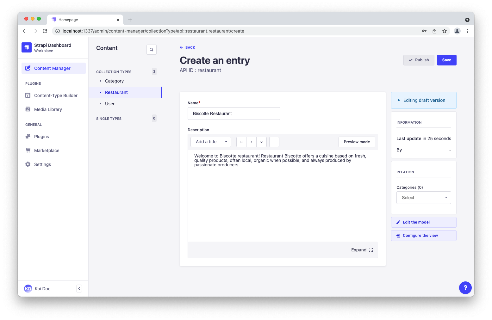
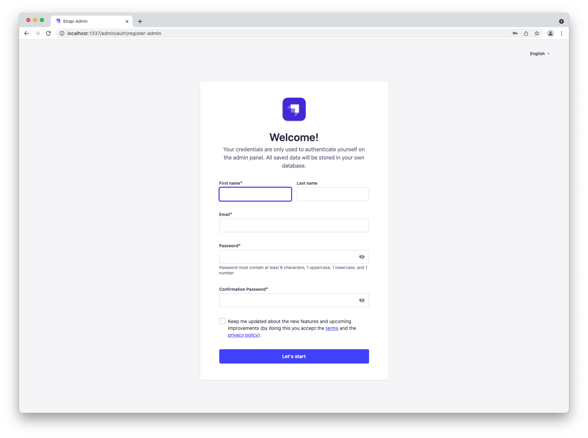
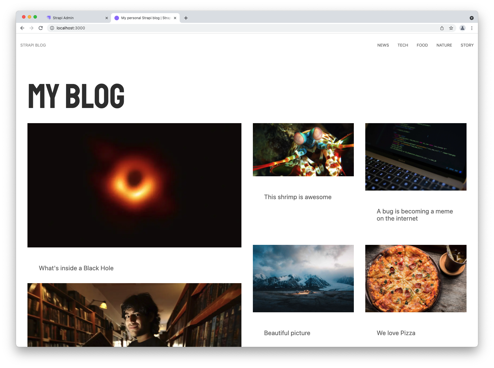
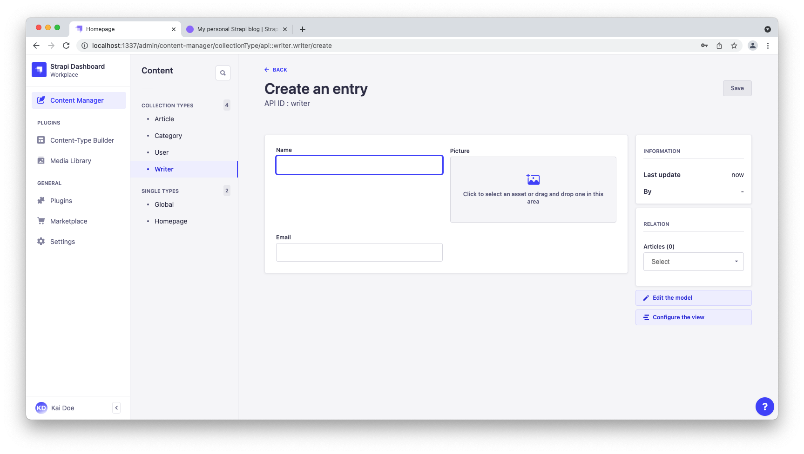

# Quick Start Guide

<style lang="scss" scoped>

  /*
    Some custom CSS tailored for this Quick Start Guide,
    so that the text can "breathe" a bit more.
  */  
  h2:not(:first-child) {
    padding-top: 2em;
  }

  h3, h4 {
    padding-top: 1.5em
  }

  h4 {
    font-size: 115%;
  }

  ul li, ol li {
    padding-bottom: .5em;
  }

  ol li {
    margin-left: 1em;
    padding-left: .3em;
  }

</style>

<!-- We use the vuepress-plugin-tabs plugin but customize tabs. -->
<!-- Not sure why I doesn't work if CSS is scoped 🤷  -->
<style lang="scss">
  /* I know some selectors are ugly, but I needed to target the proper nav and not conflict with the other "card"-style tabs embedded */
  
  .el-tabs--card > .el-tabs__header > .el-tabs__nav-wrap > .el-tabs__nav-scroll > .el-tabs__nav,
  .el-tabs--card > .el-tabs__header  {
    border: none !important;
  }

  .el-tabs--card > .el-tabs__header {
    padding-top: 3em;
  }

  .el-tabs--card > .el-tabs__header > .el-tabs__nav-wrap > .el-tabs__nav-scroll > .el-tabs__nav {
    width: 100%;
    height: 62px;
  }

  .el-tabs--card > .el-tabs__header > .el-tabs__nav-wrap > .el-tabs__nav-scroll > .el-tabs__nav > .el-tabs__item {
    height: 60px;
    text-align: center;
    line-height: 60px;
    font-size: 110%;
    width: 50%;
    border-radius: 0 8px 8px 0 !important;
    border: solid 1px #bbbbba !important;
  }

  .el-tabs--card > .el-tabs__header > .el-tabs__nav-wrap > .el-tabs__nav-scroll > .el-tabs__nav > .el-tabs__item:first-child {
    border-radius: 8px 0 0 8px !important;
    border-right: none !important;
  }

  .el-tabs--card > .el-tabs__header > .el-tabs__nav-wrap > .el-tabs__nav-scroll > .el-tabs__nav > .el-tabs__item:not(.is-active) {
    background-color: #f8f8f8;
    color: #787878;
  }

  .image--50 {
    width: 50%;
  }
  .image--right {
    float: right;
  }
</style>

Strapi offers a lot of flexibility. Whether you want to go fast and quickly see the final result, or would rather dive deeper into the product, we got you covered.

::: prerequisites

!!!include(developer-docs/latest/developer-resources/cli/snippets/installation-prerequisites.md)!!!

:::


👇 Let's get started! Using the big buttons below, please choose between:

- the **Hands-on** path for a DIY approach to run your project
- or the **Starters** path for the quickest way to spin up a fullstack application powered by a Strapi back end.

:::::: tabs type:card

<!-- we need 5 colons or it will conflict with the callouts markup -->

::::: tab Hands-on

## 🚀 Part A: Create a new project with Strapi

### Step 1: Run the installation script

Run the following command in a terminal:

<code-group>

<code-block title="NPM">
```bash
npx create-strapi-app@latest my-project --quickstart
```
</code-block>

<code-block title="YARN">
```bash
yarn create strapi-app my-project --quickstart
```
</code-block>

</code-group>

:::note
The quick start installation sets up Strapi with a SQLite database. Other databases and installation options are available (see [CLI installation guide](/developer-docs/latest/setup-deployment-guides/installation/cli.md)).
:::

### Step 2: Register the first administrator user

Once the installation is complete, your browser automatically opens a new tab.

By completing the form, you create your own account. Once done, you become the first administator user of this Strapi application. Welcome aboard, commander!

You now have access to the [admin panel](http://localhost:1337/admin):


::: callout 🥳 CONGRATULATIONS!
You have just created a new Strapi project! You can start playing with Strapi and discover the product by yourself using our [User Guide](/user-docs/latest/getting-started/introduction.md), or proceed to part B below.
:::

## 🛠 Part B: Build your content

The installation script has just created an empty project. We will now guide you through creating a restaurants directory, inspired by our [FoodAdvisor](https://github.com/strapi/foodadvisor) example application.

In short, we will create a data structure for your content, then add some entries and publish them, so that the API for your content can be consumed.

The admin panel of Strapi runs at [http://localhost:1337/admin](http://localhost:1337/admin). This is where you will spend most of your time creating and updating content.

:::tip TIP
If the server is not already running, in your terminal, `cd` into the `my-project` folder and run `npm run develop` (or `yarn develop`) to launch it.
:::

### Step 1: Create collection types with the Content-type Builder

The Content-type Builder plugin helps you create your data structure. When creating an empty project with Strapi, this is where to get the party started!

#### Create a "Restaurant" collection type

Your restaurants directory will eventually include many restaurants, so we need to create a "Restaurant" collection type. Then we can describe the fields to display when adding a new restaurant entry:

1. Go to Plugins  [Content-type Builder](http://localhost:1337/admin/plugins/content-type-builder) in the main navigation.
2. Click on **Create new collection type**.
3. Type `Restaurant` for the _Display name_, and click **Continue**.  
4. Click the Text field.
5. Type `name` in the _Name_ field.
6. Switch to the _Advanced Settings_ tab, and check the **Required field** and the **Unique field** settings.
7. Click on **Add another field**.
8. Choose the Rich text field.
9. Type `description` under the _Name_ field, then click **Finish**.
10. Finally, click **Save** and wait for Strapi to restart.


Once Strapi has restarted, "Restaurant" is listed under  _Content Manager > Collection types_ in the navigation. Wow, you have just created your very first content-type! It was so cool — let's create another one right now, just for pleasure.

#### Create a "Category" collection type

It would help getting a bit more organized if our restaurants directory had some categories. Let's create a "Category" collection type:

1. Go to Plugins  [Content-type Builder](http://localhost:1337/admin/plugins/content-type-builder) in the main navigation.
2. Click on **Create new collection type**.
3. Type `Category` for the _Display name_, and click **Continue**.
4. Click the Text field.
5. Type `name` in the _Name_ field.
6. Switch to the _Advanced Settings_ tab, and check the **Required field** and the **Unique field** settings.
7. Click on **Add another field**.
8. Choose the Relation field.
9. On the right side, click the _Category_ relational fields box and select "Restaurant".
10. In the center, select the icon that represents "many-to-many" . The text should read `Categories has and belongs to many Restaurants`.


9. Finally, click **Finish**, then the **Save** button, and wait for Strapi to restart.

### Step 2: Use the collection types to create new entries

Now that we have created a basic data structure with 2 collection types, "Restaurant" and "Category", let's use them to actually add content by creating new entries.

#### Create an entry for the "Restaurant" collection type

1. Go to  [Content Manager > Collection types - Restaurant](http://localhost:1337/admin/content-manager/collectionType/api::restaurant.restaurant) in the navigation.
2. Click on **Add new entry**.
3. Type the name of your favorite local restaurant in the _Name_ field. Let's say it's `Biscotte Restaurant`.
4. In the _Description_ field, write a few words about it. If you're lacking some inspiration, you can use `Welcome to Biscotte restaurant! Restaurant Biscotte offers a cuisine based on fresh, quality products, often local, organic when possible, and always produced by passionate producers.`
5. Click **Save**.



The restaurant is now listed in the [Collection types - Restaurant](http://localhost:1337/admin/content-manager/collectionType/api::restaurant.restaurant) view.

#### Add Categories

Let's go to  [Content Manager > Collection types - Category](http://localhost:1337/admin/content-manager/collectionType/api::category.category) and create 2 categories:

1. Click on **Add new entry**.
2. Type `French Food` in the _Name_ field.
3. Click **Save**.
4. Go back to _Collection types - Category_, then click again on **Add new entry**.  
5. Type `Brunch` in the _Name_ field, then click **Save**.


The "French Food" and "Brunch" categories are now listed in the [Collection types - Category](http://localhost:1337/admin/content-manager/collectionType/api::category.category) view.

#### Add a Category to a Restaurant

Go to  [Content Manager > Collection types - Restaurant](http://localhost:1337/admin/content-manager/collectionType/api::restaurant.restaurant) in the navigation, and click on "Biscotte Restaurant".

In the right sidebar, in the **Categories** drop-down list, select "Brunch". Click **Save**.

### Step 3: Set Roles & Permissions

We have just added a restaurant and 2 categories. We now have enough content to consume (pun intended). But first, we need to make sure that the content is publicly accessible through the API:

1. Click on _General  Settings_ at the bottom of the main navigation.
2. Under _Users & Permissions Plugin_, choose [Roles](http://localhost:1337/admin/settings/users-permissions/roles).
3. Click the **Public** role.
4. Scroll down under _Permissions_.
5. In the _Permissions_ tab, find _Restaurant_ and click on it.
6. Click the checkboxes next to **find** and **findone**.
7. Repeat with _Category_: click the checkboxes next to **find** and **findone**.
8. Finally, click **Save**.


### Step 4: Publish the content

By default, any content you create is saved as a draft. Let's publish our categories and restaurant.

First, navigate to  [Content Manager > Collection types - Category](http://localhost:1337/admin/content-manager/collectionType/api::category.category). From there:

1. Click the "Brunch" entry.
2. On the next screen, click **Publish**.
3. In the _Confirmation_ window, click **Yes, publish**.  

Then, go back to the Categories list and repeat for the "French Food" category.

Finally, to publish your favorite restaurant, go to  [Content Manager > Collection types - Restaurant](http://localhost:1337/admin/content-manager/collectionType/api::restaurant.restaurant), click the restaurant entry, and **Publish** it.


### Step 5: Use the API

OK dear gourmet, we have just finished creating our content and making it accessible through the API. You can give yourself a pat on the back — but you have yet to see the final result of your hard work.

There you are: the list of restaurants is accessible at [http://localhost:1337/api/restaurants](http://localhost:1337/api/restaurants).

Try it now! The result should be similar to the example response below 👇.

::: details Click me to view an example of API response

```json
{
  "data": [
    {
      "id": 1,
      "attributes": {
        "name": "Biscotte Restaurant",
        "description": "Welcome to Biscotte restaurant! Restaurant Biscotte offers a cuisine based on fresh, quality products, often local, organic when possible, and always produced by passionate producers.",
        "createdAt": "2021-11-18T13:34:53.885Z",
        "updatedAt": "2021-11-18T13:59:05.035Z",
        "publishedAt": "2021-11-18T13:59:05.033Z"
      }
    }
  ],
  "meta": {
    "pagination": {
      "page": 1,
      "pageSize": 25,
      "pageCount": 1,
      "total": 1
    }
  }
}
```

:::

::: callout 🥳 CONGRATULATIONS!  
Now your content is created, published, and you have permissions to request it through the API.
Keep on creating amazing content!
:::

## ⏩ What to do next?

Now that you know the basics of creating and publishing content with Strapi, we encourage you to explore and dig deeper into some Strapi features:

- 👉 [create an API token](/user-docs/latest/settings/managing-global-settings.md#managing-api-tokens) to restrict access to your API,
- 👉 learn how to use Strapi's [REST](/developer-docs/latest/developer-resources/database-apis-reference/rest-api.md) and [GraphQL](/developer-docs/latest/developer-resources/database-apis-reference/graphql-api.md) APIs to query the content,
- 👉 and [customize your Strapi back end](/developer-docs/latest/development/backend-customization.md) and [admin panel](/developer-docs/latest/development/admin-customization.md).

:::::

::::: tab Starters

## 🚀 Part A: Create a new project with Strapi starters

Strapi [starters](https://strapi.io/starters) are the fastest way to kickstart your project. They cover many use cases (blog, e-commerce solution, corporate website, portfolio) and integrate with various technologies (Next, Gridsome, Nuxt).

This quick start guide has been specifically tailored to use the [Next blog starter](https://strapi.io/starters/strapi-starter-next-js-blog). We highly recommend you to follow along with this starter. Once you get a better understanding of Strapi, you will be able to play with other starters on your own.

### Step 1: Run the installation script

To create a [Next](https://nextjs.org/) blog using Strapi, run the following command in a terminal:

:::: tabs card
::: tab npm

```bash
  npx create-strapi-starter my-project next-blog
```

:::
::: tab yarn

```bash
  yarn create strapi-starter my-project next-blog
```

::::

During the installation, when terminal asks `Choose your installation type`: select the default `Quickstart (recommended)` option by pressing Enter. The installation then resumes — just let the magic happen!

### Step 2: Register & have a look at your blog

Once the installation is complete, your browser automatically opens a tab at ([http://localhost:1337/admin/auth/register-admin](http://localhost:1337/admin/auth/register-admin)). It's for Strapi's admin panel, the back end of your application.

By completing the form in the admin panel tab, you create your own account. Once done, you become the first administator user of this Strapi application. Welcome aboard, commander!

Now, open [http://localhost:3000](http://localhost:3000) in another tab. This is the front end of your application, and you can already see the Next blog in action.




:::callout CONGRATULATIONS! 🥳
Your blog is ready! You can start playing with Strapi and discover the product by yourself using our [User Guide](/user-docs/latest/getting-started/introduction.md), or proceed to part B below.

Writing a blog is not your cup of tea? You can leave this guide and play with other [Starters](https://strapi.io/starters) on your own.
:::

## 🎨 Part B: Play with your content

Strapi [starters](https://strapi.io/starters) build a full stack application and a data structure for you, so you can start playing with your content faster.

We are about to contribute to the blog we have just created. Let's play with your application, by adding yourself as a writer and creating your own article, updating the homepage, and restarting the servers to look at the final result.

:::tip
If the Strapi server is not already running, in your terminal, `cd` into the `my-project` folder and run `npm run develop` (or `yarn develop`) to launch it.
:::

### Step 1: Add yourself as a writer

You have several ideas for great articles in mind. But first, the world needs to know who you are!

Click on  [Content Manager > Collection types - Writer](http://localhost:1337/admin/content-manager/collectionType/api::writer.writer) in the navigation, and click the **Add new entry** button.



1. Add your _Name_ and _Email_ in the corresponding fields.
2. Add your favorite selfie in the _Picture_ field. You can either drag and drop an image or click the field and upload a file. Saying 'Cheese!' during the process is optional. 😄
3. Click **Save**.

### Step 2: Write & publish your first article

To write an article, we need to add a new entry to the "Article" collection type and fill in a few fields.


Click on  [Content Manager > Collection types - Article](http://localhost:1337/admin/content-manager/collectionType/api::article.article) in the main navigation, and click the **Add new entry** button.

#### Give your article a title, a description, and add some content

1. Type `Hello World!` in the _Title_ field.
2. Type `My very first article with Strapi` in the _Description_ field.
3. Write a few lines in the _Content_ field. If you're lacking some inspiration, just type `This is my first blog article with Strapi and using it feels like a breeze!`.
4. Scroll down and add a picture in the _Image_ field.

#### Choose an author and a category for your article

In the sidebar on the right, choose your name in the _Author_ drop-down list. You have just signed your first article with Strapi. Take a few seconds to contemplate this historic moment!

While there, you might also want to choose a _Category_ for your article from the list.

🤓 Don't forget to click on **Save** to save the article.

#### Turn your draft into a publication

By default, your new article would be saved as a draft. Let's not be too shy and publish it right away.

To publish an article, click the **Publish** button at the top of the window.

You have just created and published your first article, "Hello World!". You can find it in the  [Content Manager > Collection types - Article](http://localhost:1337/admin/content-manager/collectionType/api::article.article?page=1&pageSize=10&sort=id:DESC) view.

### Step 3: Update the `Homepage` single type

It's time to make this blog a bit more yours.

Click on  [Content Manager > Single types - Homepage](http://localhost:1337/admin/content-manager/singleType/api::homepage.homepage) in the main navigation. Let's edit this homepage:

1. Replace the image in the _ShareImage_ field.
2. At the bottom of the page, update the _Title_ to `My Wonderful Strapi Blog` in the _Hero_ field group.
3. Click **Save**.

### Step 4: Restart the servers to reflect latest changes

Next is a static-site generator. It means that you need to restart the servers for changes to appear on the front end:

1. In your terminal, press `Ctrl-C` to stop the servers.
2. Make sure you are in the `my-project` folder. If not, type `cd my-project` and press Enter.
3. Restart the servers by typing `npm run develop` (or `yarn develop`) and press Enter.

After a few moments, you should see your blog with its updated title running at [http://localhost:3000](http://localhost:3000). The "Hello World!" article you have just created is also visible at the bottom of the page.


:::callout CONGRATULATIONS! 🥳
Now you know how to use Strapi to create and update your blog. Keep on creating amazing content!
:::

## ⏩ What to do next?

Now that you know the basics of kickstarting your project with a Strapi starter, we encourage you to explore and play a bit further:

* 👉  Start another project! We have lots of other [Starters](https://strapi.io/starters) you can use to kickstart your blog, e-commerce, corporate website, or portfolio project.
* 👉  Read more about the [starters CLI](https://strapi.io/blog/announcing-the-strapi-starter-cli) on our blog.

:::::

::::::
