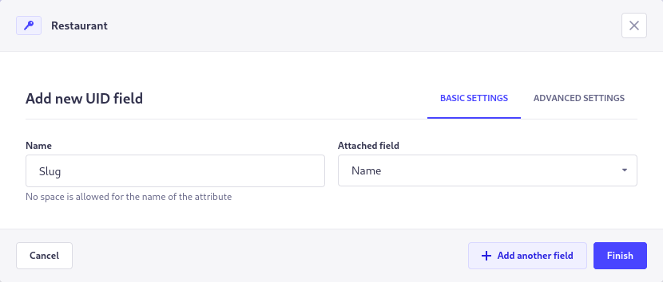
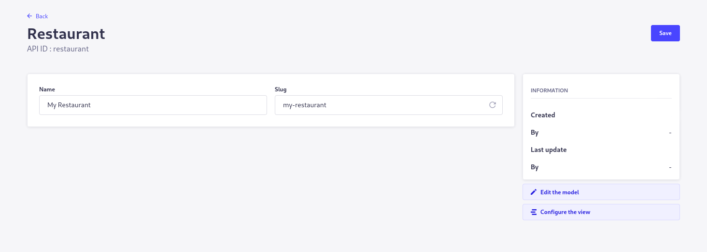

# Use Strapi built-in slug system

This guide will explain how to use Strapi built-in slug system for a Post, Article or any Content Type you want.

## Create attributes

To start using the slug system you will need a `Text` field which will be used to generate the slug, in this example we will call it `Name`.

Then you will need to add a `UID` field that will contain the slugified value of `Name`, in this case we will call it `Slug` and set `Attached field` to `Name`.

## Using the `slug` field

After the `Slug` field has been created, it will automatically generate a slug when you fill the `Name` field, to regenerate your slug you can click on the arrow.

## Fetch entries by `slug`

If you need to fetch any entry by its slug here is an example request `GET /api/pluralApiId?filters[slug]=my-slug`