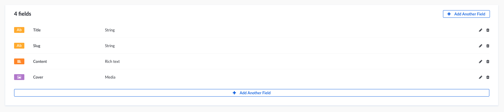
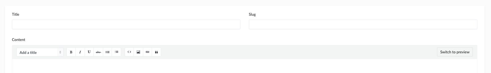
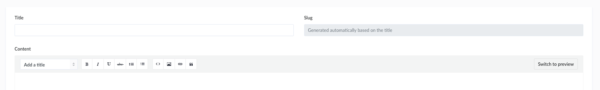
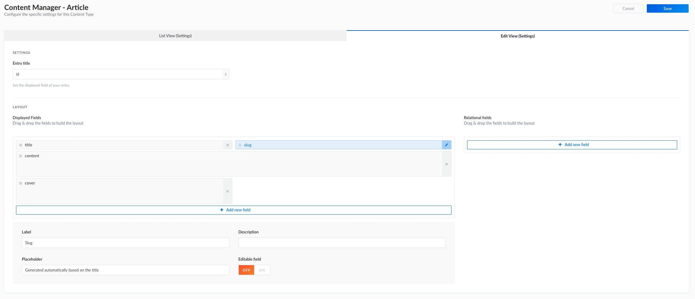

# Create a slug system

!!!include(developer-docs/latest/guides/snippets/guide-not-updated.md)!!!

This guide will explain how to create a slug system for a Post, Article or any Content Type you want.

## Create attributes

To start building your slug system you need a `string` field as a **base** for your slug, in this example we will use `title`.

You will also need another `string` field that contains the slugified value of your `title`, in this case we will use `slug`.



## Configure the layout for the content editor

Let's configure the layout of the **edit page** to make it more user friendly for the content editor.

- Click on the **Article** link in the left menu.
- Then on the `+ Add New Article` button.
- And finally on the `Configure the layout` button.

Here we will be able to setup the `slug` field.

- Click on the `slug` field.
- At the bottom of the page, edit the **placeholder** value to `Generated automatically based on the title`.
- And click **OFF** for **Editable field** option.
- Don't forget to save your updates.

:::: tabs card

::: tab View before



:::

::: tab View after



:::

::: tab View configuration



:::

::::

## Auto create/update the `slug` attribute

For that you will have to install `slugify` node module in your application.

When it's done, you have to update the life cycle of the **Article** Content Type to auto complete the `slug` field.

**Path —** `./api/article/models/Article.js`

:::: tabs card

::: tab Bookshelf

```js
const slugify = require('slugify');

module.exports = {
  /**
   * Triggered before user creation.
   */
  lifecycles: {
    async beforeCreate(data) {
      if (data.title) {
        data.slug = slugify(data.title, {lower: true});
      }
    },
    async beforeUpdate(params, data) {
      if (data.title) {
        data.slug = slugify(data.title, {lower: true});
      }
    },
  },
};
```

If you want to write automated slug for child components as well, use:

```js
const slugify = require('slugify');

function iterate(data) {
  if (data) {
    Object.keys(data).forEach(key => {
      if (key === 'slug') {
        if (data.title) {
          data.slug = slugify(data.title)
        }
      }
      if (typeof data[key] === 'object') {
        iterate(data[key]);
      }
    });
  }
}


module.exports = {
  /**
   * Triggered before user creation.
   */
  lifecycles: {
    async beforeCreate(data) {
      iterate(data)
    },
    async beforeUpdate(params, data) {
      iterate(data)
    },
  },
};
```

:::

::::

## Fetch article by `slug`

Then you will be able to fetch your **Articles** by this slug.

You will be able to find your articles by slug with this request `GET /articles?slug=my-article-slug`
