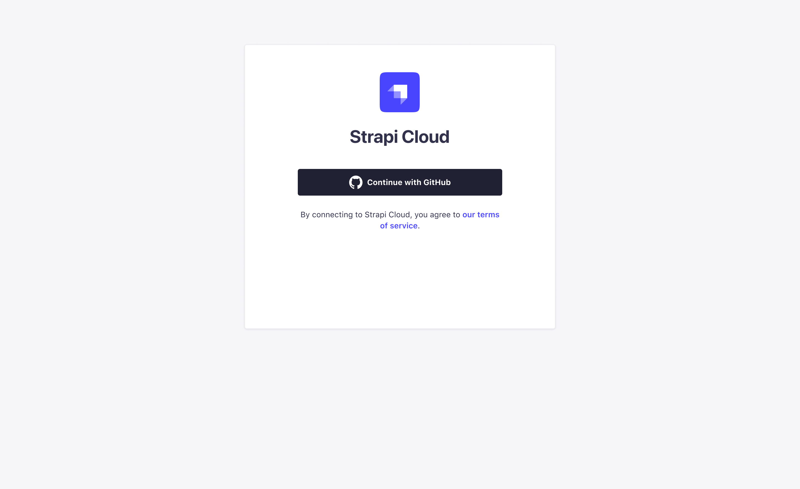

# Strapi Cloud <BetaBadge />

::: warning
Strapi Cloud is currently in Closed Beta release. Features and functionality may change prior to General Availability.
:::

This is a step-by-step guide for deploying your Strapi application on Strapi Cloud. Before you are able to access Strapi Cloud, you must first [request access](#requesting-access) to the Beta release.

## Requesting access

To request access you must sign up for the waitlist [here](https://strapi.io/cloud). Be sure to enter your correct GitHub username and Discord ID as these are used to grant access to the Strapi Cloud Beta.

Onboarding of users will be done in batches. You will be notified via email when you have been granted access to Strapi Cloud.

## Prerequisites

Before you can deploy your Strapi application on Strapi Cloud, you need to have the following prerequisites:

* Strapi version `4.6.x` or higher
* Database: Project must be compatible with PostgreSQL. Use of any external database is not supported.
* Project(s) source code hosted on [GitHub](https://github.com)
    * The connected repository can contain multiple Strapi applications. Each Strapi app must be in a separate directory.

::: warning
Importing data from an existing Strapi application and data backups for a Strapi Cloud application are not supported at this time. These features will be available in the future.
:::

## Getting started

1. Navigate to the [Strapi Cloud](https://cloud.strapi.io) home page. You are prompted to **Log In with GitHub**. Your Strapi Cloud account is created during this initial login.

    

2. Once logged in, you will be redirected to the Strapi Cloud **Projects** page. From here you can create your first Strapi Cloud project.

    

### Create a project

The first time logging into Strapi Cloud, a welcome page is displayed providing a link to the terms of service and prompting you to **Start free trial** to continue.

1. From the **Projects** page, click the **Create Project** button. You are prompted to **Connect with GitHub**.

    ::: tip
    Connect the GitHub account and/or Organizations that own the repository or repositories you want to deploy. This can be different from the account that owns the Strapi Cloud account.

    You will be redirected to GitHub to authorize Strapi Cloud to access your repository.
    :::

2. After granting the required access from GitHub, from the **Projects** page select your desired repository to install Strapi Cloud.

    

3. Click **Next** to proceed to the Project Set up page and enter the following information:
    * **Project name**: The name of your Strapi app, this is fetched from the repository name but can be edited. It is automatically converted to slug format (`my-strapi-app`).
    * **GitHub branch**: The default branch to use for this deployment. This uses the [default branch](https://docs.github.com/en/repositories/configuring-branches-and-merges-in-your-repository/managing-branches-in-your-repository/changing-the-default-branch) of the repository but can be changed via the drop-down.
    * **Deploy on push**: When enabled, this will automatically deploy the latest changes from the selected branch. When disabled, you will need to manually deploy the latest changes.

    

4. (**Optional**) Select **Show Advanced Settings** to configure the following options:
    * **Base directory**: The directory where your Strapi app is located in the repository. This is useful if you have multiple Strapi apps in the same repository or if you have a monorepo.
    * **Environment variables**: Use the **Add variable** button to add any custom [environment variables](../configurations/optional/environment.md) values to configure your Strapi app.
    
    

5. Click **Next** to proceed to the **Payment and billing** page. Enter the corresponding billing details.

    ::: tip
    This is for verification purposes only. You will not be charged during the Beta release, or without notice.
    :::

    

6. Click **Create** to finalize the project creation. An initial deployment is triggered and you are redirected to the **Projects** page.

## Managing projects

The **Projects** page displays a list of all your Strapi Cloud projects. From here you can manage your projects and access the corresponding applications.

Each project card displays the following information:

* **Project name**
* **Status**: Displays a **Disconnected** warning if the project repository is not connected to Strapi Cloud.
* **Last deployment date**: Timestamp of the last deployment.

## Project details

From the **Projects** page, click on any project card to access that project's details page.

The project details page displays the following tabs: **Deploys** and **Settings**.

### Deploys

The **Deploys** tab displays a chronological list of cards with the details of all historical deployments for the project.

Each card displays the following information:

* **Commit SHA**
* **Commit message**
* **Deployment status**: Whether the project is 
    * **Deploying**
    * **Done**
    * **Cancelled**
    * **Build failed**
    * **Deploy failed**
* **Last deployment time**: When the deployment was triggered and the duration.
* **Production branch**
* **Options** menu (`...`): The available options vary depending on the deployment status.
    * For **Done** status: No further options.
    * For **Deploying** status, you can:
        * **Cancel deploy**
    * For **Build failed** status, you can:
        * **Download error logs**
    * For **Deploy failed** status, you can:
        * **Download error logs**

From this page you can also trigger a new deployment and access the application using the corresponding buttons.

### Settings

The **Settings** tab contains three sections: **General**, **Variables**, and **Billing**.

#### General

The **General** section enables you to edit the following details for the project:

* **Project name**: The name of your Strapi app, used to identify the project on the Cloud Dashboard, Strapi CLI, and deployment URLs.
* **Production branch**: The branch of the linked repository to use for production deployments.
* **Base directory**: The directory where your Strapi app is located in the repository. This is useful if you have multiple Strapi apps in the same repository or if you have a monorepo.
* **Connected GitHub repository**: The Git repository linked to the project.
* **Environment variables**: Environment variables are used to configure the environment of your Strapi app.
* **Delete project**: This will ***permanently and irreversibly*** delete the project and all its associated data.

#### Variables

The **Variables** section displays the list of environment variables configured for the project, and enables you to add new variables.

#### Billing

The **Billing** section displays the current subscription plan and included usage for the project.

Use the **Manage subscription** button to change the subscription plan.

## Profile settings

The **Profile** settings page is accessed from your account icon in the top-left corner and enables you to manage your account details and preferences. There are three sections available: 

### General

The **General** tab enables you to edit the following details for your account:

* **Name**: The name associated with your account.
<!--
* **Email**: The email address associated with your account.
* **Delete account**: This will ***permanently and irreversibly*** delete your account and all its associated data.
-->

### Preferences

The **Preferences** tab enables you to edit the following details for your account:
<!--
* **Notifications**: Enable or disable email notifications for project activity.
    * **Frequency**: Choose the frequency of email notifications.
-->
* **Appearance**: Choose between the **Light** and **Dark** themes.

### Billing

The **Billing** tab displays your billing information and enables you to update your payment method.

