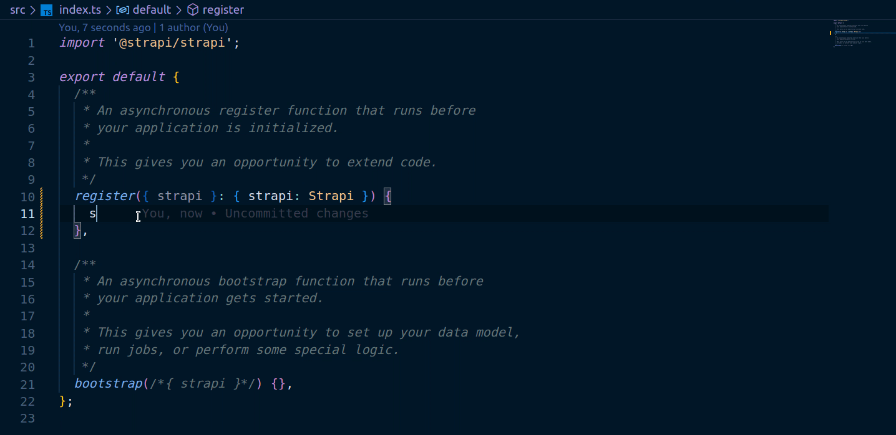

# TypeScript support

::: callout 🚧  TypeScript documentation
This section is still a work in progress and will continue to be updated and improved. Migrating existing Strapi applications written in JavaScript is not currently recommended. In the meantime, feel free to ask for help on the [forum](https://forum.strapi.io/) or on the community [Discord](https://discord.strapi.io).
:::

TypeScript adds an additional type system layer above JavaScript, which means that existing JavaScript code is also TypeScript code. Strapi supports TypeScript in new and existing projects running v4.2.0 and above. The core Developer Documentation contains code snippets in both JavaScript and TypeScript.

## Create a new TypeScript project

Create a Strapi project with Typescript support by using the `--ts` or `--typescript` flags with either the npm or yarn package manager.

::: tip
Adding the `--quickstart` flag in addition to the `--ts` flag will create a TypeScript project with an [SQLite database](/developer-docs/latest/setup-deployment-guides/installation/cli.md#creating-a-strapi-project).
:::

<!-- UPDATE these code blocks for the stable release-->

<code-group>

<code-block title="NPM">

```sh
npx create-strapi-app@beta my-app --ts
#or
npx create-strapi-app@beta my-app --typescript
```

</code-block>

<!-- <code-block title="YARN">
```sh
yarn create-strapi-app@latest my-project --ts

# or

yarn create-strapi-app@latest my-project --typescript
```
</code-block> -->

</code-group>

## Understand TypeScript support

TypeScript-enabled Strapi applications have a specific [project structure](/developer-docs/latest/setup-deployment-guides/file-structure.md)) with the following dedicated folders and configuration files:

| TypeScript-Specific directories and files | Purpose                                                                                                                                           | Location         |
|-------------------------------------------|---------------------------------------------------------------------------------------------------------------------------------------------------|------------------|
| `./dist` directory                        | Adds the location for compiling the project JavaScript source code.                                                                               | application root |
| `build` directory                         | Contains the compiled administration panel JavaScript source code.  The directory is created on the first `yarn build` or `npm run build` command | `./dist/`         |
| `tsconfig.json` file                      | Manages TypeScript compilation for the server.                                                                                                    | application root |
| `tsconfig.json` file                      | Manages TypeScript compilation for the admin panel.                                                                                               | `./src/admin/`   |

Starting the development environment for a TypeScript-enabled project requires building the admin panel prior to starting the server. In development mode, the application source code is compiled to the `./dist/build` directory and recompiled with each change in the Content-type Builder. To start the application, run the following commands in the root directory:

<code-group>

<code-block title="NPM">

```sh
npm run build
npm run develop
```

</code-block>

 <code-block title="YARN">

```sh
yarn build
yarn develop
```

</code-block>

</code-group>

## Use TypeScript typings

Strapi provides typings on the Strapi class to improve the TypeScript experience. In the following example a `register` method is added to `./src/index.ts`. For example, when the `strapi.runLifecyclesFunctions` method is added, a list of available lifecycle types (`register`, `bootstrap` and `destroy`) are returned by the code editor. The following example is illustrated statically and the second tab shows an animated example.

:::: tabs card

::: tab STATIC EXAMPLE

```ts
// path: ./src/index.ts

import '@strapi/strapi';

export default {

  register( {strapi }: { strapi: Strapi }) {
    strapi.runLifecyclesFunctions('register') .then(()  => console.log('hello world')
    )
    
  },
};
```

:::

::: tab ANIMATED GIF



:::

::::


## Develop a plugin using TypeScript

New plugins can be generated following the [plugins development documentation](/developer-docs/latest/development/plugins-development.md). There are 2 important distinctions for TypeScript applications:

- After creating the plugin, run `yarn install` or `npm run install` in the plugin directory `src/admin/plugins/[my-plugin-name]` to install the dependencies for the plugin.
- Run `yarn build` or `npm run build` in the plugin directory `src/admin/plugins/[my-plugin-name]` to build the admin panel including the plugin.

::: note
It is not necessary to repeat the `yarn install` or `npm run install` command after the initial installation. The `yarn build` or `npm run build` command is necessary to implement any plugin development that affects the admin panel.
:::

## Start Strapi programmatically

Instantiating Strapi programmatically in a TypeScript project requires additional configurations to load everything correctly. The primary difference for TypeScript programmatic use is that the codebase and compiled code are stored in separate directories, whereas the same directory is used to read and write in native JavaScript.

### Understand programatic use

When instantiating Strapi programmatically using the default export of `@strapi/strapi`, different parameters such as the `app` directory and the `dist` directory can be passed. The `app` directory is the project root directory and `dist` is a subdirectory of `app`. The `dist` directory represents the compiled project, with the same directory structure as the `app` directory, and the `app` directory represents the codebase (TypeScript or JavaScript). The main differences are:

- When using the Content-type Builder to create, update, delete content types (or any other service that creates files), Strapi uses the `app` folder to write the files.
- When reading what content types exist on the system Strapi reads the `dist` folder.
- When the `develop` command is used only the `app` directory is watched. In TypeScript, a compilation will be triggered when a change is detected in the `app` directory & the output will be written to the `dist` directory.

::: note
The public folder is considered static and thus ignores the  `app` and `dist` directories.
:::

The default values for the `app` and `dist` directories are transformed and assigned using one of the following options:

```js

const resolveWorkingDirectories = opts => {
  const cwd = process.cwd(); // Neither the appDir or distDir are passed. Both the appDir and distDir are set to process.cwd().

  const appDir = opts.appDir ? path.resolve(cwd, opts.appDir) : cwd; // Only appDir is defined distDir matches appDir.
  
  const distDir = opts.distDir ? path.resolve(cwd, opts.distDir) : appDir; // Only distDir is defined, appDir is set to process.cwd().

  return { appDir, distDir };
}

```

For example, if the compiled code is stored in a separate directory (eg: when using TypeScript)  Strapi should be instantiated with a specific `distDir` value which matches the path of your build directory.

::: caution
Do not set the `appDir` to the `build` or `dist` directory as it could cause issues when the app tries to write some files.
:::

### Start Strapi programmatically examples

Start Strapi for JavaScript applications:

```js
const strapi = require('@strapi/strapi');

strapi();
// appDir => process.cwd() | distDir => process.cwd()

```

Start Strapi using a custom `dist` directory:

```js
const strapi = require('@strapi/strapi');

strapi({ distDir: './dist' });
// appDir => process.cwd() | distDir => './dist'
```

Start Strapi using custom `app` and `dist` directories:

```js

const strapi = require('@strapi/strapi');

strapi({ distDir: './dist' });
// appDir => process.cwd() | distDir => './dist'

```

Start Strapi using a custom `app` directory:

```js

const strapi = require('@strapi/strapi');

strapi({ appDir: './app' });
// appDir => './app' | distDir => './app'

```

### Use both JavaScript and TypeScript codebases when starting Strapi programmatically

Adding the package `@strapi/typescript-utils` allows for both JavaScript and TypeScript codebases to be used programatically. A common use is for creating command line interface tools or developing a plugin. Examples of how to incorporate both code bases:

```js
const tsUtils = require('@strapi/typescript-utils');
const strapi = require('@strapi/strapi');

const appDir = process.cwd();

// Automatically detect if this is a Typescript project:
const isTSProject = await tsUtils.isUsingTypeScript(appDir);

// Resolve the directory containing the compilation output:
const outDir = await tsUtils.resolveOutDir(appDir);

if (isTSProject) {
// If inside a Typescript project, compile the TypeScript code in the appDir:
  await tsUtils.compile(appDir, {
    watch: false,
    configOptions: { options: { incremental: true } },
  });
}

// If inside a Typescript project, use a custom dist directory, otherwise set it to appDir value: 
const distDir = isTSProject ? outDir : appDir;

// Start the app by providing the app and dist directories:
const app = await strapi({ appDir, distDir }).load();

```
