<!-- TODO: update SEO -->

# v4 data migration: SQL relations in Strapi v3 and v4

This documentation is part of the [SQL migration guide](/developer-docs/latest/update-migration-guides/migration-guides/v4/data/sql.md) included in the [data migration guide](/developer-docs/latest/update-migration-guides/migration-guides/v4/data-migration.md) and designed to help you migrate from Strapi v3.6.x to Strapi v4.0.x.

::: strapi v3 / v4 comparison

In Strapi v3, only many-to-many relations (both bidirectional and unidirectional) and polymorphic relations trigger the creation of SQL join tables.

In Strapi v4, every type of [relation](/developer-docs/latest/development/backend-customization/models.md#relations) between 2 entities triggers the creation of a SQL join table.
:::

This documentation is built around an example using 2 different database entities: `article` and `category`. The example simulates adding a relation to the `article` entity pointing towards the `category` entity. For each relation type, the following sections illustrate:

- the definition of attributes in the [model schema](/developer-docs/latest/development/backend-customization/models.md#model-schema) for each entity's model
- and the entity relationship diagrams.

::: details Legend for entity relationship diagrams
Entity relationship diagrams use the following color code:

* for tables and relations:
  * Strapi v3 items are in <span style="color: rgb(191,56,5)">orange</span>
  * Strapi v4 items are in <span style="color: rgb(170,0,243)">purple</span>
* for table names (e.g. <span style="color: rgb(13, 89, 223)">articles</span>_<span style="color: rgb(17,124,7)">category</span>_links):
  * entity names (singular or plural) are in <span style="color: rgb(13,89,223)">blue</span>
  * attribute names from a schema are in <span style="color: rgb(17,124,7)">green</span>
  * all the other parts of a table name are in black

Entity relationship diagrams also use the following abbreviations:
- PK for primary key
- FK for foreign key

:::

## One-to-one relations (1-1)

:::: grid Model schemas (attributes only):
::: grid-top-left Strapi v3

`article/article.settings.json`

```json
"category": {
  "model": "category",
  "via": "article"
}
```

:::

::: grid-bottom-left

`category/category.settings.json`

```json
"article": {
  "model": "article",
  "via": "category"
}
```

:::

::: grid-top-right Strapi v4

`article/schema.json`

```json
  "category": {
    "type": "relation",
    "relation": "oneToOne",
    "target": "api::category.category",
    "inversedBy": "article"
  }
```
:::

::: grid-bottom-right

`category/schema.json`

```json
  "article": {
    "type": "relation",
    "relation": "oneToOne",
    "target": "api::article.article",
    "mappedBy": "category"
}
```
:::

::::

**Database structures**:

:::: columns
::: column-left Strapi v3
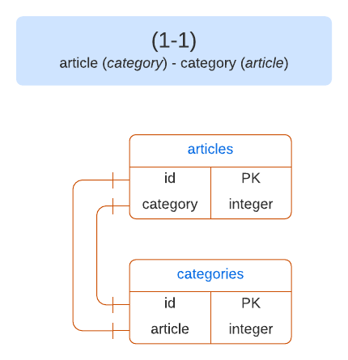
:::

::: column-right Strapi v4
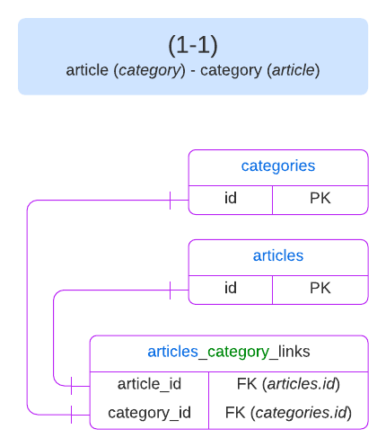
:::
::::

## One-to-many relations (1-N)

:::: grid Model schemas (attributes only):
::: grid-top-left Strapi v3

`article/article.settings.json`

```json
"categories": {
  "collection": "category",
  "via": "article"
}
```
:::

::: grid-bottom-left

`category/category.settings.json`

```json
"article": {
  "model": "article",
  "via": "categories"
}
```
:::

::: grid-top-right Strapi v4

`article/schema.json`

```json
"categories": {
  "type": "relation",
  "relation": "oneToMany",
  "target": "api::category.category",
  "mappedBy": "article"
}
```

:::

::: grid-bottom-right

`category/schema.json`

```json
"article": {
  "type": "relation",
  "relation": "manyToOne",
  "target": "api::article.article",
  "inversedBy": "categories"
}
```
:::

::::

**Database structures:**

:::: columns

::: column-left Strapi v3
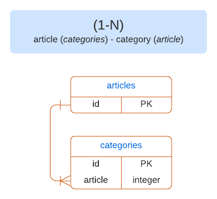
:::

::: column-right Strapi v4

:::
::::

## Many-to-one relations (N-1)

:::: grid Model schemas (attributes only):
::: grid-top-left Strapi v3
`article/article.settings.json`

```json
"category": {
  "model": "category",
  "via": "articles"
}
```
:::

::: grid-bottom-left
`category/category.settings.json`

```json
"articles": {
  "collection": "article",
  "via": "category"
}
```
:::

::: grid-top-right Strapi v4

`article/schema.json`

```json
"category": {
  "type": "relation",
  "relation": "manyToOne",
  "target": "api::category.category",
  "inversedBy": "articles"
}
```

:::

::: grid-bottom-right
`category/schema.json`

```json
  "articles": {
    "type": "relation",
    "relation": "oneToMany",
    "target": "api::article.article",
    "mappedBy": "category"
}
```
:::
::::

**Database structures:**

:::: columns

::: column-left Strapi v3
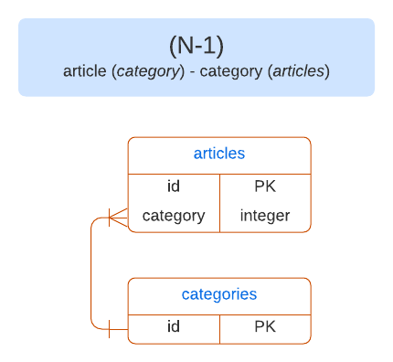

:::
::: column-right Strapi v4
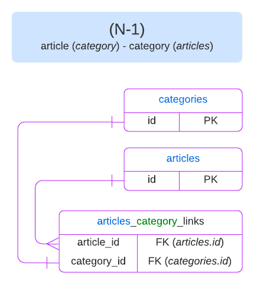
:::
::::

## Many-to-many relations (N-N)

:::: grid Model schemas (attributes only):
::: grid-top-left Strapi v3

`article/article.settings.json`

```json
"categories": {
  "collection": "category",
  "via": "articles",
  "dominant": true
}
```
:::

::: grid-bottom-left

`category.settings.json`

```json
"articles": {
  "collection": "article",
  "via": "categories"
}
```
:::

::: grid-top-right Strapi V4

`article/schema.json`


```json
"categories": {
  "type": "relation",
  "relation": "manyToMany",
  "target": "api::category.category",
  "inversedBy": "articles"
}
```

:::

::: grid-bottom-right

`category/schema.json`

```json
"articles": {
  "type": "relation",
  "relation": "manyToMany",
  "target": "api::article.article",
  "mappedBy": "categories"
}
```
:::
::::

**Database structures:**

:::: columns
::: column-left Strapi v3
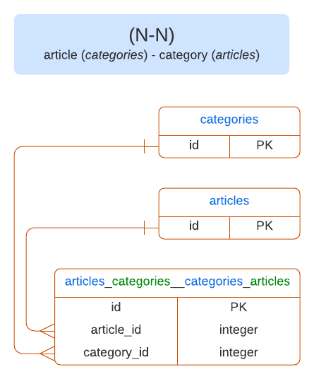
:::
::: column-right Strapi v4
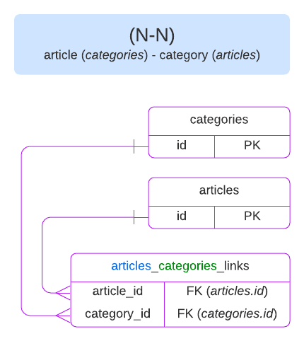
:::
::::

## One-way relations (unidirectional N-1)

**Model schemas (attributes only):**

:::: columns
::: column-left Strapi v3

`article/article.settings.json`

```json
"category": {
  "model": "category"
}
```
:::

::: column-right Strapi v4

`article/schema.json`

```json
"category": {
  "type": "relation",
  "relation": "oneToOne",
  "target": "api::category.category"
}
```
:::
::::

**Database structures:**

:::: columns
::: column-left Strapi v3
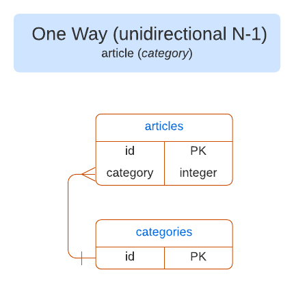
:::
::: column-right Strapi v4
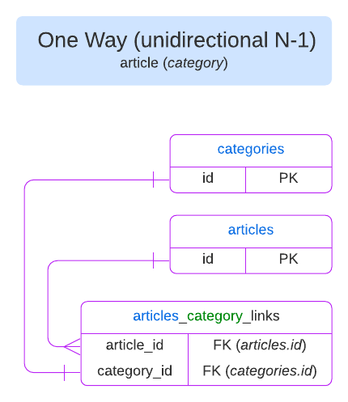
:::
::::

## Many-way relations (unidirectional N-N)

**Model schemas (attributes only):**
:::: columns
::: column-left Strapi v3

`article/article.settings.json`

```json
"categories": {
  "collection": "category"
}
```

:::
::: column-right Strapi v4

`article/schema.json`

```json
"categories": {
  "type": "relation",
  "relation": "oneToMany",
  "target": "api::category.category"
}
```
:::
::::

**Database structures:**

:::: columns
::: column-left Strapi v3
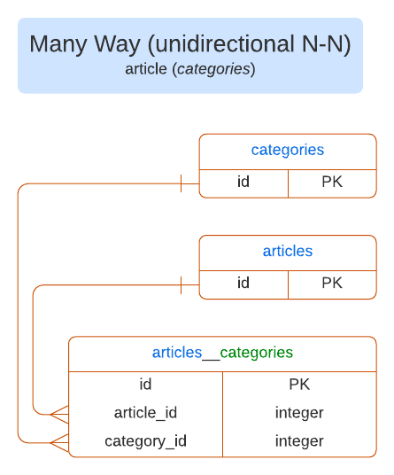
:::
::: column-right Strapi v4
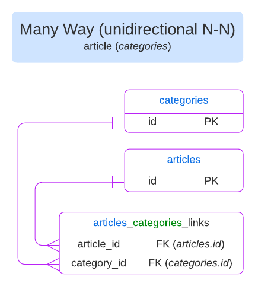
:::
::::

## Polymorphic relations

::: strapi v3 / v4 comparison
In Strapi v3, table names for polymorphic relations end with `_morph` (singular), and the `attribute_type` points to an entity name.

In Strapi v4, table names for polymorphic relations end with `_morphs` (plural), and the `attribute_type` must point to an entity unique identifier.
:::

::: caution
Polymorphic relations should always have `“configurable”: false` defined in the attributes of the schema to prevent their modification in the admin panel.
:::

:::: grid Model schemas (attributes only):
::: grid-top-left Strapi v3
`article/article.settings.json`

```json
"related": {
  "collection": "*",
  "filter": "field",
  "configurable": false
}
```
:::

::: grid-bottom-left
`category/category.settings.json`

```json
"articles": {
  "collection": "article",
  "via": "related"
}
```

In Strapi v3, only one morph table is created for every entity. Whenever a polymorphic relation attribute is added to the entity schema, 2 new columns are added to the `entity_morph` table: `attribute_id` and `attribute_type`.

:::
::: grid-top-right Strapi v4

`article/schema.json`

```json
"related": {
  "type": "relation",
  "relation": "morphToMany", // or morphToOne
  "configurable": false
}
```
:::
::: grid-bottom-right

`category/schema.json`

```json
"article": {
  "type": "relation",
  "relation": "morphMany", // or morphOne
  "target": "article",
  "morphBy": "related"
}
```

In Strapi v4, a morph table is created for every entity/morph relation defined in the schema. If a single entity has 2 morph relations, 2 different tables are created and named using the following format: `entity_attribute_morphs`.

:::
::::

<!-- Don't remove these line breaks or the text will overlap with the grid. We'll fix the CSS later on :D  -->
<br/>
<br/>
<br/>

**Database structures:**

:::: columns
::: column-left Strapi v3
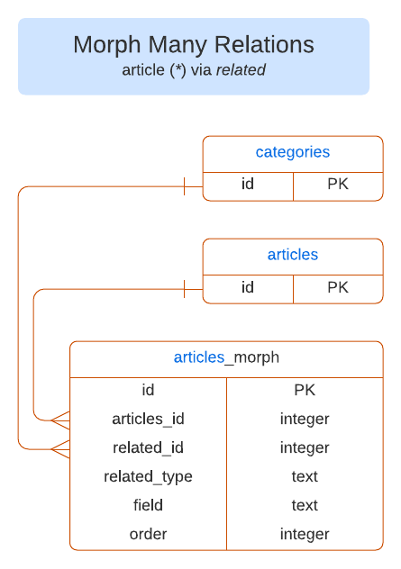
:::
::: column-right Strapi v4
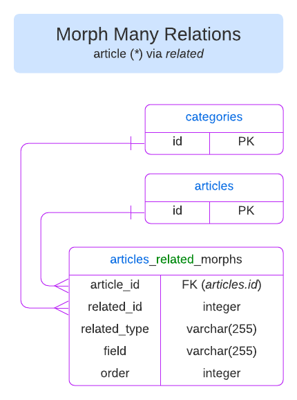
:::
::::

## Circular relations

Circular relations are relations that point to the same entity (e.g. `article` → `article`). In the schema definitions, circular relations are defined the same way as other relations.

In Strapi v4, `entity_id` and `inv_entity_id` are used to differentiate the relation to the initial entry from the related entry in the SQL join table.

**Database structures example in Strapi v4**:

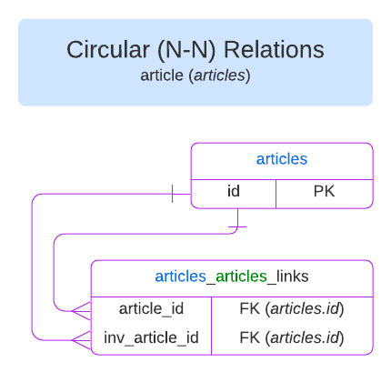

## Relations to components

The schema definition for components is the same in Strapi v3 and in Strapi v4, but database structures differ.

**Model schemas (attributes only):**

:::: columns
::: column-left Strapi v3

```json
"component-name": {
  "type": "component",
  "component": "default.comp"
}
```
:::
::: column-right Strapi v4

```json
"component-name": {
  "type": "component",
  "component": "default.comp"
}
```
:::
::::

**Database structures:**

:::: columns
::: column-left Strapi v3
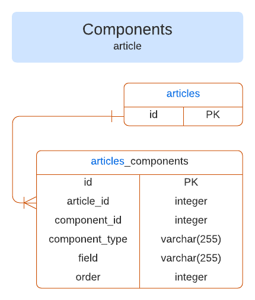
:::
::: column-right Strapi v4
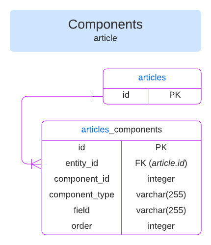
:::
::::
