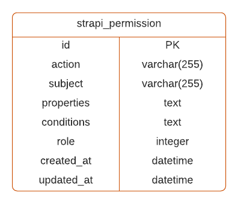
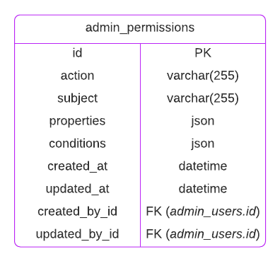
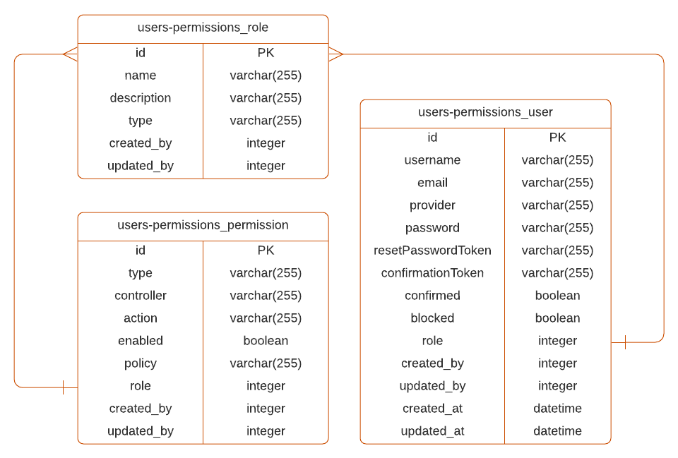
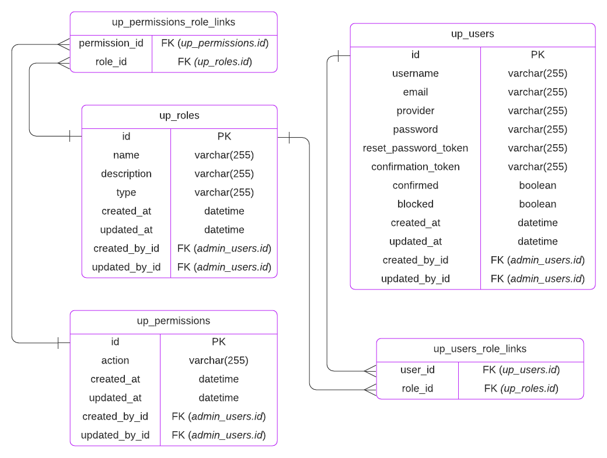

<!-- TODO: update SEO -->

# Migrate a SQL database from Strapi v3 to Strapi v4

The database layer of Strapi has been fully rewritten in Strapi v4. Model schemas use new attributes and relations are handled differently.

::: strapi Relations in Strapi v3 vs. v4
The [v3 vs. v4 SQL relations cheatsheet](/developer-docs/latest/update-migration-guides/migration-guides/v4/data/sql-relations.md) is designed to help you understand the differences in model schemas and entity relationship diagrams between Strapi v3 and v4.
:::
## Global changes

### Column name casing

In Strapi v3, it is possible to have a mix of different casings in columns names (e.g. `PascalCase`, `camelCase`, and `snake_case`).

In Strapi v4, every column name should use `snake_case`.

Attributes defined in another casing in the model schema will see their name transformed to `snake_case` when communicating to the database layer.

### Strapi’s timestamps columns

::: note
By default, Strapi’s timestamps columns refer here to `created_at` and `updated_at`.
:::

- Since v4 it isn’t possible to configure (eg: rename) or disable Strapi’s timestamps attributes/columns.  It thus has an impact on the migration since timestamps with custom column names should be migrated to the `created_at` and `updated_at` fields.
- In Strapi v3, timestamps columns were given a default value directly by the database layer.

In Strapi v4, we’ve put this logic in the Strapi domain.

Thus, the default value (`CURRENT_TIMESTAMP`) must be removed from the table structure.

## Other Changes

### Upload Plugin

- In Strapi v3, the polymorphic table associated to the file content-type was named `upload_file_morph` and has both an `id` and an `upload_file_id` attribute.

  In Strapi v4:
  
  * the polymorphic table is named `files_related_morphs` (as it concerns the file’s `related` attribute),
  * the `id` and `upload_file_id` columns have been removed
  * and a new column `file_id` (foreign key pointing to `files.id`) has been added.

- In Strapi v4, an index has been created for the `file_id` column as `files_related_morph_fk`.

### Admin Permissions

- The table structure has changed:

  :::: columns
  ::: column-left Strapi v3
  
  :::
  ::: column-right Strapi v4
  
  :::
  ::::

- The role relation in Strapi v4 is handled in a join table named `admin_permissions_role_links`.
- In Strapi v4, new indexes have been created for the `created_by_id` and `updated_by_id` columns with the following names:

| Column name in Strapi v3 | Index name in Strapi v4 |
|----|----|
| `created_by_id` | `admin_permissions_created_by_id_fk` |
| `updated_by_id` | `admin_permissions_updated_by_id_fk`

### Core store

The core store table has a different name in Strapi v3 and Strapi v4:

| Name in Strapi v3 | Name in Strapi v4            |
| ----------------- | ---------------------------- |
| `core_store`      | `strapi_core_store_settings` |

The structure of the core store table remains untouched.

### Strapi’s tables
<!-- 
<aside>
💡 Tables that have been introduced In Strapi v4 and don’t have equivalent in Strapi v3 (noted **N/A**) **should not** be created by the migrations script.
</aside> -->

Strapi built-in tables have a different name in Strapi v3 and Strapi v4:

| Table name in Strapi v3       | Table name in Strapi v4 |
| ----------------------------- | ----------------------- |
| `admin_permissions`           | `strapi_permission`     |
| `admin_permissions_role_link` | _(non applicable)_      |
| `admin_roles`                 | `strapi_role`           |
| `admin_users`                 | `strapi_administrator`  |
| `amin_users_roles_links`      | `strapi_users_roles`    |
| `strapi_webhooks`             | `strapi_webhooks`       |
| `strapi_core_store_settings`  | `core_store`            |
| `strapi_migrations`           | _(non applicable)_      |
| `strapi_api_tokens`           | _(non applicable)_      |
| `strapi_database_schema`      | _(non applicable)_      |

### Users and Permissions plugin

The tables and database structure is different in Strapi v3 and v4:

Strapi v3:

Strapi v4:

<!-- #### Permissions *to be finished*

- In Strapi v3 `permissions` were defined by a `type`, a `controller`, and an `action` column.
- In Strapi v4 those columns have been aggregated and replaced by a single one named `action`

The aggregation works like so:

> **action = *transform(*type*)*.controller.action**
>  -->

<!-- ### I18N Plugin *to be finished*

Localization tables follows the [circular many to many relationships migration](./assets.md)  and thus are renamed from `entities__localizations` to `entities_localizations_links`.

The columns are also changed from v3(`id`, `entity_id`, `related_entity_id`) to v4(`entity_id`, `inv_entity_id`) ← ER diagram to be done -->
