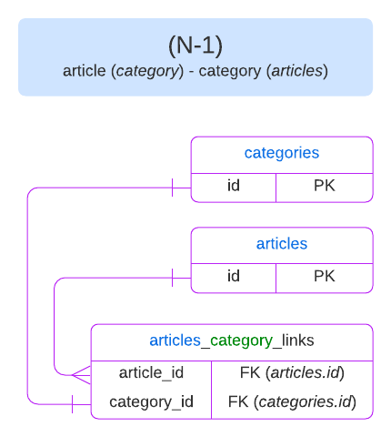
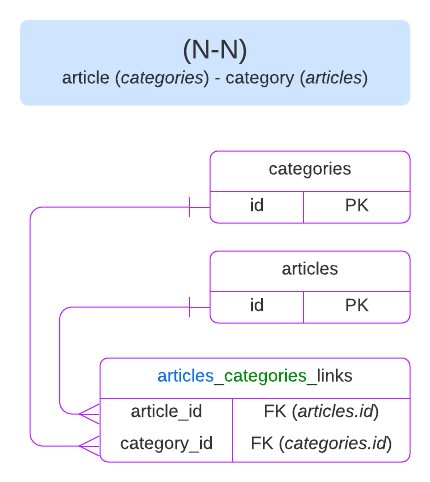
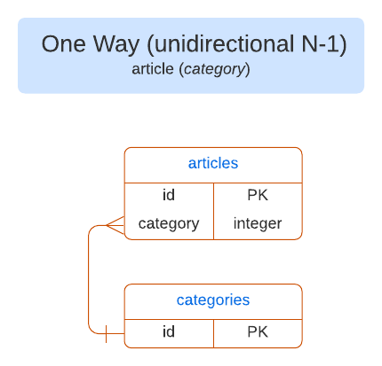
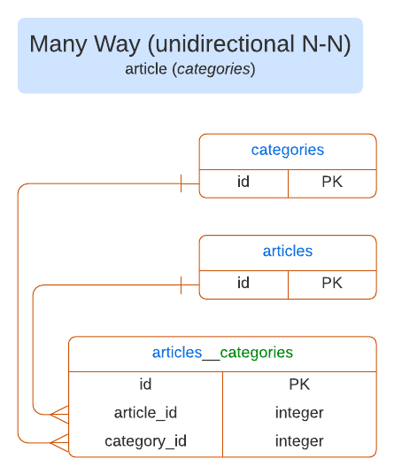
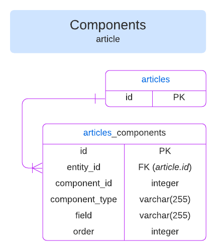

<!-- TODO: update SEO -->

# Migrate a SQL database from Strapi v3 to Strapi v4

## Relations

::: strapi v3 / v4 comparison

In Strapi v3, only many-to-many (both bidirectional and unidirectional) and polymorphic relations trigger the creation of join tables.

In Strapi v4, every type of relationship between 2 entities induces the creation of a join table.
:::

This part of the guide is built around an example using 2 different entities: `article` and `category`. For each relation type, we’ll simulate adding a relation to the `article` entity pointing towards the `category` entity.

Strapi v4 supports the following types of relations:

* [one-to-one](#one-to-one-relations-1-1),
* [one-to-many](#one-to-many-relations-1-n),
* [many-to-one](#many-to-one-relations-n-1),
* [many-to-many](#many-to-many-relations-n-n),
* [one-way (unidirectional one-to-many)](#one-way-relations-unidirectional-n-1),
* [many-way (unidirectional many-to-many)](#many-way-relations-unidirectional-n-n),
* [polymorphic](#polymorphic-relations),
* [circular](#circular-relations),
* and [relations to components](#relations-to-components).

The rest of this section describes and illustrates the attributes definition in the schema of each entity's model and the entity-relationship diagrams for each type of relation.

::: note NOTES

* A one-to-many relationship means a relationship where one `article` entity has several `category` entities linked to it.

* In schemas definitions for bidirectional relations:

  * `inversedBy` has to be specified on the owning side of the relation
  * `mappedBy` has to be specified on the inversed side of the relation

:::

Entity-relationship diagrams use the following color code:

* for tables and relations:
  * Strapi v3 items are in <span style="color: rgb(191,56,5)">orange</span>
  * Strapi v4 items are in <span style="color: rgb(170,0,243)">purple</span>
* for table names (e.g. <span style="color: rgb(13, 89, 223)">articles</span>_<span style="color: rgb(17,124,7)">category</span>_links):
  * entity names (singular or plural) are in <span style="color: rgb(13,89,223)">blue</span>
  * attribute names from a schema are in <span style="color: rgb(17,124,7)">green</span>
  * all the other parts of a table name are in black 

### One-to-one relations (1-1)

:::: grid-wrapper Schemas (attributes definition)
::: grid-top-left Strapi v3

`article/article.settings.json`

```json
"category": {
  "model": "category",
  "via": "article"
}
```

:::

::: grid-bottom-left

`category/category.settings.json`

```json
"article": {
  "model": "article",
  "via": "category"
}
```

:::

::: grid-top-right Strapi v4

`article/schema.json`

```json
  "category": {
    "type": "relation",
    "relation": "oneToOne",
    "target": "api::category.category",
    "inversedBy": "article"
  }
```
:::

::: grid-bottom-right

`category/schema.json`

```json
  "article": {
    "type": "relation",
    "relation": "oneToOne",
    "target": "api::article.article",
    "mappedBy": "category"
}
```
:::

::::

**Database structure**:

:::: column-wrapper
::: column-left Strapi v3

:::

::: column-right Strapi v4

:::
::::

### One-to-many relations (1-N)

:::: grid-wrapper Schemas (attributes definition)
::: grid-top-left Strapi V3

`article/article.settings.json`

```json
"categories": {
  "collection": "category",
  "via": "article"
}
```
:::

::: grid-bottom-left

`category/category.settings.json`

```json
"article": {
  "model": "article",
  "via": "categories"
}
```
:::

::: grid-top-right Strapi v4

`article/schema.json`

```json
"categories": {
  "type": "relation",
  "relation": "oneToMany",
  "target": "api::category.category",
  "mappedBy": "article"
}
```

:::

::: grid-bottom-right

`category/schema.json`

```json
"article": {
  "type": "relation",
  "relation": "manyToOne",
  "target": "api::article.article",
  "inversedBy": "categories"
}
```
:::

::::

**Database structure:**

:::: column-wrapper

::: column-left Strapi V3

:::

::: column-right Strapi V4

:::
::::

### Many-to-one relations (N-1)

:::: grid-wrapper Schemas (attribute definition)
::: grid-top-left Strapi v3
`article/article.settings.json`

```json
"category": {
"model": "category",
"via": "articles"
}
```
:::

::: grid-bottom-left
`category/category.settings.json`

```json
"articles": {
"collection": "article",
"via": "category"
}
```
:::

::: grid-top-right Strapi v4

`article/schema.json`

```json
"category": {
  "type": "relation",
  "relation": "manyToOne",
  "target": "api::category.category",
  "inversedBy": "articles"
}
```

:::

::: grid-bottom-right
`category/schema.json`

```json
  "articles": {
    "type": "relation",
    "relation": "oneToMany",
    "target": "api::article.article",
    "mappedBy": "category"
}
```
:::
::::

**Database-structure**

:::: column-wrapper

::: column-left Strapi v3


:::
::: column-right Strapi V4

:::
::::

### Many-to-many relations (N-N)

:::: grid-wrapper Schemas (attribute definition)
::: grid-top-left Strapi v3

`article/article.settings.json`

```json
"categories": {
  "collection": "category",
  "via": "articles",
  "dominant": true
}
```
:::

::: grid-bottom-left

`category.settings.json`

```json
"articles": {
  "collection": "article",
  "via": "categories"
}
```
:::

::: grid-top-right Strapi V4

`article/schema.json`


```json
"categories": {
  "type": "relation",
  "relation": "manyToMany",
  "target": "api::category.category",
  "inversedBy": "articles"
}
```

:::

::: grid-bottom-right

`category/schema.json`

```json
"articles": {
  "type": "relation",
  "relation": "manyToMany",
  "target": "api::article.article",
  "mappedBy": "categories"
}
```
:::
::::

**Database-structure**

:::: column-wrapper
::: column-left Strapi v3

:::
::: column-right Strapi v4

:::
::::

### One-way relations (unidirectional N-1)

**Schemas (attribute definition):**

:::: column-wrapper
::: column-left Strapi v3

`article/article.settings.json`

```json
"category": {
  "model": "category"
}
```
:::

::: column-right Strapi v4

`article/schema.json`

```json
"category": {
  "type": "relation",
  "relation": "oneToOne",
  "target": "api::category.category"
}
```
:::
::::

**Database-structure**

:::: column-wrapper
::: column-left Strapi v3

:::
::: column-right Strapi v4

:::
::::

### Many-way relations (unidirectional N-N)

**Schemas (attributes definition)**
:::: column-wrapper
::: column-left Strapi v3

`article/article.settings.json`

```json
"categories": {
  "collection": "category"
}
```

:::
::: column-right Strapi v4

`article/schema.json`

```json
"categories": {
  "type": "relation",
  "relation": "oneToMany",
  "target": "api::category.category"
}
```
:::
::::

**Database-structure**

:::: column-wrapper
::: column-left Strapi v3

:::
::: column-right Strapi v4

:::
::::

### Polymorphic relations

In Strapi v3, table names for polymorphic relationships end with `_morph` (singular).

In Strapi v4, table names for polymorphic relations end with `_morphs` (plural).

:::: grid-wrapper Schemas (attribute definition)
::: grid-top-left Strapi v3
`article/article.settings.json`

```json
"related": {
  "collection": "*",
  "filter": "field",
  "configurable": false
}
```
:::

::: grid-bottom-left
`category/category.settings.json`

```json
"articles": {
  "collection": "article",
  "via": "related"
}
```

In Strapi v3, only one morph table is created for every entity. It means that whenever a polymorphic relation attribute is added to the entity schema, 2 new columns are added to the `entity_morph` table: `attribute_id` and `attribute_type`.

:::
::: grid-top-right Strapi v4

`article/schema.json`

```json
"related": {
  "type": "relation",
  "relation": "morphToMany", // or morphToOne
  "configurable": false
}
```
:::
::: grid-bottom-right

`category/schema.json`

```json
"article": {
  "type": "relation",
  "relation": "morphMany", // or morphOne
  "target": "article",
  "morphBy": "related"
}
```

In Strapi v4, a morph table is created for every entity/morph relation defined in the schema. If a single entity has 2 morph relations, 2 different tables are created and named using the following format: `entity_attribute_morphs`)

:::
::::

::: caution
Polymorphic relations should always have `“configurable”: false` defined in the attributes of the schema to prevent their modification in the admin panel.
:::

**Database-structure**

:::: column-wrapper
::: column-left Strapi v3

:::
::: column-right Strapi v4

:::
::::

::: note
In Strapi v3, the `attribute_type` points to an entity name whereas in Strapi v4, the `attribute_type` must point to an entity unique identifier.
:::

### Circular relations

Circular relations are relations that point to the same entity (e.g. `article` → `article`). In the schema definitions, circular relations are defined the same way as other relations.

In Strapi v4, `entity_id` and `inv_entity_id` are used to differentiate the relation to the initial entry from the related entry in the join table.

Example:


### Relations to components

The schema definition of components is the same in Strapi v3 and Strapi v4.

**Schemas (attributes definition)**

:::: column-wrapper
::: column-left Strapi v3

```json
"component-name": {
  "type": "component",
  "component": "default.comp"
}
```
:::
::: column-right Strapi v4

```json
"component-name": {
  "type": "component",
  "component": "default.comp"
}
```
:::
::::

**Database-structure**

:::: column-wrapper
::: column-left Strapi v3

:::
::: column-right Strapi v4

:::
::::

## Global changes

### Column name casing

In Strapi v3, it is possible to have a mix of different casings in columns names (e.g. `PascalCase`, `camelCase`, and `snake_case`).

In Strapi v4, every column name should use `snake_case`.

Attributes defined in another casing in the model schema will see their name transformed to `snake_case` when communicating to the database layer.

### Strapi’s timestamps columns

::: note
By default, Strapi’s timestamps columns refer here to `created_at` and `updated_at`.
:::

- Since v4 it isn’t possible to configure (eg: rename) or disable Strapi’s timestamps attributes/columns.  It thus has an impact on the migration since timestamps with custom column names should be migrated to the `created_at` and `updated_at` fields.
- In Strapi v3, timestamps columns were given a default value directly by the database layer.

In Strapi v4, we’ve put this logic in the Strapi domain.

Thus, the default value (`CURRENT_TIMESTAMP`) must be removed from the table structure.

## Other Changes

### Upload Plugin

- In Strapi v3, the polymorphic table associated to the file content-type was named `upload_file_morph` and has both an `id` and an `upload_file_id` attribute.

  In Strapi v4:
  
  * the polymorphic table is named `files_related_morphs` (as it concerns the file’s `related` attribute),
  * the `id` and `upload_file_id` columns have been removed
  * and a new column `file_id` (foreign key pointing to `files.id`) has been added.

- In Strapi v4, an index has been created for the `file_id` column as `files_related_morph_fk`.

### Admin Permissions

- The table structure has changed:

  :::: column-wrapper
  ::: column-left Strapi v3
  
  :::
  ::: column-right Strapi v4
  
  :::
  ::::

- The role relation in Strapi v4 is handled in a join table named `admin_permissions_role_links`.
- In Strapi v4, new indexes have been created for the `created_by_id` and `updated_by_id` columns with the following names:

| Column name in Strapi v3 | Index name in Strapi v4 |
|----|----|
| `created_by_id` | `admin_permissions_created_by_id_fk` |
| `updated_by_id` | `admin_permissions_updated_by_id_fk`

### Core store

The core store table has a different name in Strapi v3 and Strapi v4:

| Name in Strapi v3 | Name in Strapi v4            |
| ----------------- | ---------------------------- |
| `core_store`      | `strapi_core_store_settings` |

The structure of the core store table remains untouched.

### Strapi’s tables
<!-- 
<aside>
💡 Tables that have been introduced In Strapi v4 and don’t have equivalent in Strapi v3 (noted **N/A**) **should not** be created by the migrations script.
</aside> -->

Strapi built-in tables have a different name in Strapi v3 and Strapi v4:

| Table name in Strapi v3       | Table name in Strapi v4 |
| ----------------------------- | ----------------------- |
| `admin_permissions`           | `strapi_permission`     |
| `admin_permissions_role_link` | _(non applicable)_      |
| `admin_roles`                 | `strapi_role`           |
| `admin_users`                 | `strapi_administrator`  |
| `amin_users_roles_links`      | `strapi_users_roles`    |
| `strapi_webhooks`             | `strapi_webhooks`       |
| `strapi_core_store_settings`  | `core_store`            |
| `strapi_migrations`           | _(non applicable)_      |
| `strapi_api_tokens`           | _(non applicable)_      |
| `strapi_database_schema`      | _(non applicable)_      |

### Users and Permissions plugin

The tables and database structure is different in Strapi v3 and v4:

Strapi v3:


Strapi v4:


<!-- #### Permissions *to be finished*

- In Strapi v3 `permissions` were defined by a `type`, a `controller`, and an `action` column.
- In Strapi v4 those columns have been aggregated and replaced by a single one named `action`

The aggregation works like so:

> **action = *transform(*type*)*.controller.action**
>  -->

<!-- ### I18N Plugin *to be finished*

Localization tables follows the [circular many to many relationships migration](./assets.md)  and thus are renamed from `entities__localizations` to `entities_localizations_links`.

The columns are also changed from v3(`id`, `entity_id`, `related_entity_id`) to v4(`entity_id`, `inv_entity_id`) ← ER diagram to be done -->
