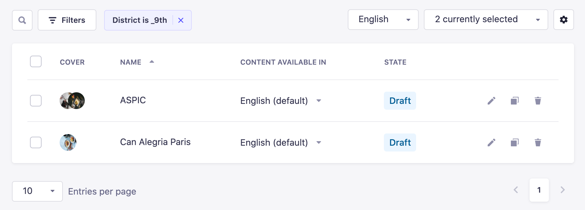
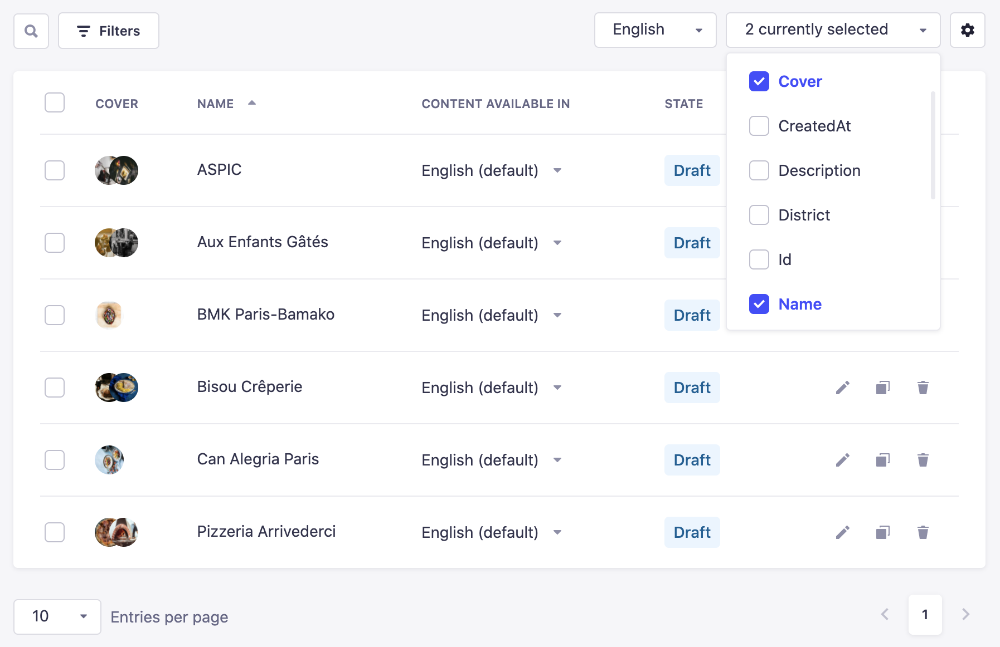

# Introduction to the Content Manager

The Content Manager is a core plugin of Strapi. It is a feature that is always activated by default and cannot be deleted. It is accessible both when the application is in a development and production environment.

The Content Manager is divided into 2 categories, both displayed in the main navigation: _Collection types_ and _Single types_. Each category contains the available collection and single content-types, which were created beforehand using the Content-Types Builder. From these 2 categories, administrators can create, manage, and publish content.

::: tip 💡 TIP
Click the search icon <Fa-Search /> in the main navigation to use a text search and find one of your content types more quickly!
:::

## Collection types

The _Collection types_ category of the Content Manager displays the list of available collection types which are directly accessible from the main navigation of the admin panel.

For each available collection type multiple entries can be created which is why each collection type is divided into 2 interfaces: the list view and the edit view (see [Writing content](writing-content.md)).

The list view of a collection type displays all entries created for that collection type.

From the list view, it is possible to:

- make a textual search (1) or set filters (2) to find specific entries,
- create a new entry (3),
- configure the fields displayed in the table of the list view (4).

::: tip 💡 TIP
Sorting can be enabled for any field displayed in the list view table (see [Configuring view of content type](../content-manager/configuring-view-of-content-type.md)). Click on a field name, in the header of the table, to sort on that field.
:::

### Filtering entries

Right above the list view table, on the left side of the interface, a **Filters** button is displayed. It allows to set one or more condition-based filters, which add to one another (i.e. if you set several conditions, only the entries that match all the conditions will be displayed).

To set a new filter:

1. Click on the **Filters** button.
2. Click on the 1st drop-down list to choose the field on which the condition will be applied.
3. Click on the 2nd drop-down list to choose the type of condition to apply.
4. Enter the value of the condition in the 3rd box.
5. (optional) Click on the add button  to add another condition-based filter.
6. Click on the **Apply** button.

::: tip NOTE
When active, filters are displayed next to the **Filters** button. They can be removed by clicking on the delete icon .
:::

### Creating a new entry

On the top right side of the list view interface, an **Add New [collection type name]** button is displayed. It allows to create a new entry for your collection type.

Clicking on the new entry button will redirect you to the edit view, where you will be able to write the content of the new entry (see [Writing content](writing-content.md)).

::: warning IMPORTANT
New entries are only considered created once some of their content has been written and saved once. Only then will the new entry be listed in the list view.
:::

### Configuring the table fields

Right above the list view table, on the right side of the interface, a settings button <Fa-Cog /> is displayed. It allows to access the configurations that can be set for the list view of your collection type (see [Configuring view of content type](../content-manager/configuring-view-of-content-type.md)), and to choose which fields to display in the table.

::: tip NOTE
Configuring the displayed field of the table in the way detailed below is only temporary: the configurations will be reset as soon as the page is refreshed or when navigating the admin panel outside the Content Manager. For permanent configurations, please refer to [Configuring view of content type](../content-manager/configuring-view-of-content-type.md).
:::

To temporarily configure the fields displayed in the table:

1. Click on the settings button <Fa-Cog />.
2. In the Displayed Fields section, tick the boxes associated with the field you want to be displayed in the table.
3. Untick the boxes associated with the fields you do not want to be displayed in the table.

::: tip NOTE
Relational fields can also be displayed in the list view. Please refer to [Configuring view of content type](../content-manager/configuring-view-of-content-type.md) for more information on their specificities.

:::

## Single types

The _Single types_ category of the Content Manager displays the list of available single types, which are directly accessible from the main navigation of the admin panel.

Unlike collection types which have multiple entries, single types are not created for multiple uses. In other words, there can only be one default entry per available single type. There is therefore no list view in the Single types category.

Clicking on a single type will directly redirect you to the edit view, where you will be able to write the content of your single type (see [Writing content](writing-content.md)).

