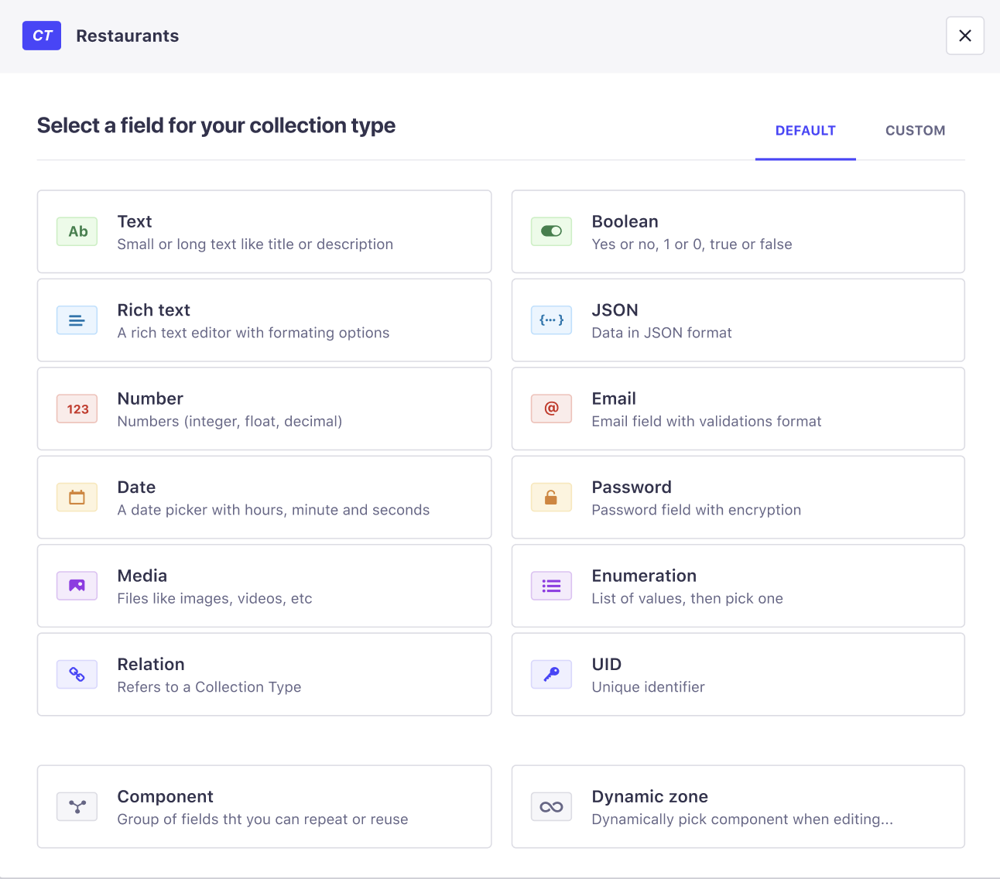

# Configuring fields for content types

::: warning IMPORTANT
The Content-Types Builder is only accessible when your Strapi application is in a development environment.
:::

Content-types are composed of one or several fields. Each field is designed to contain specific kind of data, filled up in the Content Manager (see [Writing content](/latest/content-manager/writing-content)).

In the Content-Types Builder, fields can be added at the creation of a new content-type or component, or afterward when a content-type or component is edited or updated. The following documentation lists all existing regular fields but also tackles the specificities of components and dynamic zones. For each, you will find a definition, explanation of the form they take once in the Content Manager, and instructions to configure them.

::: tip NOTE
Depending on what content-type or component is being created or edited, not all fields -including components and dynamic zones- are always available. 
:::

## Regular fields

###  Text

The Text field displays a textbox that can contain small text. This field can be used for titles, descriptions, etc.

:::: tabs

::: tab Base settings

| Setting name | Instructions                                                                                            |
|--------------|---------------------------------------------------------------------------------------------------------|
| Name         | Write the name of the Text field.                                                                       |
| Type         | Choose between *Short text* and *Long text*, to allow more or less space to fill up the Text field.     |

:::

::: tab Advanced settings

| Setting name   | Instructions                                                                  |
|----------------|-------------------------------------------------------------------------------|
| Default value  | Write the default value of the Text field.                                    |
| RegExp pattern | Write a regular expression to make sure the value of the Text field matches a specific format. |
| Private field  | Tick to make the field private and prevent it from being found via the API.   |
| Required field | Tick to prevent creating or saving an entry if the field is not filled in.    |
| Unique field   | Tick to prevent another field to be identical to this one.                    |
| Maximum length | Tick to define a maximum number of characters allowed.                        |
| Minimum length | Tick to define a minimum number of characters allowed.                        |

:::

::::

###  Rich Text

The Rich Text field displays an editor with formatting options to manage rich text. This field can be used for long written content.

:::: tabs

::: tab Base settings

| Setting name | Instructions                           |
|--------------|----------------------------------------|
| Name         | Write the name of the Rich Text field. |

:::

::: tab Advanced settings

| Setting name   | Instructions                                                                |
|----------------|-----------------------------------------------------------------------------|
| Default value  | Write the default value of the Rich Text field.                             |
| Private field  | Tick to make the field private and prevent it from being found via the API. |
| Required field | Tick to prevent creating or saving an entry if the field is not filled in.  |
| Maximum length | Tick to define a maximum number of characters allowed.                      |
| Minimum length | Tick to define a minimum number of characters allowed.                      |

:::

::::

###  Number

The Number field displays a field for any kind of number: integer, decimal and float.

:::: tabs

::: tab Base settings

| Setting name  | Instructions                                                    |
|---------------|-----------------------------------------------------------------|
| Name          | Write the name of the Number field.                             |
| Number format | Choose between *integer*, *big integer*, *decimal* and *float*. |

:::

::: tab Advanced settings

| Setting name   | Instructions                                                                |
|----------------|-----------------------------------------------------------------------------|
| Default value  | Write the default value of the Number field.                                |
| Private field  | Tick to make the field private and prevent it from being found via the API. |
| Required field | Tick to prevent creating or saving an entry if the field is not filled in.  |
| Unique field   | Tick to prevent another field to be identical to this one.                  |
| Maximum length | Tick to define a maximum number of characters allowed.                      |
| Minimum length | Tick to define a minimum number of characters allowed.                      |

:::

::::

###  Date

The Date field can display a date (year, month, day), time (hour, minute, second) or datetime picker.

:::: tabs

::: tab Base settings

| Setting name  | Instructions                                                    |
|---------------|-----------------------------------------------------------------|
| Name          | Write the name of the Date field.                               |
| Type          | Choose between *date*, *datetime* and *time*                    |

:::

::: tab Advanced settings

| Setting name   | Instructions                                                                |
|----------------|-----------------------------------------------------------------------------|
| Default value  | Write the default value of the Date field.                                  |
| Private field  | Tick to make the field private and prevent it from being found via the API. |
| Required field | Tick to prevent creating or saving an entry if the field is not filled in.  |
| Unique field   | Tick to prevent another field to be identical to this one.                  |

:::

::::

###  Boolean

The Boolean field displays a toggle button to manage boolean values (e.g. Yes or No, 1 or 0, True or False).

:::: tabs

::: tab Base settings

| Setting name  | Instructions                                                    |
|---------------|-----------------------------------------------------------------|
| Name          | Write the name of the Boolean field.                            |

:::

::: tab Advanced settings

| Setting name   | Instructions                                                                |
|----------------|-----------------------------------------------------------------------------|
| Default value  | Write the default value of the Boolean field.                               |
| Private field  | Tick to make the field private and prevent it from being found via the API. |
| Required field | Tick to prevent creating or saving an entry if the field is not filled in.  |
| Unique field   | Tick to prevent another field to be identical to this one.                  |

:::

::::

###  Relation

The Relation field allows to establish a relation with another content-type, that must be a collection type.

There are 6 different types of relations:

- Content-type A *has one* Content-type B
- Content-type A *has and belong to one* Content-type B
- Content-type A *belongs to many* Content-type B
- Content-type B *has many* Content-type A
- Content-type A *has and belongs to many* Content-type B
- Content-type A *has many* Content-type B

:::: tabs

::: tab Base settings

Configuring the base settings of the Relation field consists in choosing with which existing content-type the relation should be established and the kind of relation. The edition window of the Relation field displays 2 grey boxes, each representing one of the content-types in relation. Between the grey boxes are displayed all possible relation types.

1. (optional) Choose the *Field name* of the content-type A. <!--- More info needed on that --->
2. Click on the icon representing the relation to establish between the content-types.
3. Click on the 2nd grey box to define the content-type B. It must be an already created collection type.
4. (optional) Choose de *Field name* of the content-type B. <!--- More info needed on that --->

:::

::: tab Advanced settings

| Setting name   | Instructions                                                                |
|----------------|-----------------------------------------------------------------------------|
| Private field  | Tick to make the field private and prevent it from being found via the API. |
| Unique field   | Tick to prevent another field to be identical to this one.                  |
| Custom column names | Rename the columns corresponding to the relational fields to make it more comprehensive API-wise. <!--- Confirmation needed on this setting ---> |

:::

:::: 

###  Email

The Email field displays an email address field with format validation to ensure the email address is valid.

:::: tabs

::: tab Base settings

| Setting name  | Instructions                                                    |
|---------------|-----------------------------------------------------------------|
| Name          | Write the name of the Email field.                              |

:::

::: tab Advanced settings

| Setting name   | Instructions                                                                |
|----------------|-----------------------------------------------------------------------------|
| Default value  | Write the default value of the Email field.                                 |
| Private field  | Tick to make the field private and prevent it from being found via the API. |
| Required field | Tick to prevent creating or saving an entry if the field is not filled in.  |
| Unique field   | Tick to prevent another field to be identical to this one.                  |
| Maximum length | Tick to define a maximum number of characters allowed.                      |
| Minimum length | Tick to define a minimum number of characters allowed.                      |

:::

::::

###  Password

The Password field displays a password field that is encrypted.

:::: tabs

::: tab Base settings

| Setting name  | Instructions                                                    |
|---------------|-----------------------------------------------------------------|
| Name          | Write the name of the Password field.                           |

:::

::: tab Advanced settings

| Setting name   | Instructions                                                                |
|----------------|-----------------------------------------------------------------------------|
| Default value  | Write the default value of the Password field.                              |
| Private field  | Tick to make the field private and prevent it from being found via the API. |
| Required field | Tick to prevent creating or saving an entry if the field is not filled in.  |
| Unique field   | Tick to prevent another field to be identical to this one.                  |
| Maximum length | Tick to define a maximum number of characters allowed.                      |
| Minimum length | Tick to define a minimum number of characters allowed.                      |

:::

::::

###  Enumeration

The Enumeration field allows to configure a list of values displayed in a drop-down list.

:::: tabs

::: tab Base settings

| Setting name  | Instructions                                                    |
|---------------|-----------------------------------------------------------------|
| Name          | Write the name of the Enumeration field.                        |
| Values        | Write the values of the enumeration, one per line.              |

:::

::: tab Advanced settings

| Setting name   | Instructions                                                                |
|----------------|-----------------------------------------------------------------------------|
| Default value  | Write the default value of the Enumeration field.                           |
| Name override for GraphQL  |  <!--- Info needed on this setting --->                                                               |
| Private field  | Tick to make the field private and prevent it from being found via the API. |
| Required field | Tick to prevent creating or saving an entry if the field is not filled in.  |
| Unique field   | Tick to prevent another field to be identical to this one.                  |

:::

::::

###  Media

The Media field allows to choose one or more media files (e.g. image, video) from those uploaded in the Media Library of the application.

:::: tabs

::: tab Base settings

| Setting name  | Instructions                                                    |
|---------------|-----------------------------------------------------------------|
| Name          | Write the name of the Media field.                              |
| Type          | Choose between *Multiple media* to allow multiple media uploads, and *Single media* to only allow one media upload. |

:::

::: tab Advanced settings

| Setting name   | Instructions                                                                |
|----------------|-----------------------------------------------------------------------------|
| Private field  | Tick to make the field private and prevent it from being found via the API. |
| Required field | Tick to prevent creating or saving an entry if the field is not filled in.  |
| Unique field   | Tick to prevent another field to be identical to this one.                  |
| Select allowed types of media  | Click on the drop-down list to untick media types not allowed for this field. |

:::

::::

###  JSON

The JSON field allows to configure data in a JSON format, to store JSON objects or arrays.

:::: tabs

::: tab Base settings

| Setting name  | Instructions                                                    |
|---------------|-----------------------------------------------------------------|
| Name          | Write the name of the JSON field.                               |

:::

::: tab Advanced settings

| Setting name   | Instructions                                                                |
|----------------|-----------------------------------------------------------------------------|
| Private field  | Tick to make the field private and prevent it from being found via the API. |
| Required field | Tick to prevent creating or saving an entry if the field is not filled in.  |
| Unique field   | Tick to prevent another field to be identical to this one.                  |
| Maximum length | Tick to define a maximum number of characters allowed.                      |
| Minimum length | Tick to define a minimum number of characters allowed.                      |

:::

::::

###  UID

The UID field displays a field that sets a unique identifier, optionally based on an existing other field from the same content-type.

:::: tabs

::: tab Base settings

| Setting name   | Instructions                                                    |
|----------------|-----------------------------------------------------------------|
| Name           | Write the name of the UID field. It must not contain special characters or spaces.                     |
| Attached field | Choose what existing field to attach to the UID field. Choose *None* to not attach any specific field. |

:::

::: tab Advanced settings

| Setting name   | Instructions                                                                |
|----------------|-----------------------------------------------------------------------------|
| Default value  | Write the default value of the UID field.                                   |
| Private field  | Tick to make the field private and prevent it from being found via the API. |
| Required field | Tick to prevent creating or saving an entry if the field is not filled in.  |
| Maximum length | Tick to define a maximum number of characters allowed.                      |
| Minimum length | Tick to define a minimum number of characters allowed.                      |

:::

::::

## Dynamic zones & Components

Dynamic zones are a combination of components, while the latter are a combination of several fields. Dynamic zones can only be added to content-types whereas components can be added to content-types but also nested into another component.

When adding a dynamic zone to a content-type through the Content-Types Builder, the configuration requires:

1. Writing the name of the dynamic zone.
2. Configuring the components of the dynamic zone.

When configuring a component through the Content-Types Builder, it is possible to either:

- create a new component by clicking on *Create a new component* (see [Creating a new component](/user-docs/latest/content-types-builder/creating-new-content-type.html#creating-a-new-component)),
- or use an existing one by clicking on *Use an existing component*. 

:::: tabs

::: tab Base settings

| Setting name       | Instructions                                                    |
|--------------------|-----------------------------------------------------------------|
| Name               | Write the name of the component for the content-type.           |
| Select a component | When using an existing component only - Select from the drop-down list an existing component. |
| Type               | Choose between *Repeatable component* to be able to use several times the component for the content-type, or *Single component* to limit to only one time the use of the component. |

:::

::: tab Advanced settings

| Setting name   | Instructions                                                                            |
|----------------|-----------------------------------------------------------------------------------------|
| Required field | Tick to prevent creating or saving an entry if the field is not filled in.              |
| Maximum length | For repeatable components only - Tick to define a maximum number of characters allowed. |
| Minimum length | For repeatable components only - Tick to define a minimum number of characters allowed. |

:::

::::
