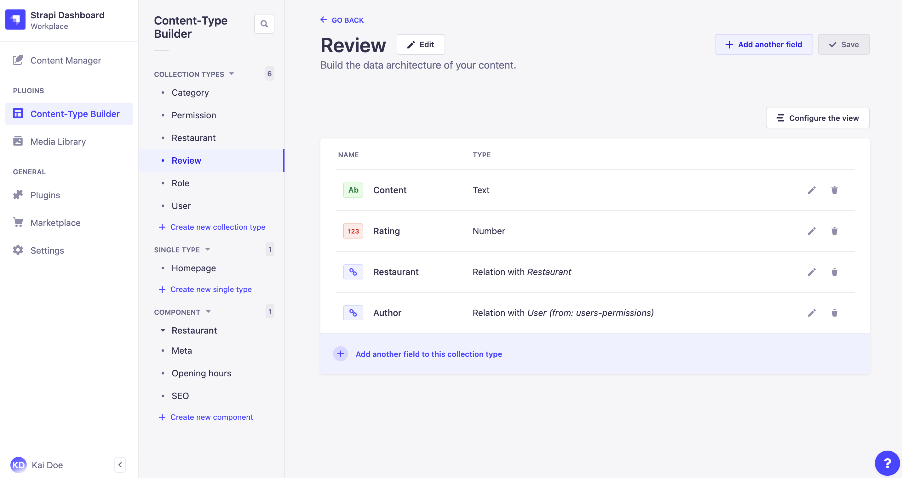

# Introduction to the Content-Types Builder

The Content-Types Builder is a core plugin of Strapi. It is a feature that is always activated by default and cannot be deleted. The Content-Types Builder is however only accessible when the application is in a development environment.

Administrators can access the Content-Types Builder from _Plugins > Content-Types Builder_ in the main navigation of the admin panel.

From the Content-Types Builder, administrators can create and manage content-types: collection types and single types but also components.

- Collection types are content-types that can manage several entries.
- Single types are content-types that can only manage one entry.
- Components are a data structure that can be used in multiple collection types and single types.

All 3 are displayed as categories in the left side of the Content-Types Builder interface. In each category are listed all content-types and components that have already been created.

From each category of the Content-Types Builder, it is possible to:

- click on an existing content-type or component to access it and edit it (see [Managing content-types](/user-docs/latest/content-types-builder/managing-content-types.md)),
- or create a new content-type or component (see [Creating content-types](/user-docs/latest/content-types-builder/creating-new-content-type.md)).

::: tip TIP
Click the search icon <Fa-Search /> of any category to find a specific collection type, single type, or component.
:::
