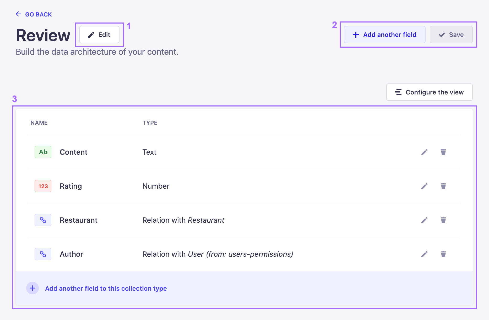

# Managing content-types

::: warning IMPORTANT
The Content-Types Builder is only accessible when your Strapi application is in a development environment.
:::

The Content-Types Builder allows to manage any existing content-type or component, even if it is already being used in the Content Manager. They can only be managed one at a time.

To manage a content-type or a component, click on its name in the Collection Types, Single Types or Components category.

## Editing content-types

Managing a content-type or component can include editing the general settings and the fields, but also deleting the whole content-type or component. For any chosen content-type of component, the right side of the Content-Types Builder interface displays all available editing options.

- Next to the name and optional description of the content-type or component, an edit button <Fa-PencilAlt />  (1) allows to access the general settings of the content-type or component.
- In the top right corner, **Cancel** and **Save** buttons (2) allow to respectively cancel or save any ongoing modification.
- Below the previous editing options, a table (3) lists all the fields created and configured for the content-type or component. From the fields table, it is possible to:
  - Click on the edit button <Fa-PencilAlt /> to edit a field
  - Click on the trash button <Fa-TrashAlt /> to delete a field
  - Click on the **Add another field** button to add another field to the content-type or component (see [Configuring fields for content-types](/user-docs/latest/content-types-builder/configuring-fields-content-type))
  - Click on the **Configure the view** button to access the view configuration interface (see [Configuring the edit view](/user-docs/latest/content-manager/configuring-view-of-content-type#configuring-the-edit-view))

## Deleting content-types

Content types and components can be deleted through the Content-Types Builder. Deleting a content-type automatically deletes all entries from the Content Manager that were based on that content-type. The same goes for the deletion of a component, which is automatically deleted from every content-type or entry where it was used.

To delete a content-type or component:

1. In the Content-Types Builder navigation, click on the name of the content-type or component to delete.
2. In the edition interface of the chosen content-type or component, click on the edit button <Fa-PencilAlt /> on the right side of the content-type's or component's name.
3. In the edition window, click on the **Delete** button.
4. In the confirmation window, confirm the deletion.

