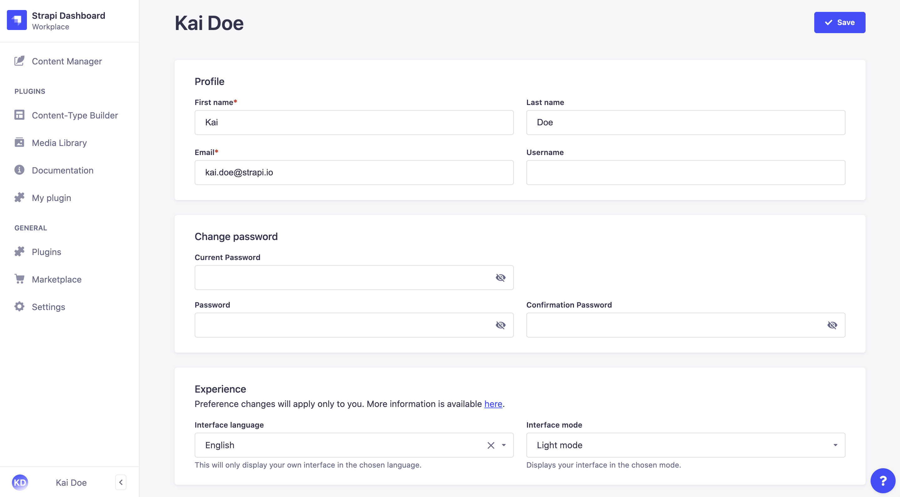

# Welcome to the Strapi User Guide!

This user guide contains the functional documentation for all Strapi admin panel features.

Keep the following in mind as you explore this guide:

- **Feature Availability in Different Environments**   Some features can only be used in certain environments – for example, the Content Types Builder is only available in the Development environment. Check the introduction in each feature section for its environment availability.

- **Strapi Versions**   We recommend always using the latest version of Strapi to get access to updated features and brand new functionality. Since our documentation, including this guide, is updated to support the most recent release<!-- (see Update Strapi version or refer to our migration guides to update your Strapi application) -->, some information may no longer apply if you are using an older version of Strapi.

- **License and Pricing Plans**   Four versions of Strapi are available – the Community Edition and three Enterprise Editions: Bronze, Silver, and Gold (see [Pricing and Plans](https://strapi.io/pricing-self-hosted)). Badges next to section titles indicate which plans can access which features  (e.g., <BronzeBadge withLinkIcon link="https://strapi.io/pricing-self-hosted" /> <SilverBadge withLinkIcon link="https://strapi.io/pricing-self-hosted" /> <GoldBadge withLinkIcon link="https://strapi.io/pricing-self-hosted" />).

- **Roles and Permissions**   Roles and permissions determine who can access what features in Strapi. All features and possible options are documented in this guide but, depending on your role and permissions, you may not have access to them. Please contact your Strapi Super Admin if you can’t access a feature that you think you should be able to use.

Good luck, and welcome!

## Accessing the admin panel

The admin panel is the back office of your Strapi application. From the admin panel, you will be able to manage content types, and write their actual content. It is also from the admin panel that you will manage users, both administrators and end-users of your Strapi application.

::: caution
In order to access the admin panel, your Strapi application must be launched<!-- (see Installing Strapi) -->, and you must be aware of the URL to its admin panel (e.g. `api.example.com/admin`).
:::

To access the admin panel:

1. Go to the URL of your Strapi application's admin panel.
2. Enter your credentials to log in.
3. Click on the **Log in** button. You should be redirected to the homepage of the admin panel.

### Using SSO for authentication <GoldBadge withLinkIcon link="https://strapi.io/pricing-self-hosted" />

If your Strapi application was configured to allow authentication through SSO (see [Configuring Single Sign-On](../settings/managing-global-settings.md)), you can access the admin panel using a specific provider instead of logging in with a regular Strapi administrator account.

To do so, in the login page of your Strapi application, click on a chosen provider. If you cannot see your provider, click the  button to access the full list of all available providers. You will be redirected to your provider's own login page where you will be able to authenticate.

## Setting up your administrator profile

If you are a new administrator, we recommend making sure your profile is all set, before diving into your Strapi application. From your administrator profile, you are able to modify your user information, such as name, username, email or password.

To modify your user information:

1. Click on your user name in the top right hand corner of the admin panel.
2. In the drop-down menu, click on **Profile**.
3. Modify the information of your choice:

| User information      | Instructions                                                                                            |
| --------------------- | ------------------------------------------------------------------------------------------------------- |
| First name            | Write your first name in the textbox.                                                                   |
| Last name             | Write your last name in the textbox.                                                                    |
| Email                 | Write your complete email address in the textbox.                                                       |
| Username              | (optional) Write a username in the textbox.                                                             |
| Password              | Write a new password in the textbox. You can click on the eye icon for the password to be shown.        |
| Confirmation password | Write the same new password in the textbox. You can click on the eye icon for the password to be shown. |

4. Click on the **Save** button.

---

Congratulations on being a new Strapi user! You're now ready to discover all the features and options that Strapi has to offer!

::: strapi Welcome to the Strapi community!
If you have any trouble with your Strapi experience, you can reach us through [GitHub](https://github.com/strapi/) or our [forum](https://forum.strapi.io/)! The Strapi Community and Strapi team are always available to answer your questions or help you with anything!
:::
