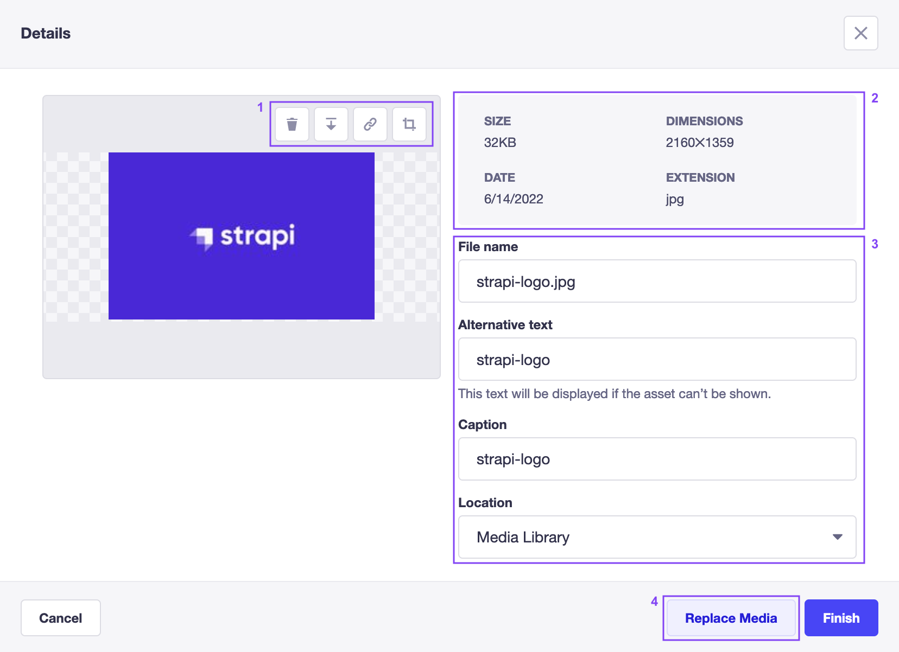

<!-- TODO: update SEO -->

# Managing individual assets

The Media Library allows to manage individual assets, which includes modifying the asset's file details and location, downloading and copying the link to the asset file, and deleting the asset. Image files can also be cropped. To manage an asset, click on its  **Edit** button.

## Editing assets

Clicking on the  **Edit** button of an asset opens up a "Details" window, with all the available options.

<!-- TODO: improve/replace screenshot -->

- On the left, above the preview of the asset, control buttons (1) allow to perform various actions:
  <!-- TODO: fix icons -->
  - click on the Delete button  to delete the asset,
  - click on the Download button  to download the asset,
  - click on the Copy link button  to copy the asset's link to the clipboard,
  - optionally, click on the Crop button  to enter cropping mode for the image (see [cropping images](#cropping-images)).
- On the right, meta data for the asset is displayed at the top of the window (2) and the fields below can be used to update the _File name_, _Alternative text_, _Caption_ and _Asset location_ (see [organizing assets with folders](/user-docs/latest/media-library/organizing-assets-with-folders.md)) for the asset (3).
- At the bottom, the **Replace Media** button (4) can be used to replace the asset file but keep the existing content of the other editable fields, and the **Finish** button is used to confirm any updates to the fields.

## Moving assets

An individual asset can be moved to a folder when editing the asset's details.

To move an asset:

1. Click on the  **Edit** button for the asset to be moved.
2. On the window that pops up, click the _Asset location_ field and choose a different folder from the drop-down list.
3. Click **Finish** to confirm.

<!-- ? is the button named Finish or Save ? -->

::: note
Assets can also be moved to other folders from the main view of the Media Library (see [organizing assets with folders](/user-docs/latest/media-library/organizing-assets-with-folders.md#moving-assets-to-a-folder)).
:::

## Deleting assets

Assets can be deleted when editing the asset's details.

To delete an asset:

1. Click on the  **Edit** button for the asset to be deleted.
2. On the window that pops up, click the Delete icon  in the control buttons bar above the asset's preview.
3. Click **Confirm**.

::: tip
Assets can also be deleted individually or in bulk from the main view of the Media Library. Select assets by clicking on their checkbox in the top left corner, then click the Delete icon  at the top of the window, below the filters and sorting options.
:::

## Cropping images

