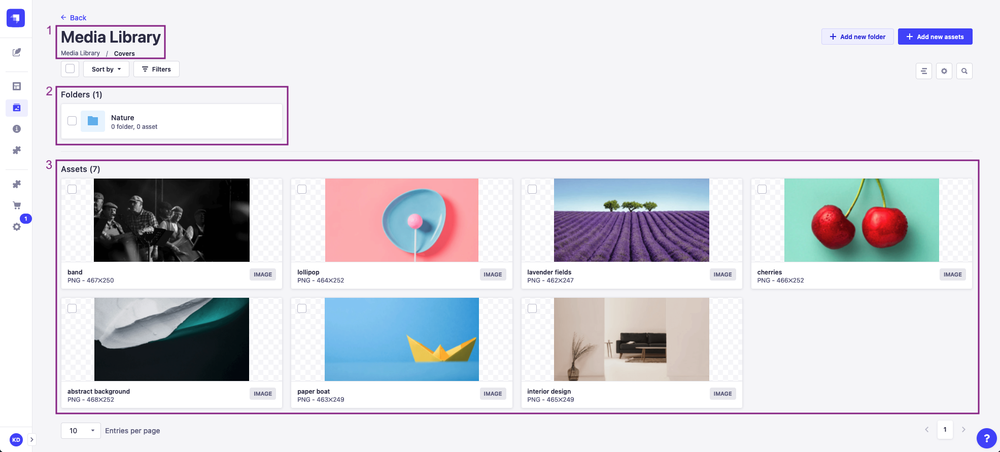

# Organizing assets with folders

Folders in the Media Library help you organize uploaded assets. Folders sit at the top of the Media Library view or are accessible from the Media field popup when using the [Content Manager](/user-docs/latest/content-manager/writing-content.md).

From the Media Library, it is possible to view the list of folders and browse a folder's content, create new folders, edit an existing folder, move assets to a folder, and delete a folder.

::: note
Folders follow the permission system of assets (see [Users, Roles & Permissions](/user-docs/latest/users-roles-permissions/introduction-to-users-roles-permissions.md)). It is not yet possible to define specific permissions for a folder.
:::

## Browsing folders

By default, the Media Library displays folders and assets created at the root level. Clicking a folder navigates to this folder, and displays the following elements:

- the folder title and breadcrumbs to navigate to a parent folder (1)
- the subfolders (2) the current folder contains
- all assets (3) from this folder

From this dedicated folder view, folders and assets can be managed, filtered, sorted and searched just like from the main Media Library (see [introduction to Media Library](/user-docs/latest/media-library/introduction-to-media-library.md)).

To navigate back to the parent folder, one level up, use the **Back** button at the top of the interface.

::: tip
The breadcrumb navigation can also be used to go back to a parent folder: click on a folder name to directly jump to it or click on the 3 dots `...` and select a parent folder from the drop-down list.
:::

## Adding folders

To create a new folder in the Media Library:

1. Click on **Add new folder** in the upper right of the Media Library interface.
2. In the window that pops up, type a name for the new folder in the _Name_ field.
3. (optional) In the _Location_ drop-down list, choose a location for the new folder. The default location is the active folder.
4. Click **Create**.

::: note
There is no limit to how deep your folders hierarchy can go, but bear in mind it might take some effort to reach a deeply nested subfolder, as the Media Library currently has no visual hierarchy indication. Searching for files using the  on the right side of the user interface might be a faster alternative to finding the asset you are looking for.
:::

## Moving assets to a folder

Assets and folders can be moved to another folder from the root view of the Media Library or from any view for a dedicated folder.

To bulk move assets and folders to another folder:

1. Select assets and folder to be moved, by clicking the checkbox on the left of the folder name or clicking the asset itself.
2. Click the  **Move** button at the top of the interface.
3. In the _Move elements to_ pop-up window, select the new folder from the _Location_ drop-down list.
4. Click **Move**.

::: note
An individual asset can also be moved to a folder when [editing the asset](/user-docs/latest/media-library/managing-assets.md).
:::

## Editing folders

Once created, a folder can be renamed, moved or deleted. To manage a single folder:

1. In the Folders part of the Media library, hover the folder to be edited and click its edit button .
2. In the window that pops up, update the name and location with the _Name_ field and _Location_ drop-down list, respectively.
3. Click **Save**.

## Deleting folders

Deleting a folder can be done either from the list of folders of the Media Library, or when editing a single folder.

To delete a folder, from the Media Library:

1. Click the checkbox on the left of the folder name. Multiple folders can be selected.
2. Click the  **Delete** button above the Folders list.
3. In the _Confirmation_ dialog, click **Confirm**.

::: note
A single folder can also be deleted when editing it: hover the folder, click on its edit icon , and in the window that pops up, click the **Delete folder** button and confirm the deletion.
:::
