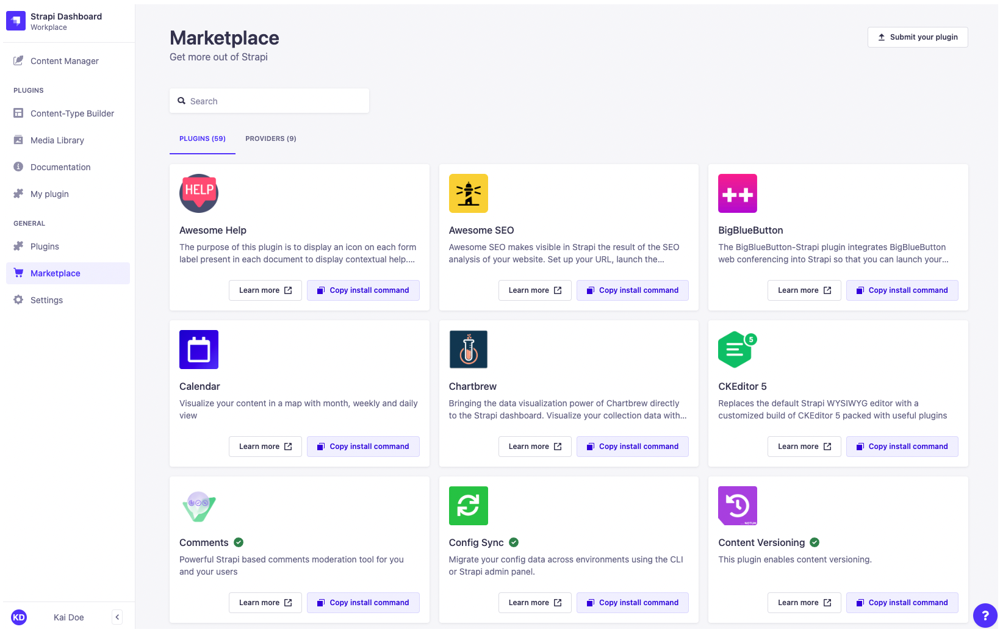

# Managing Marketplace plugins

The Marketplace is where users can find additional plugins to customize Strapi applications. The Marketplace is located in the admin panel, indicated by  _Marketplace_. In the Marketplace, users can browse or search for plugins, link to detailed plugin descriptions and submit new plugins. This documentation describes how to navigate the Marketplace and how to install Marketplace plugins.

 ::: strapi In-app Marketplace vs. Market website
The Marketplace in the admin panel only displays v4 plugins, but all plugins for all Strapi versions are discoverable in the [Strapi Market](https://market.strapi.io). Keep in mind that v3 and v4 plugins are not cross-compatible.
:::

Plugins are displayed on individual cards containing:

- the plugin name, sometimes followed by either of the following badges:
  -  to indicate the plugin is made by Strapi,
  -  to indicate the plugin was verified by Strapi.
- the plugin description
- a **Learn more** button for additional information, including detailed implementation instructions
- a **Copy install command** button to copy the plugin installation command to the local clipboard

In the top right corner of the Marketplace, the **Submit your plugin** button redirects to the Strapi Market where it is possible to submit your own plugin.

::: tip
The search bar displays incremental search results based on the plugin name and description.
:::

## Installing Marketplace plugins

To install a new plugin via the Marketplace:

1. Go to the  Marketplace.
2. Choose an available plugin and click on the **Copy install command** button.
3. Switch to your terminal and navigate to the Strapi application directory.
4. Paste and run the copied install command.
5. Follow any plugin-specific implementation instructions.

::: note
Marketplace plugins are installed and deleted from the user's terminal ([see Developer Documentation](/developer-docs/latest/developer-resources/cli/CLI.md)).
:::
