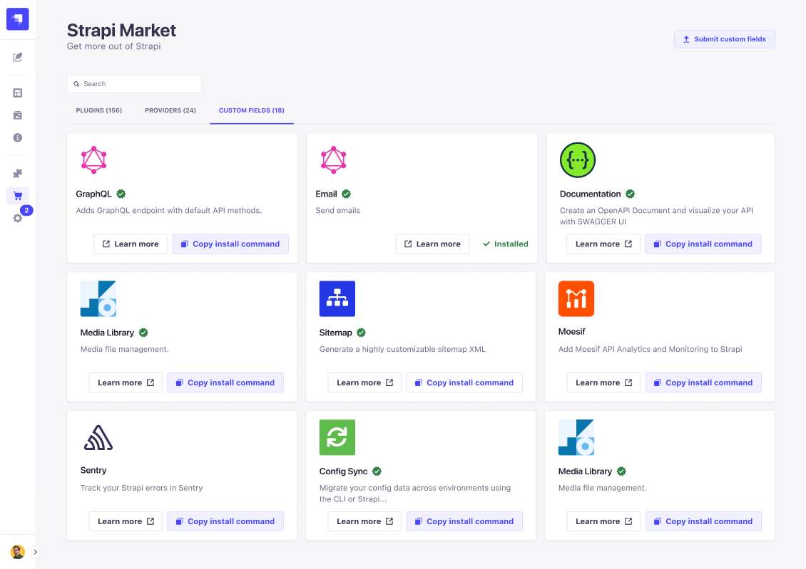

# Using the Marketplace

The Marketplace is where users can find additional plugins to customize Strapi applications, and additional [providers](./introduction-to-plugins.md#providers) to extend plugins. The Marketplace is located in the admin panel, indicated by  _Marketplace_. In the Marketplace, users can browse or search for plugins and providers, link to detailed descriptions for each, and submit new plugins and providers.

 ::: strapi In-app Marketplace vs. Market website
The Marketplace in the admin panel only displays v4 plugins, but all plugins for all Strapi versions are discoverable in the [Strapi Market](https://market.strapi.io).

Keep in mind that v3 and v4 plugins are not cross-compatible, but that providers are compatible both with v3 and v4 plugins.
:::

<!-- TODO: replace this Figma screenshot with an actual one while testing the feature -->

The Plugins, Providers and Custom Fields tabs display each package on individual cards containing:

- their name, sometimes followed by either of the following badges:
  -  to indicate it is made by Strapi,
  -  to indicate it was verified by Strapi.
- the description
- a **Learn more** button for additional information, including detailed implementation instructions
- a **Copy install command** button to copy the installation command to the local clipboard. For any installed plugins, providers, and custom fields, this button is replaced by an indicator that it is already installed.

<!-- ? does the text on the button change based on the tab (Submit your plugin/Submit your provider/Submit your custom field) ? -->
In the top right corner of the Marketplace, the **Submit your plugin** button redirects to the Strapi Market where it is possible to submit your own plugin and provider.

::: tip
The search bar displays incremental search results based on the plugin/provider/custom field name and description.
:::

## Installing Marketplace plugins and providers

::: note
Marketplace plugins, providers and custom fields are installed and deleted from the user's terminal ([see Developer Documentation](/developer-docs/latest/developer-resources/cli/CLI.md#strapi-install)).
:::

To install a new plugin, provider or custom field via the Marketplace:

1. Go to the  Marketplace.
2. Choose the **Plugins** tab to browse available plugins, the **Providers** tab to browse available providers, or the **Custom Fields** tab to browse available custom fields.
3. Choose an available plugin/provider/custom field and click on the **Copy install command** button.
4. Switch to your terminal and navigate to the Strapi application directory.
5. Paste and run the copied install command.
6. Follow any plugin/provider/custom field-specific implementation instructions.
