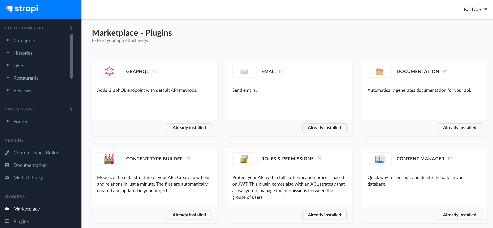

# Installing plugins via the Marketplace

The Marketplace is a section of the admin panel that lists all plugins that can be installed in a Strapi application. The Marketplace is accessible from _General > Marketplace_ in the main navigation of the admin panel.

::: note
Plugins can also be installed via the Command Line Interface (see [Developer Documentation](/developer-docs/latest/developer-resources/cli/CLI.md#strapi-install)).
:::

The Marketplace displays each available plugin in a box, which contains:
- the name of the plugin,
- the description of the plugin,
- indications on the current status of the plugin:
   - "Compatible with your app": indicates that the plugin is not installed yet but can be installed on your Strapi application
   - "Already installed": indicates that the plugin is already installed and available in your Strapi application

::: tip
Click on the <Fa-ExternalLinkAlt /> icon next to the name of a plugin to be redirected to the plugin package in the Strapi GitHub repository.
:::

To install a new plugin via the Marketplace:

1. Go to *General > Marketplace*.
2. Among the available plugin, choose the one you wish to install.
3. Click on the **Download** button in the chosen plugin's box.