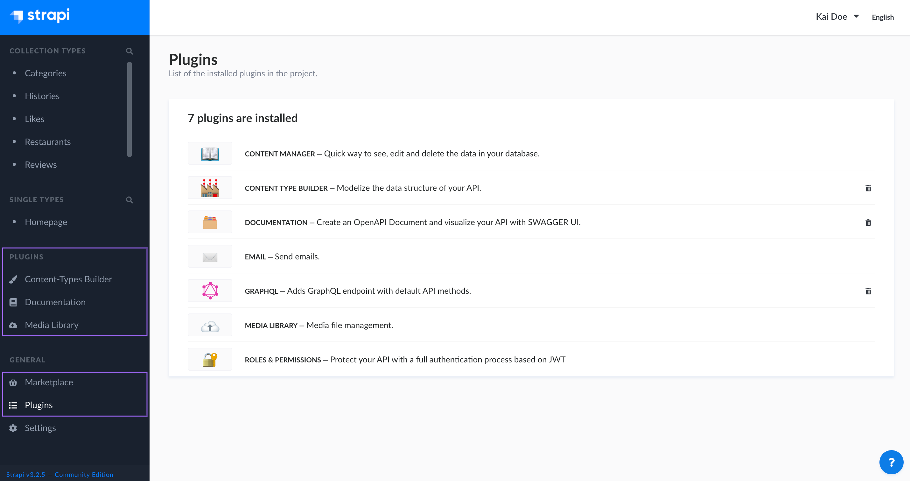

# Introduction to plugins

Strapi is built around different types of plugins. Every default Strapi application comes with the following pre-installed plugins:

* Content Manager (see [Introduction to the Content Manager](../content-manager/introduction-to-content-manager.md))
* Content Type Builder (see [Introduction to the Content-type Builder](../content-types-builder/introduction-to-content-types-builder.md))
* Email
* Media Library (implemented via the [Upload plugin](../../../developer-docs/latest/plugins/upload.md))
* Internationalization
* Roles and Permissions

These plugins are essential for your Strapi application to function and cannot be uninstalled.

Additional plugins that you can use to extend and customize your Strapi applications are available in the [Marketplace](../plugins/installing-plugins-via-marketplace.md). This section focuses on how to install and manage these additional plugins.

From the admin panel, administrators are allowed to:

- discover additional plugins and [providers](#providers) in the  _Marketplace_ (see [Managing Marketplace plugins](/user-docs/latest/plugins/installing-plugins-via-marketplace.md))
- review the currently installed plugins and [providers](#providers) in  _Plugins_

## Providers

Some plugins can be further extended through the configuration of _providers_, packages designed to be used on top of an existing plugin and add a specific integration to it. For example, you can use the AWS S3 provider to extend the Media Library plugin and store files in your S3 bucket rather than locally on your server.

Currently, the only plugins designed to work with providers are the:

* [Email plugin](/developer-docs/latest/plugins/email.md), and
* Media Library plugin (implemented via the [Upload plugin](/developer-docs/latest/plugins/upload.md)).

## Custom fields

Some plugins can add _custom fields_ to Strapi. Custom fields are a way to extend Strapi’s capabilities by adding new types of fields to content-types or components.

Once added to Strapi through plugins (see [Marketplace](/user-docs/latest/plugins/installing-plugins-via-marketplace.md)), custom fields can be added to content-types in the [Content-type Builder](/user-docs/latest/content-types-builder/configuring-fields-content-type.md#custom-fields) and used in the [Content Manager](/user-docs/latest/content-manager/writing-content.md).
