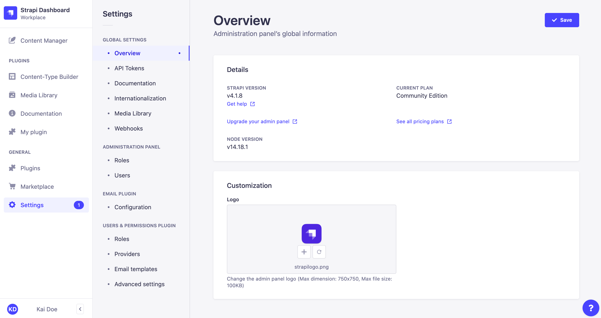
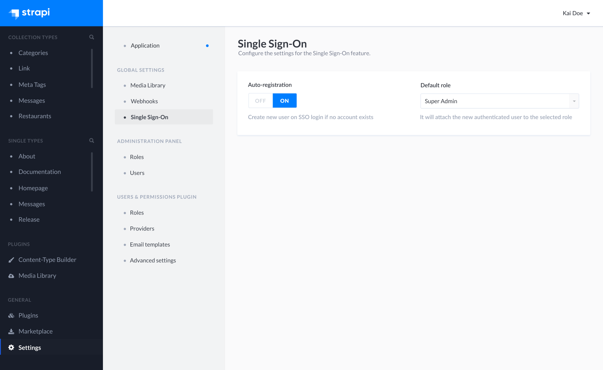
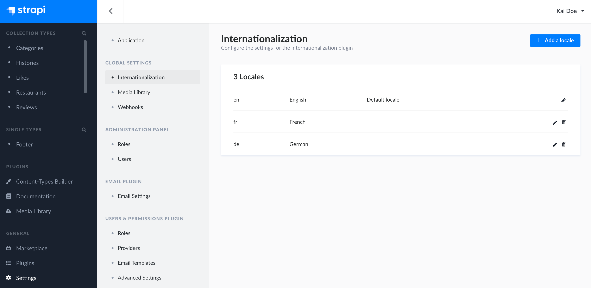
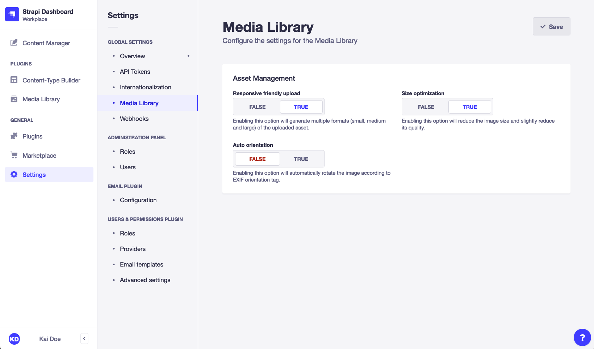
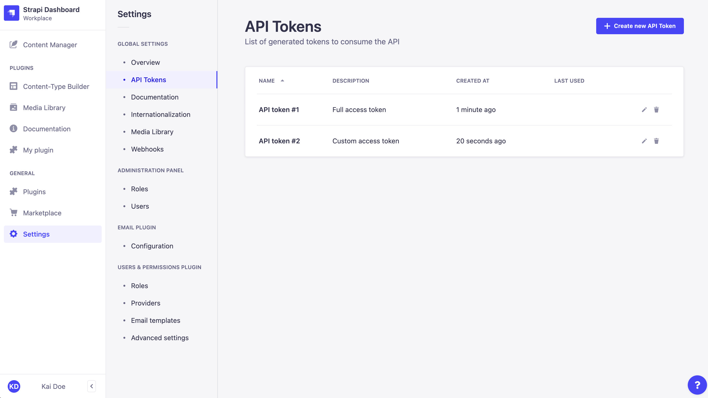
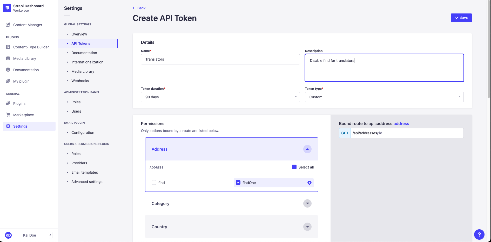
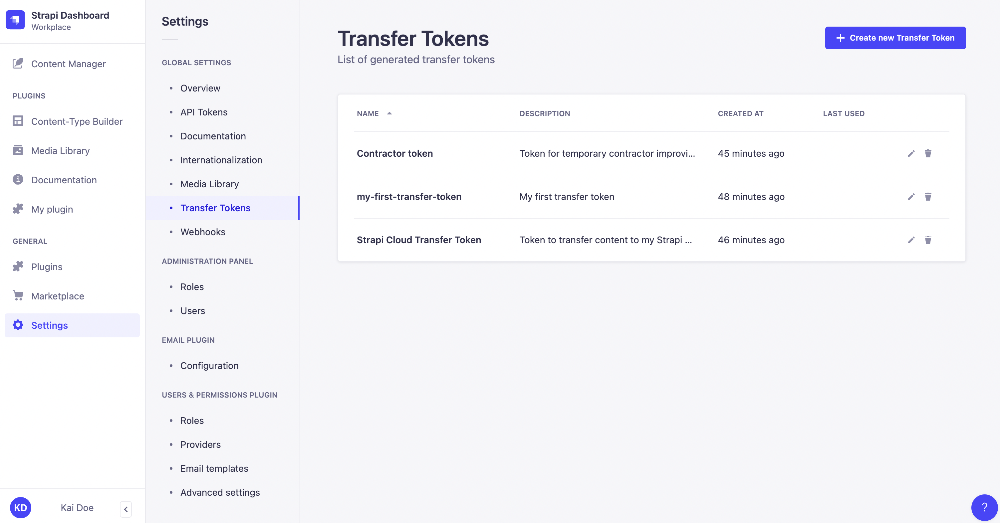
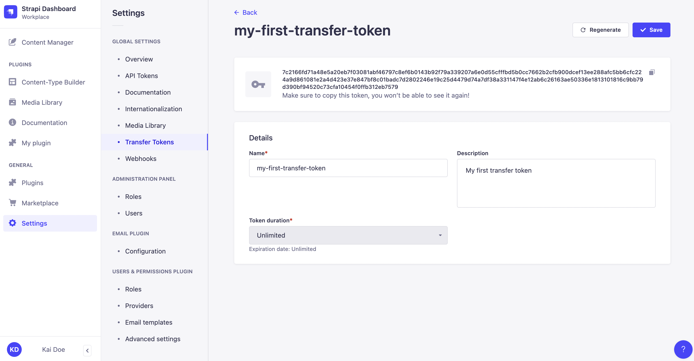

# Managing global settings

Global settings for plugins and features are managed from  *Settings* in the main navigation of the admin panel.

## Customizing the admin panel

The default Strapi logos, displayed in the main navigation of a Strapi application and the authentication pages, can be modified through the *Settings > Overview* sub-section of the admin panel.

::: note
Both logos can also be customized programmatically via the Strapi application's configuration files (see [Developer Documentation](/developer-docs/latest/development/admin-customization.md#logos)). However, the logos uploaded via the admin panel supersedes any logo set through the configuration files.
:::

To customize the logos:

1. Go to the *Global settings > Overview* sub-section of the settings interface.
2. Click on the upload area.
3. Upload your chosen logo, either by browsing files, drag & dropping the file in the right area, or by using a URL. The logo shouldn't be more than 750x750px. 
4. Click on the **Upload logo** button in the upload window.
5. Click on the **Save** button in the top right corner.

::: tip
Once uploaded, the new logo can be replaced with another one , or reset  with the default Strapi logo or the logo set in the configuration files.
:::

## Configuring Single Sign-On <GoldBadge withLinkIcon link="https://strapi.io/pricing-self-hosted" />

Single Sign-On (SSO) can be made available on a Strapi application to allow administrators to authenticate through an identity provider (e.g. Microsoft Azure Active Directory).

To configure the SSO feature settings:

1. Go to the *Global settings > Single Sign-On* sub-section of the settings interface.
2. Define your chosen new settings:

| Setting name      | Instructions                                                                                                                                                                                                                                                        |
| ----------------- | --------------------------------------------------------------------------------------------------------------------------------------------------------------------------------------------------------------------------------------------------------------------|
| Auto-registration | Click on **ON** to allow the automatic creation of a new Strapi administrator when an SSO login does not match an existing Strapi administrator account. If this setting is set on **OFF**, new Strapi administrators accounts must be created manually beforehand. |
| Default role      | Choose among the drop-down list the role to attribute by default to auto-registered Strapi administrators through SSO login.                                                                                                                                       |

3. Click the **Save** button.

## Configuring Internationalization locales

The [Internationalization plugin](/user-docs/latest/plugins/strapi-plugins.md#internationalization-plugin) allows to manage content in different languages, called "locales". Once the Internationalization plugin is installed in a Strapi application (see [Installing plugins via the Marketplace](../plugins/installing-plugins-via-marketplace.md)), administrators can manage locales from the *Global settings > Internationalization* sub-section of the settings interface.

The *Internationalization* settings sub-section displays a table listing all locales available for the Strapi application. By default, only the English locale is configured and set as the default locale. 

For each locale, the table displays the default ISO code of the locale, its optional display name and indicates if the locale is set as the default one. From the table, administrators can also:

- Click on the edit button  to edit a locale
- Click on the delete button  to delete a locale

### Adding a new locale

Administrators can add and manage as many locales as they want. There can however only be one locale set as the default one for the whole Strapi application.

::: note
It is not possible to create custom locales. Locales can only be created based on [the 500+ pre-created list of locales](https://github.com/strapi/strapi/blob/v4.0.0/packages/plugins/i18n/server/constants/iso-locales.json) set by Strapi.
:::

To add a new locale:

1. Click on the **Add new locale** button.
2. In the locale addition window, choose your new locale among the *Locales* drop-down list. The latter lists alphabetically all locales, displayed as their ISO code, that can be added to your Strapi application.
3. (optional) In the *Locale display name* textbox, write a new display name for your new locale.
4. (optional) In the Advanced settings tab, tick the *Set as default locale* setting to make your new locale the default one for your Strapi application.
5. Click on the **Save** button to confirm the addition of your new locale.

## Configuring the Media Library

The [Media Library](/user-docs/latest/media-library/introduction-to-media-library.md) displays all assets uploaded in the Strapi application. The Media Library settings allow controlling the format, file size, and orientation of uploaded assets.

To configure the Media Library settings:

1. Go to the *Global settings > Media Library* sub-section of the settings interface.
2. Define your chosen new settings:

    | Setting name               | Instructions                                                                                         | Default value |
    | -------------------------- | ---------------------------------------------------------------------------------------------------- |---------------|
    | Responsive friendly upload | Enabling this option will generate multiple formats (small, medium and large) of the uploaded asset. | True          |
    | Size optimization          | Enabling this option will reduce the image size and slightly reduce its quality.                     | True          |
    | Auto orientation           | Enabling this option will automatically rotate the image according to EXIF orientation tag.          | False         |

3. Click on the **Save** button.

## Managing API tokens

::: prerequisites
* Administrators can create, read, update, or delete API tokens only if proper permissions are granted (see [Configuring administrator roles](/user-docs/latest/users-roles-permissions/configuring-administrator-roles.md#plugins-and-settings)).
* The *Global settings > API Tokens* sub-section of the settings interface is accessible in the admin panel only if the _API tokens > Read_ permission is granted.
:::

API tokens allow users to authenticate REST and GraphQL API queries (see [Developer Documentation](/developer-docs/latest/setup-deployment-guides/configurations/optional/api-tokens.md)). Administrators can manage API tokens through the *Global settings > API Tokens* sub-section of the settings interface.

The *API Tokens* settings sub-section displays a table listing all of the created API tokens.

The table displays each API token's name, description, date of creation, and date of last use. From the table, administrators can also:

- Click on the edit button <!-- icon --> to edit an API token's name, description, type, duration or [regenerate the token](#regenerating-an-api-token).
- Click on the delete button <!-- icon --> to delete an API token.

### Creating a new API token

To create a new API token:

1. Click on the **Create new API Token** button.
2. In the API token edition interface, configure the new API token:

    | Setting name   | Instructions                                                             |
    | -------------- | ------------------------------------------------------------------------ |
    | Name           | Write the name of the API token.                                         |
    | Description    | (optional) Write a description for the API token.                        |
    | Token duration | Choose a token duration: *7 days*, *30 days*, *90 days*, or *Unlimited*. |
    | Token type     | Choose a token type: *Read-only*, *Full access*, or *Custom*.            |

3. (optional) For the *Custom* token type, define specific permissions for your API endpoints by clicking on the content-type name and using checkboxes to enable or disable permissions.
4. Click on the **Save** button. The new API token will be displayed at the top of the interface, along with a copy button <!-- icon -->.

    

::: caution
For security reasons, API tokens are only shown right after they have been created. When refreshing the page or navigating elsewhere in the admin panel, the newly created API token will be hidden and will not be displayed again.
:::

### Regenerating an API token

To regenerate an API token:

1. Click on the API token's edit button.
2. Click on the **Regenerate** button.
3. Click on the **Regenerate** button to confirm in the dialog.
4. Copy the new API token displayed at the top of the interface.

## Managing transfer tokens <BetaBadge />

:::prerequisites
* Administrators can create, read, update, or delete transfer tokens only if proper permissions are granted (see [Configuring administrator roles](/user-docs/latest/users-roles-permissions/configuring-administrator-roles.md#plugins-and-settings)).
* The *Global settings > Transfer Tokens* sub-section of the settings interface is accessible in the admin panel only if the _Transfer tokens > Read_ permission is granted.
:::

Transfer tokens allow users to authorize the `strapi transfer` CLI command (see [Developer Documentation](/developer-docs/latest/developer-resources/data-management.md#transfer)). Administrators can manage API tokens through the *Global settings > Transfer Tokens* sub-section of the settings interface.

The *Transfer Tokens* settings sub-section displays a table listing all of the created Transfer tokens.

The table displays each Transfer token's name, description, date of creation, and date of last use. From the table, administrators can also:

- Click on the edit button <!-- icon --> to edit an Transfer token's name, description, type, duration or [regenerate the token](#regenerating-a-transfer-token).
- Click on the delete button <!-- icon --> to delete a Transfer token.

### Creating a new transfer token

To create a new Transfer token:

1. Click on the **Create new Transfer Token** button.
2. In the Transfer token edition interface, configure the new Transfer token:

    | Setting name   | Instructions                                                                  |
    | -------------- | ----------------------------------------------------------------------------- |
    | Name           | Write the name of the Transfer token.                                         |
    | Description    | (optional) Write a description for the Transfer token.                        |
    | Token duration | Choose a token duration: *7 days*, *30 days*, *90 days*, or *Unlimited*.      |
    
3. Click on the **Save** button. The new Transfer token will be displayed at the top of the interface, along with a copy button <!-- icon -->.

    

:::caution
For security reasons, Transfer tokens are only shown right after they have been created. When refreshing the page or navigating elsewhere in the admin panel, the newly created Transfer token will be hidden and will not be displayed again.
:::

### Regenerating a Transfer token

To regenerate an Transfer token:

1. Click on the Transfer token's edit button.
2. Click on the **Regenerate** button.
3. Click on the **Regenerate** button to confirm in the dialog.
4. Copy the new Transfer token displayed at the top of the interface.

## Configuring other plugins

Installed plugins can add their own settings sub-sections. These sections are found at the bottom of the list of sub-sections, following the settings for pre-installed Strapi plugins. Settings for 3rd party plugins are described in the plugin's documentation on the [Marketplace](https://market.strapi.io).