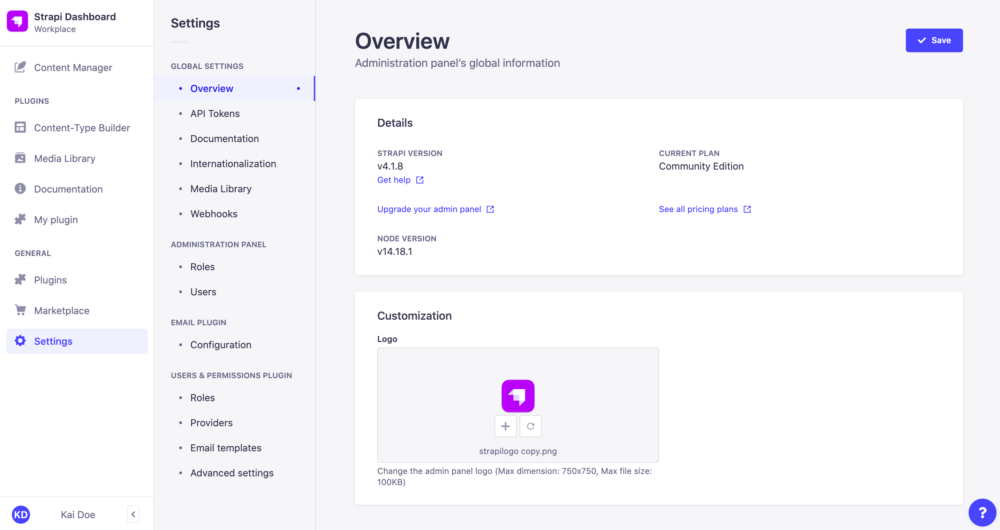
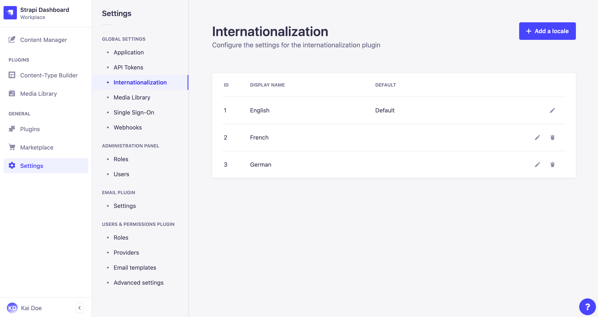

# Managing global settings

Global settings for plugins and features are managed from  *Settings* in the main navigation of the admin panel.

## Customizing the admin panel

The default Strapi logo, displayed in the main navigation of a Strapi application, can be modified through the *Settings > Overview* sub-section of the admin panel.

::: note
The logo displayed in the admin panel can also be customized programmatically via the Strapi application's configuration files (see [Developer Documentation](/developer-docs/latest/development/admin-customization.md#logos)). However, the logo uploaded via the admin panel supersedes any logo set through the configuration files.
 
Note also that modifying the configuration files (see [Developer Documentation](/developer-docs/latest/development/admin-customization.md#configuration-options)) also allows changing the logo displayed in the login page of the application, which is not yet possible via the *Settings* section of the admin panel.
:::

To customize the logo of the admin panel:

1. Go to the *Global settings > Overview* sub-section of the settings interface.
2. Click on the upload area.
3. Upload your chosen logo, either by browsing files, drag & dropping the file in the right area, or by using a URL. The logo shouldn't be more than 750x750px. 
4. Click on the **Upload logo** button in the upload window.
5. Click on the **Save** button in the top right corner.

::: tip
Once uploaded, the new logo can be replaced with another one , or reset  with the default Strapi logo or the logo set in the configuration files.
:::

## Configuring Single Sign-On <GoldBadge withLinkIcon link="https://strapi.io/pricing-self-hosted" />

Single Sign-On (SSO) can be made available on a Strapi application to allow administrators to authenticate through an identity provider (e.g. Microsoft Azure Active Directory).

To configure the SSO feature settings:

1. Go to the *Global settings > Single Sign-On* sub-section of the settings interface.
2. Define your chosen new settings:

| Setting name      | Instructions                                                                                                                                                                                                                                                        |
| ----------------- | --------------------------------------------------------------------------------------------------------------------------------------------------------------------------------------------------------------------------------------------------------------------|
| Auto-registration | Click on **ON** to allow the automatic creation of a new Strapi administrator when an SSO login does not match an existing Strapi administrator account. If this setting is set on **OFF**, new Strapi administrators accounts must be created manually beforehand. |
| Default role      | Choose among the drop-down list the role to attribute by default to auto-registered Strapi administrators through SSO login.                                                                                                                                       |

3. Click the **Save** button.

## Configuring Internationalization locales

The [Internationalization plugin](/user-docs/latest/plugins/strapi-plugins.md#internationalization-plugin) allows to manage content in different languages, called "locales". Once the Internationalization plugin is installed in a Strapi application (see [Installing plugins via the Marketplace](../plugins/installing-plugins-via-marketplace.md)), administrators can manage locales from the *Global settings > Internationalization* sub-section of the settings interface.

The *Internationalization* settings sub-section displays a table listing all locales available for the Strapi application. By default, only the English locale is configured and set as the default locale. 

For each locale, the table displays the default ISO code of the locale, its optional display name and indicates if the locale is set as the default one. From the table, administrators can also:

- Click on the edit button  to edit a locale
- Click on the delete button  to delete a locale

### Adding a new locale

Administrators can add and manage as many locales as they want. There can however only be one locale set as the default one for the whole Strapi application.

::: note
It is not possible to create custom locales. Locales can only be created based on [the 500+ pre-created list of locales](https://github.com/strapi/strapi/blob/v4.0.0/packages/plugins/i18n/server/constants/iso-locales.json) set by Strapi.
:::

To add a new locale:

1. Click on the **Add new locale** button.
2. In the locale addition window, choose your new locale among the *Locales* drop-down list. The latter lists alphabetically all locales, displayed as their ISO code, that can be added to your Strapi application.
3. (optional) In the *Locale display name* textbox, write a new display name for your new locale.
4. (optional) In the Advanced settings tab, tick the *Set as default locale* setting to make your new locale the default one for your Strapi application.
5. Click on the **Save** button to confirm the addition of your new locale.

## Managing API tokens

API tokens allow users to authenticate their Content API queries (see [Developer Documentation](/developer-docs/latest/setup-deployment-guides/configurations/optional/api-tokens.md)). Administrators can manage API tokens through the *Global settings > API Tokens* sub-section of the settings interface.

The *API Tokens* settings sub-section displays a table listing all created API tokens.

For each API token, the table displays its name, description, type and date of creation. From the table, administrators can also:

- Click on the edit button <!-- icon --> to edit an API token's name, description or type
- Click on the delete button <!-- icon --> to delete an API token

### Creating a new API token

All API tokens created by administrators of the Strapi application are permanent tokens that cannot be regenerated.

To create a new API token:

1. Click on the **Add new entry** button.
2. In the API token edition interface, configure the new API token:

| Setting name | Instructions                                              |
|--------------|-----------------------------------------------------------|
| Name         | Write the name of the API token.                          |
| Description  | (optional) Write a description for the API token.         |
| Token type   | Choose a token type: either *Read-only* or *Full access*. |

3. Click on the **Save** button. The new API token will be displayed at the top of the interface, along with a copy button <!-- icon -->.

::: caution
For security reasons, API tokens are only shown right after they have been created. When refreshing the page or navigating elsewhere in the admin panel, the newly created API token will be hidden and will not be displayed again.
:::
