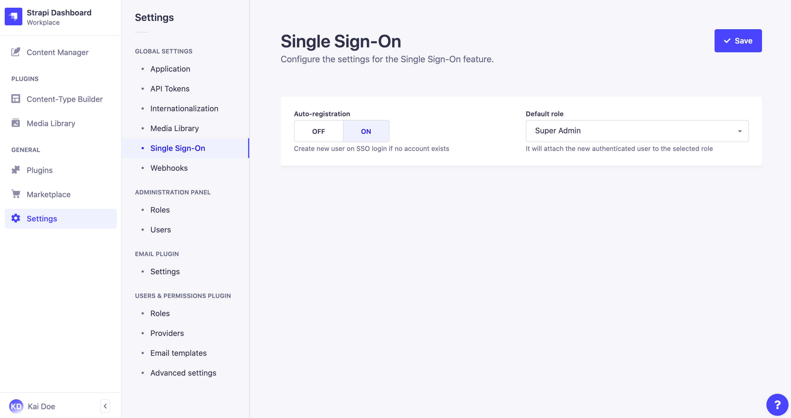

# Managing global settings

Global settings for plugins and features are managed from *General > Settings* in the main navigation of the admin panel.

## Configuring Single Sign-On <GoldBadge withLinkIcon link="https://strapi.io/pricing-self-hosted" />

Single Sign-On (SSO) can be made available on a Strapi application to allow administrators to authenticate through an identity provider (e.g. Microsoft Azure Active Directory).

To configure the SSO feature settings:

1. Go to the *Global settings > Single Sign-On* area of the settings interface.
2. Define your chosen new settings:

| Setting name      | Instructions                                                                                                                                                                                                                                                        |
| ----------------- | --------------------------------------------------------------------------------------------------------------------------------------------------------------------------------------------------------------------------------------------------------------------|
| Auto-registration | Click on **ON** to allow the automatic creation of a new Strapi administrator when an SSO login does not match an existing Strapi administrator account. If this setting is set on **OFF**, new Strapi administrators accounts must be created manually beforehand. |
| Default role      | Choose among the drop-down list the role to attribute by default to auto-registrated Strapi administrators through SSO login.                                                                                                                                       |
