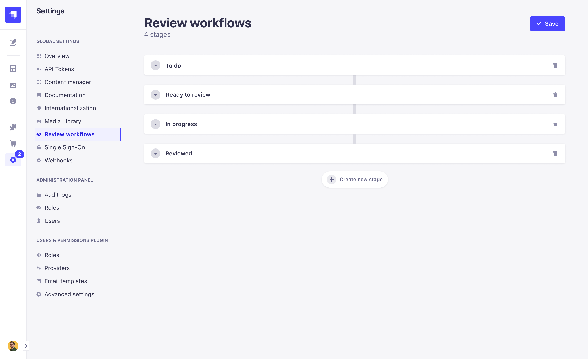
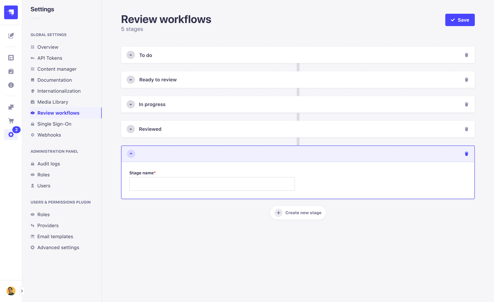

# Managing Review Workflows <GoldBadge withLinkIcon link="https://strapi.io/pricing-self-hosted" /> <AlphaBadge />

The Review Workflows feature allows you to create and manage any desired review stages for your content, enabling your team to collaborate in the content creation flow from draft to publication. Configured review workflows are available in the [Content Manager](../content-manager/reviewing-content.md) and [Content-Types Builder](../content-types-builder/introduction-to-content-types-builder.md).

## Configuring Review workflows

::: note
The Review workflows settings are only available to users with the Super Admin role by default. Other roles must be granted the **Review workflows** permission. See [Users, Roles, & Permissions](../users-roles-permissions/introduction-to-users-roles-permissions.md) for more information.
:::

Review workflow settings are available in the **Settings** section of the admin panel. To access the settings, click on the **Settings** icon in the left-hand menu, then click on the **Review Workflows** link in the **Global Settings** section.

There are four stages in the default review workflow available in Strapi: **To do**, **In progress**, **Ready to review**, and **Reviewed**. You can add, edit, or delete stages as needed. 

### Adding a new stage

To add a new stage, click on the **Add a new stage** button. A new stage will be added to the bottom of the list. You can then edit the stage name and description as needed.

### Deleting a stage

::: warning Pending reviews on deleted stages
If you delete a stage that has pending reviews, the reviews will be moved to first stage in the workflow.
:::

To delete a stage, click on the **Delete** button next to the stage you want to remove. A confirmation modal will appear. Click on the **Save** button to confirm the deletion.

