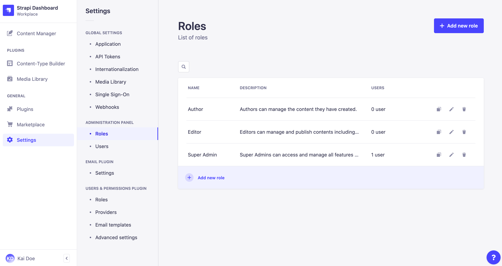
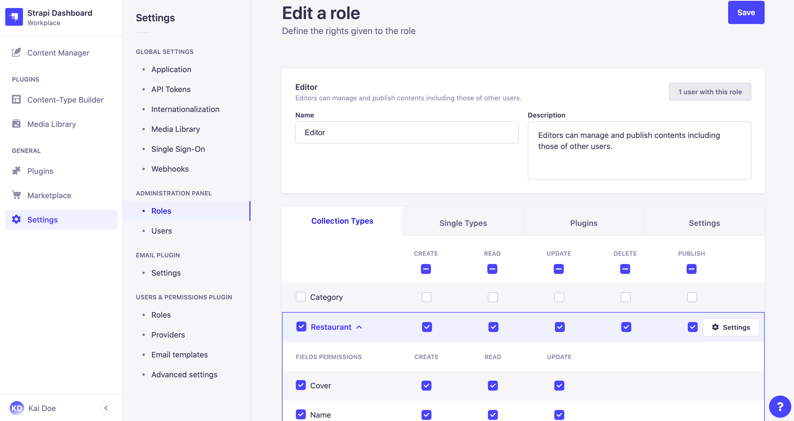
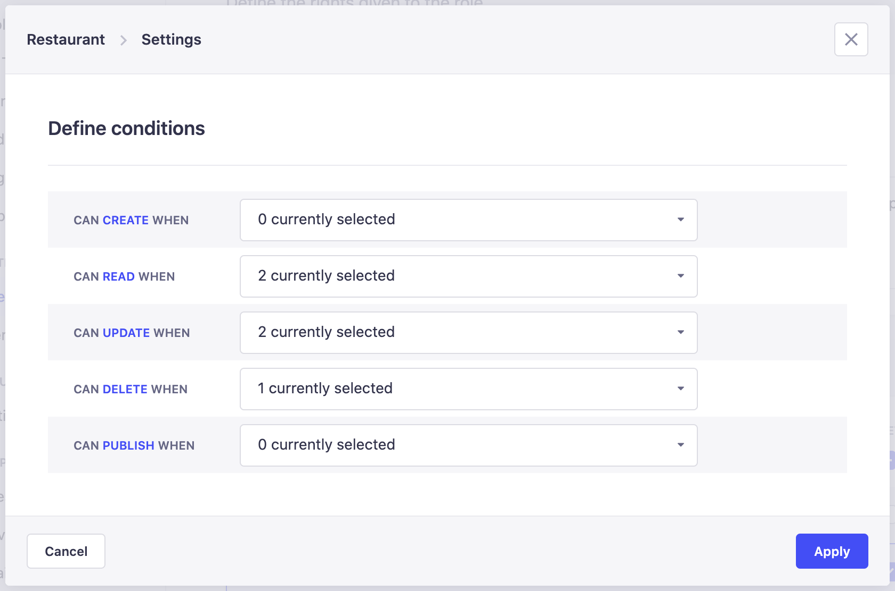

# Configuring administrator roles

Administrators are the users of an admin panel of a Strapi application. Administrator accounts and roles are managed with the Role-Based Access Control (RBAC) feature. It is available in the *Administration panel* section of the Settings interface, accessible from *General > Settings* in the main navigation of the admin panel.

The *Administration panel* section is divided into 2 sub-sections: *Roles* and *Users* (see [Managing administrators](managing-administrators.md)).

The *Roles* sub-section of *Administration panel* displays all created roles for the administrators of your Strapi application.

From this interface, it is possible to:

- create a new administrator role (see [Creating a new role](#creating-a-new-role)),
- delete an administrator role (see [Deleting a role](#deleting-a-role)),
- or access information regarding an administrator role, and edit it (see [Editing a role](#editing-a-role)).

By default, 3 administrator roles are defined for any Strapi application:

- Author: to be able to create and manage their own content.
- Editor: to be able to create content, and manage and publish any content.
- Super Admin: to be able to access all features and settings. This is the role attributed by default to the first administrator at the creation of the Strapi application.

::: caution
If you use your Strapi application with the Community Edition (see [Pricing and Plans](https://strapi.io/pricing-self-hosted)), your use of the RBAC feature will be limited. Only the 3 default roles are available, as you cannot create more roles and cannot delete the default ones. It is however possible to edit them, but to an extent:

- You can only configure permissions for the content-types, but not for the plugins and settings of the Strapi application.
- Configuring permissions in detail is only available for the Enterprise Edition. With the Community Edition, although you can choose which fields of a content type are accessible, these fields are automatically fully accessible with all permissions.
- Custom conditions defined for a specific permission are also only available for the Enterprise Edition.

:::

## Creating a new role <BronzeBadge link="https://strapi.io/pricing-self-hosted"/> <SilverBadge link="https://strapi.io/pricing-self-hosted"/> <GoldBadge link="https://strapi.io/pricing-self-hosted" withLinkIcon/>

On the top right side of the *Administration panel > Roles* interface, an **Add new role** button is displayed. It allows to create a new role for administrators of your Strapi application.

To create a new role, click on the **Add new role** button.
Clicking on the **Add new role** button will redirect you to the roles edition interface, where you will be able to edit the role's details and configure its permissions (see [Editing a role](#editing-role-s-details)).

::: tip
In the *Roles* interface, from the table, you can click on the duplicate button <Fa-Copy /> to create a new role by duplicating an existing one.
:::

## Deleting a role <BronzeBadge link="https://strapi.io/pricing-self-hosted"/> <SilverBadge link="https://strapi.io/pricing-self-hosted"/> <GoldBadge link="https://strapi.io/pricing-self-hosted" withLinkIcon/>

Administrator roles can be deleted from the *Administration panel > Roles* interface. However, they can only be deleted once they are no more attributed to any administrator of the Strapi application.

To delete a role:

1. Click on the trash button <Fa-TrashAlt /> on the right side of the role's record.
2. In the deletion window, click on the **Yes, confirm** button to confirm the deletion.

::: tip
You also have the possibility to delete multiple roles at the same time. To do so, select the roles by ticking the box on the left side of the roles' record. Then, click on the **Delete** button in the top right corner of the table.
:::

## Editing a role

The role edition interface allows to edit the details of an administrator role as well as configure in detail the permissions to all sections of your Strapi application. It is accessible from *Administration panel > Roles* either after clicking on the edit button <Fa-PencilAlt /> on the right side of a role's record, or after clicking on the **Add new role** button (see [Creating a new role](#creating-a-new-role)).

::: caution
It isn't possible to edit the permissions of the Super Admin role. All configurations are in read-only mode.
:::

### Editing role's details

The details area of an administrator role editing interface allow to define the name of the role, and to give it a description that should help other administrators understand what the role gives access to.

::: tip
In the top right corner, you can see a counter indicating how many administrators have been attributed the role.
:::

To edit a role's details, follow the instructions from the table below:

| Role details  | Instructions                                                                                                                     |
| ------------- | -------------------------------------------------------------------------------------------------------------------------------- |
| Name          | Write the new name of the role in the textbox.                                                                                   |
| Description   | Write the description of the role in the textbox.                                                                                |

### Configuring role's permissions

The permissions area of an administrator role editing interface allows to configure in detail what actions an administrator can do for any part of the Strapi application. It is displayed as a table, split into 4 categories: Collection Types, Single Types, Plugins and Settings.

#### Collection and Single Types

The Collection Types and Single Types categories respectively list all available collection and single types for the Strapi application. For each content type, the administrators can have the permission to perform the following actions: create, read, update, delete and publish.

To configure Collection or Single Types permissions for a role:

1. Go to the Collection Types or Single Types category of the permissions table.
2. Tick the box on the left of the name of the content type to give access to. By default, all actions can be performed for all fields of the content type.
3. (optional - Enterprise Edition only) Untick the action-related boxes to prevent actions of your choice.
4. (optional) Click the name of the content type to display its full list of fields. Untick the field and action-related boxes to prevent access and/or action for the fields of your choice. If the [Internationalization plugin](/user-docs/latest/plugins/strapi-plugins.md#internationalization-plugin) is installed, define also what permissions should be granted for each available locale.
5. Repeat steps 2 to 4 for each content type available to which the role should give access.
6. Click on the **Save** button on the top right corner.

#### Plugins and Settings <BronzeBadge link="https://strapi.io/pricing-self-hosted"/> <SilverBadge link="https://strapi.io/pricing-self-hosted"/> <GoldBadge link="https://strapi.io/pricing-self-hosted" withLinkIcon/>

The Plugins and Settings categories both display a sub-category per available plugin or setting of the Strapi application. Each sub-category contains its own specific set of permissions.

To configure plugins or settings permissions for a role:

1. Go to the Plugins or Settings category of the permissions table.
2. Click on the name of the sub-category which permissions to configure, to display all available permissions.
3. Tick the boxes of the permissions the role should give access to. You can refer to the table below for more information and instructions.

:::: tabs

::: tab Plugins

By default, plugins permissions can be configured for the Content-Type Builder, the Upload (i.e. Media Library) plugin, the Content Manager, and Users Permissions (i.e. the Users & Permissions plugin allowing to manage end-users). Each plugin has its own specific set of permissions.

| Plugin name          | Permissions |
| -------------------- | ----------- |
| Content-Type-Builder | <ul><li>General</li><ul><li>"Read" - gives access to the Content-Types Builder plugin in read-only mode</li></ul></ul> |
| Upload   *(Media Library)* | <ul><li>General</li><ul><li>"Access the Media Library" - gives access to the Media Library plugin</li></ul></ul> <ul><li>Assets</li><ul><li>"Create (upload)" - allows to upload media files</li><li>"Update (crop, details, replace) + delete" - allows to edit uploaded media files</li><li>"Download" - allows to download uploaded media files</li><li>"Copy link" - allows to copy the link of an uploaded media file</li></ul></ul> |    
| Content-Manager | <ul><li>Single types</li><ul><li>"Configure view" - allows to configure the edit view of a single type</li></ul></ul><ul><li>Collection types</li><ul><li>"Configure view" - allows to configure the edit view of a collection type</li></ul></ul><ul><li>Components</li><ul><li>"Configure Layout" - allows to configure the layout of a component</li></ul></ul> |
| Users-Permissions | <ul><li>Roles</li><ul><li>"Create" - allows to create end-user roles</li><li>"Read" - allows to see created end-user roles</li><li>"Update" - allows to edit end-user roles</li><li>"Delete" - allows to delete end-user roles</li></ul></ul><ul><li>Providers</li><ul><li>"Read" - allows to see providers</li><li>"Edit" - allows to edit providers</li></ul></ul><ul><li>Email Templates</li><ul><li>"Read" - allows to access the email templates</li><li>"Edit" - allows to edit email templates</li></ul></ul><ul><li>Advanced settings</li><ul><li>"Read" - allows to access the advanced settings of the Users & Permissions plugin</li><li>"Edit" - allows to edit advanced settings</li></ul></ul> 👉 Path reminder to the Users & Permissions plugin:   *General > Settings > Users & Permissions plugin* |

:::

::: tab Settings

Settings permissions can be configured for all settings accessible from *General > Settings* from the main navigation of the admin panel: Media Library and Webhooks (*Global settings* section) and Users & Roles (*Administration panel* section, to configure the settings of the RBAC feature). Settings permissions also allow to configure access to the Plugins and Marketplace sections of the admin panel. Each setting has its own specific set of permissions.

| Setting name            | Permissions |
| ----------------------- | ----------- |
| Media Library | <ul><li>General</li><ul><li>"Access the Media Library settings page" - gives access to Media Library settings</li></ul></ul> 👉 Path reminder to Media Library settings:   *General > Settings > Global Settings - Media Library* |
| Plugins and Marketplace | <ul><li>Marketplace</li><ul><li>"Access the Marketplace" - gives access to the Marketplace</li></ul></ul><ul><li>Plugins</li><ul><li>"Install (only for dev env)" - allows to install new plugins when in a development environment</li><li>"Uninstall (only for dev env)" - allows to uninstall plugins when in a development environment</li></ul></ul> |    
| Webhooks | <ul><li>General</li><ul><li>"Create" - allows to create webhooks</li><li>"Read" - allows to see created webhooks</li><li>"Update" - allows to edit webhooks</li><li>"Delete" - allows to delete webhooks</li></ul></ul> 👉 Path reminder to Webhook settings:   *General > Settings > Global Settings - Webhook* |
| Users and Roles | <ul><li>Users</li><ul><li>"Create (invite)" - allows to create administrator accounts</li><li>"Read" - allows to see existing administrator accounts</li><li>"Update" - allows to edit administrator accounts</li><li>"Delete" - allows to delete administrator accounts</li></ul></ul><ul><li>Roles</li><ul><li>"Create" - allows to create administrator roles</li><li>"Read" - allows to see created administrator roles</li><li>"Update" - allows to edit administrator roles</li><li>"Delete" - allows to delete administrator roles</li></ul></ul> 👉 Path reminder to the RBAC feature:   *General > Settings > Administration Panel* |

:::

::::

4. Click on the **Save** button on the top right corner.

### Setting custom conditions for permissions <BronzeBadge link="https://strapi.io/pricing-self-hosted"/> <SilverBadge link="https://strapi.io/pricing-self-hosted"/> <GoldBadge link="https://strapi.io/pricing-self-hosted" withLinkIcon/>

For each permission of each category, a **Settings** button is displayed. It allows to push the permission configuration further by defining additional conditions for the administrators to be granted the permission. There are 2 default additional conditions:

- the administrator must be the creator,
- the administrator must have the same role as the creator.

::: note
Other custom conditions can be available if they have been created beforehand for your Strapi application (see [Role-Based Access Control](/developer-docs/latest/setup-deployment-guides/configurations/optional/rbac.md)).
:::

To set custom conditions:

1. Click on the **Settings** button of the permission already granted for the role.
2. In the *Define conditions* window, each available permission can be customised with a specific condition. Click on the drop-down list related to the permission you want to customise.
3. Define the custom condition for the chosen permission. You can either:
   - Tick the Default option for all available additional conditions to be applied.
   - Click on the arrow button  to see the available additional conditions and tick only the chosen one(s).
4. Click on the **Apply** button.

::: caution
Custom conditions can only be set for permissions that have been ticked to be granted for the role. If not, when clicking the **Settings** button, the window that opens will remain empty, as no custom condition option will be available.
:::
