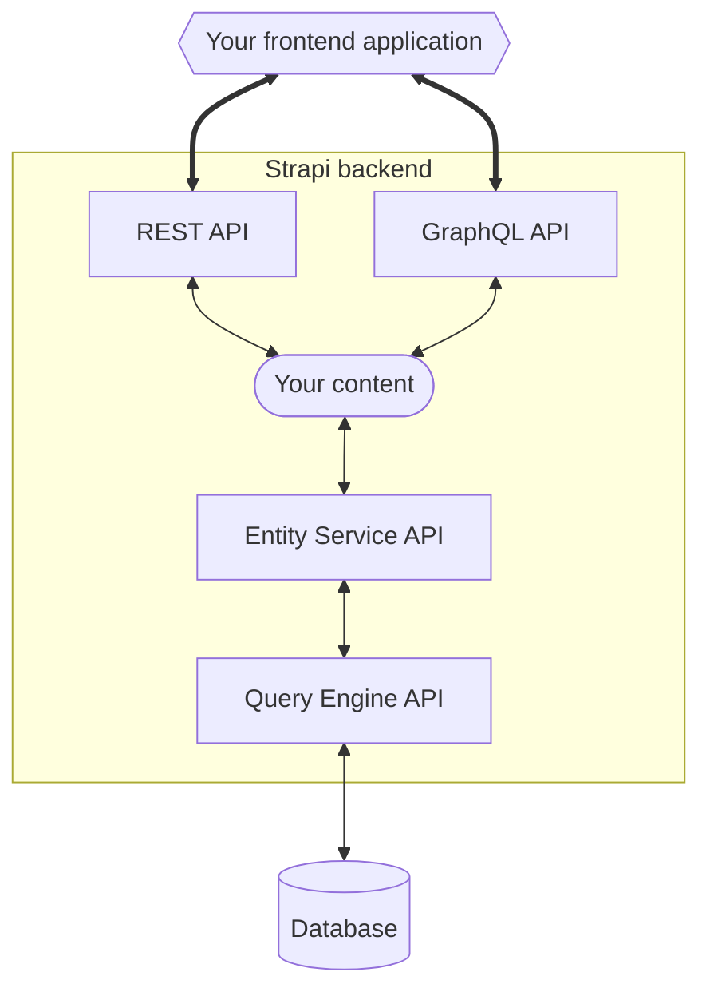

# Strapi APIs to access your content

Once you've created and configured a Strapi project, created a data structure with the [Content-Type Builder](/user-docs/content-type-builder) and started adding data through the [Content Manager](/user-docs/content-manager), you likely would like to access your content.

From a front-end application, your content can be accessed through Strapi's Content API, which is exposed:
- by default through the [REST API](/dev-docs/api/rest)
- and also through the [GraphQL API](/dev-docs/api/graphql) if you installed the Strapi built-in [GraphQL plugin](/dev-docs/plugins/graphql).

REST and GraphQL APIs represent the top-level layers of the Content API exposed to external applications. Strapi also provides 2 lower-level APIs:

- The [Entity Service API](/dev-docs/api/entity-service) is the recommended API to interact with your application's database within the [backend server](/dev-docs/customization) or through [plugins](/dev-docs/plugins). The Entity Service is the layer that handles Strapi's complex data structures like components and dynamic zones, which the lower-level layers are not aware of.
- The [Query Engine API](/dev-docs/api/query-engine) interacts with the database layer at a lower level and is used under the hood to execute database queries. It gives unrestricted internal access to the database layer, but should be used only if the Entity Service API does not cover your use case.

 

This documentation section includes reference information about the following Strapi APIs and some integration guides with 3rd party technologies:

<CustomDocCardsWrapper>

<CustomDocCard emoji="↕️" title="REST API" description="Query the Content API from a front-end application through REST." link="/dev-docs/api/rest" />

<CustomDocCard emoji="↕️" title="GraphQL API" description="Query the Content API  from a front-end application through GraphQL." link="/dev-docs/api/graphql" />

<CustomDocCard emoji="🔃" title="Entity Service API" description="Query your data through the backend server or plugins." link="/dev-docs/api/entity-service" />

<CustomDocCard emoji="🔃" title="Query Engine API" description="Query your data by interacting directly with the database layer." link="/dev-docs/api/query-engine" />

<CustomDocCard emoji="🔄" title="Integration guides" description="Use 3rd-party technologies to query the Content API from a front-end application." link="/dev-docs/integrations" />

</CustomDocCardsWrapper>

:::note Plugin APIs
[Plugins](/dev-docs/plugins) also have their dedicated APIs: the Server API and the Admin Panel API. These plugin-related APIs are offered to develop plugins and allow a plugin to interact either with the back-end server of Strapi ([Server API](/dev-docs/api/plugins/server-api)) or with the admin panel of Strapi ([Admin Panel API](/dev-docs/api/plugins/admin-panel-api)).
:::
