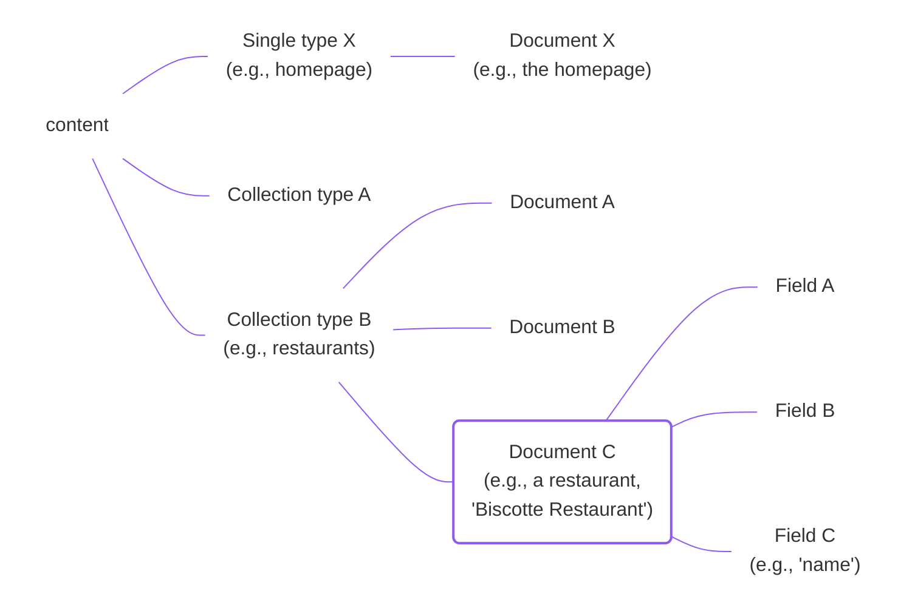
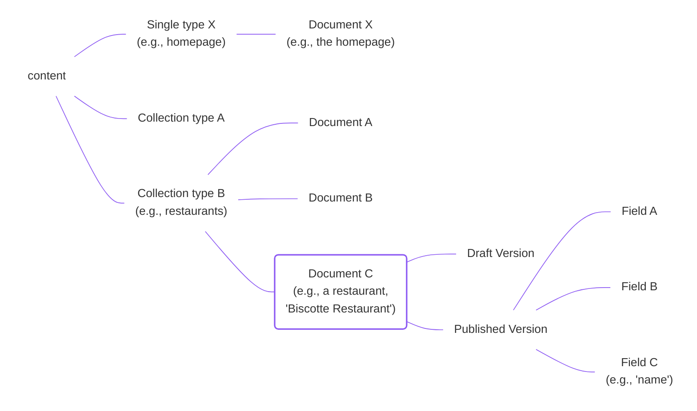
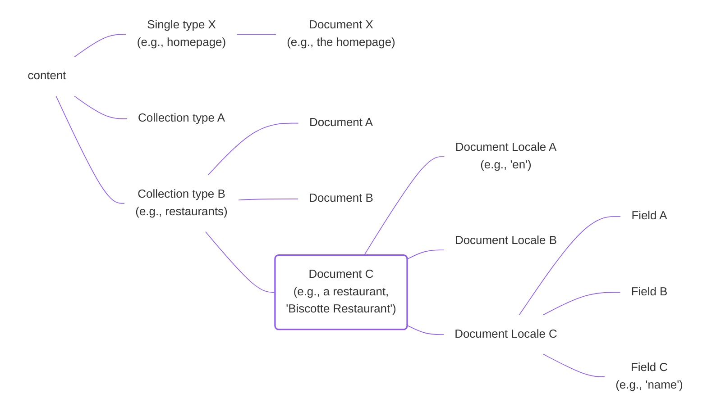
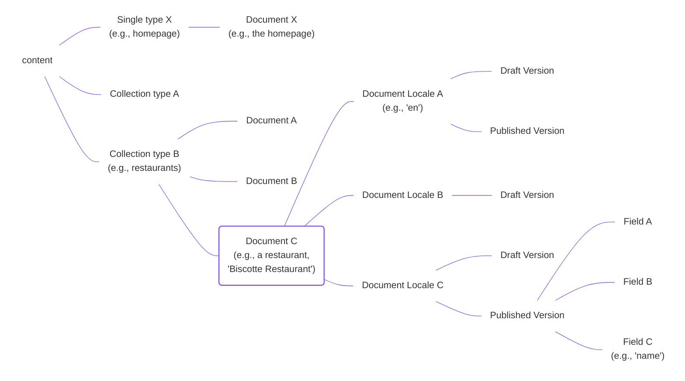

A **document** in Strapi 5 is an API-only concept. A document represents all the different variations of content for a given entry of a content-type.

A single type contains a unique document, and a collection type can contain several documents.

When you use the admin panel, the concept of a document is never mentioned and not necessary for the end user. Users create and edit **entries** in the [Content Manager](/user-docs/content-manager). For instance, as a user, you either list the entries for a given locale, or edit the draft version of a specific entry in a given locale.

However, at the API level, the value of the fields of an entry can actually have:

- different content for the English and the French locale,
- and even different content for the draft and published version in each locale.

The bucket that includes the content of all the draft and published versions for all the locales is a document.

Manipulating documents with the [Document Service API](/dev-docs/api/document-service) will help you create, retrieve, update, and delete documents or a specific subset of the data they contain.

The following diagrams represent all the possible variations of content depending on which features, such as [Internationalization (i18n)](/user-docs/content-manager/translating-content) and [Draft & Publish](/user-docs/content-manager/saving-and-publishing-content), are enabled for a content-type:

<Tabs>
<TabItem value="document-only" label="Neither i18n nor Draft & Publish enabled">

</TabItem>

<TabItem value="dandp-only" label="Only Draft & Publish enabled">

</TabItem>

<TabItem value="i18n-only" label="Only i18n enabled">

</TabItem>

<TabItem value="i18n-and-dandp" label="i18n + Draft & Publish enabled" default>

</TabItem>
</Tabs>

- If the Internationalization (i18n) feature is enabled on the content-type, a document can have multiple **document locales**.
- If the Draft & Publish feature is enabled on the content-type, a document can have a **published** and a **draft** version.

:::strapi APIs to query documents data
To interact with documents or the data they represent:

  - From the back-end server (for instance, from controllers, services, and the back-end part of plugins), use the [Document Service API](/dev-docs/api/document-service).
  - From the front-end part of your application, query your data using the [REST API](/dev-docs/api/rest) or the [GraphQL API](/dev-docs/api/graphql).

For additional information about the APIs, please refer to the [Content API introduction](/dev-docs/api/content-api).
:::

:::info Default version in returned results
An important difference between the back-end and front-end APIs is about the default version returned when no parameter is passed:
- The Document Service API returns the draft version by default,
- while REST and GraphQL APIs return the published version by default.
:::

