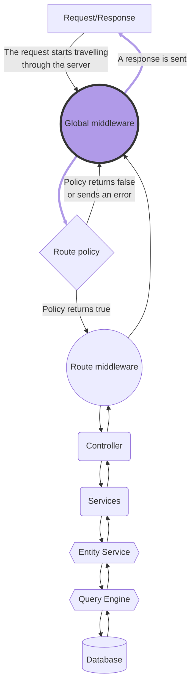

# Back-end customization

:::strapi Disambiguation: Strapi back end
As a headless CMS, the Strapi software as a whole can be considered as the "backend" of your website or application.
But the Strapi software itself includes 2 different parts:

- The back-end part of Strapi is an HTTP server that Strapi runs. Like any HTTP server, the Strapi back end receives requests and send responses. Your content is stored in a database, and the Strapi back end interacts with the database to create, retrieve, update, and delete content.
- The front-end part of Strapi is called the admin panel. The admin panel presents a graphical user interface to help you structure and manage the content.

Throughout this developer documentation, 'backend' refers exclusively to the back-end part of Strapi.

The [User Guide](/user-docs/intro) explains how to use the admin panel and the [admin panel customization section](/dev-docs/admin-panel-customization) details the various customization options available for the admin panel.
:::

The Strapi back end runs an HTTP server based on [Koa](https://koajs.com/), a back-end JavaScript framework.

Like any HTTP server, the Strapi back end receives requests and send responses. You can send requests to the Strapi back end to create, retrieve, update, or delete data through the [REST](/dev-docs/api/rest) or [GraphQL](/dev-docs/api/graphql) APIs.

A request can travel through the Strapi backend as follows:

1. The Strapi server receives a [request](/dev-docs/backend-customization/requests-responses#requests).
2. The request hits a [route](/dev-docs/backend-customization/routes).
3. [Middlewares](/dev-docs/backend-customization/middlewares) control the request flow and the request itself before moving forward.
4. _(optional)_ [Policies](/dev-docs/backend-customization/policies) can block access to a route.
5. [Controllers](/dev-docs/backend-customization/controllers) execute code once a route has been reached. [Services](/dev-docs/backend-customization/services) are optional, additional code that can be used to build custom logic reusable by controllers.
6. The code executed by the controllers and services interacts with the [models](/dev-docs/backend-customization/models) that are a representation of the content data structure.
7. The server returns a response with some data, according to the request. The response can travel back through controllers and middlewares before being sent.

:::note
Strapi also supports [webhooks](/dev-docs/backend-customization/webhooks) that are used to notify other applications of events that occurred.
:::
