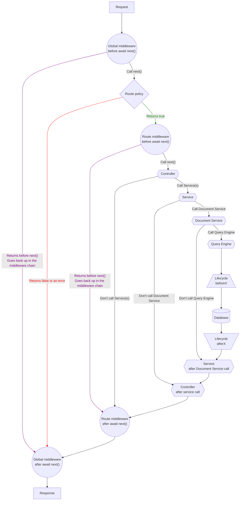

# Back-end customization

:::strapi Disambiguation: Strapi back end
As a headless CMS, the Strapi software as a whole can be considered as the "back end" of your website or application.
But the Strapi software itself includes 2 different parts:

- The **back-end** part of Strapi is an HTTP server that Strapi runs. Like any HTTP server, the Strapi back end receives requests and send responses. Your content is stored in a database, and the Strapi back end interacts with the database to create, retrieve, update, and delete content.
- The **front-end** part of Strapi is called the admin panel. The admin panel presents a graphical user interface to help you structure and manage the content.

Throughout this developer documentation, 'back end' refers _exclusively_ to the back-end part of Strapi.

The [User Guide](/user-docs/intro) explains how to use the admin panel and the [admin panel customization section](/dev-docs/admin-panel-customization) details the various customization options available for the admin panel.
:::

The Strapi back end runs an HTTP server based on [Koa](https://koajs.com/), a back-end JavaScript framework.

Like any HTTP server, the Strapi back end receives requests and send responses. You can send requests to the Strapi back end to create, retrieve, update, or delete data through the [REST](/dev-docs/api/rest) or [GraphQL](/dev-docs/api/graphql) APIs.

A request can travel through the Strapi back end as follows:

1. The Strapi server receives a [request](/dev-docs/backend-customization/requests-responses).
2. The request hits [global middlewares](/dev-docs/backend-customization/middlewares) that are run in a sequential order.
3. The request hits a [route](/dev-docs/backend-customization/routes). By default, Strapi generates route files for all the content-types that you create (see [REST API documentation](/dev-docs/api/rest)), and more routes can be added and configured.
4. [Route policies](/dev-docs/backend-customization/policies) act as a read-only validation step that can block access to a route. [Route middlewares](/dev-docs/backend-customization/routes#middlewares) can control the request flow and mutate the request itself before moving forward.
5. [Controllers](/dev-docs/backend-customization/controllers) execute code once a route has been reached. [Services](/dev-docs/backend-customization/services) are optional, additional code that can be used to build custom logic reusable by controllers.
6. The code executed by the controllers and services interacts with the [models](/dev-docs/backend-customization/models) that are a representation of the content data structure stored in the database. Interacting with the data represented by the models is handled by the [Document Service](/dev-docs/api/document-service) and [Query Engine](/dev-docs/api/query-engine).
7. The server returns a [response](/dev-docs/backend-customization/requests-responses). The response can travel back through route middlewares and global middlewares before being sent.

Both global and route middlewares include an asynchronous callback function, `await next()`. Depending on what is returned by the middleware, the request will either go through a shorter or longer path through the back end:

* If a middleware returns nothing, the request will continue travelling through the various core elements of the back end (i.e., controllers, services, and the other layers that interact with the database).
* If a middleware returns before calling `await next()`, a response will be immediately sent, skipping the rest of the core elements. Then it will go back down the same chain it came up.

:::info
Please note that all customizations described in the pages of this section are only for the REST API. [GraphQL customizations](/dev-docs/plugins/graphql#customization) are described in the GraphQL plugin documentation.
:::

:::tip Learn by example
If you prefer learning by reading examples and understanding how they can be used in real-world use cases, the [Examples cookbook](/dev-docs/backend-customization/examples) section is another way at looking how the Strapi back end customization works.
:::

## Interactive diagram

The following diagram represents how requests travel through the Strapi back end. You can click on any shape to jump to the relevant page in the documentation.

