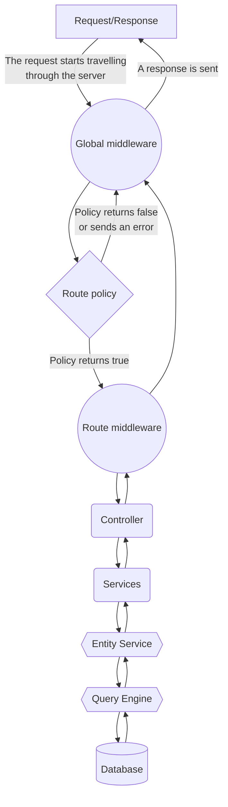

# Back-end customization

:::strapi Disambiguation: Strapi back end
As a headless CMS, the Strapi software as a whole can be considered as the "backend" of your website or application.
But the Strapi software itself includes 2 different parts:

- The back-end part of Strapi is an HTTP server that Strapi runs. Like any HTTP server, the Strapi back end receives requests and send responses. Your content is stored in a database, and the Strapi back end interacts with the database to create, retrieve, update, and delete content.
- The front-end part of Strapi is called the admin panel. The admin panel presents a graphical user interface to help you structure and manage the content.

Throughout this developer documentation, 'backend' refers exclusively to the back-end part of Strapi.

The [User Guide](/user-docs/intro) explains how to use the admin panel and the [admin panel customization section](/dev-docs/admin-panel-customization) details the various customization options available for the admin panel.
:::

The Strapi back end runs an HTTP server based on [Koa](https://koajs.com/), a back-end JavaScript framework.

Like any HTTP server, the Strapi back end receives requests and send responses. You can send requests to the Strapi back end to create, retrieve, update, or delete data through the [REST](/dev-docs/api/rest) or [GraphQL](/dev-docs/api/graphql) APIs.

A request can travel through the Strapi backend as follows:

1. The Strapi server receives a [request](/dev-docs/backend-customization/requests-responses#requests).
2. The request hits [global middlewares](/dev-docs/backend-customization/middlewares) that are defined in `config/middlewares.js` and run in a sequential order.
3. The request hits a [route](/dev-docs/backend-customization/routes). By default, Strapi generates routes for all the content-types (see [REST API documentation](/dev-docs/api/rest)) that you create, and more routes can be added and configured. Routes code is found in the `src/api/(your-api-name)/(your-content-name)/routes` folders.
4. _(optional)_ Route [policies](/dev-docs/backend-customization/policies) can block access to a route and [route middlewares](/dev-docs/backend-customization/routes#middlewares) can control the request flow and the request itself before moving forward.
5. [Controllers](/dev-docs/backend-customization/controllers) execute code once a route has been reached. [Services](/dev-docs/backend-customization/services) are optional, additional code that can be used to build custom logic reusable by controllers.
6. The code executed by the controllers and services interacts with the [models](/dev-docs/backend-customization/models) that are a representation of the content data structure.
7. The server returns a response with some data, according to the request. The response can travel back through controllers and middlewares before being sent.

<!-- TODO: update this graph by adapting what Derrick shared to me -->

Both global and route middlewares include an asynchronous callback (i.e.,`await next()`) function. Depending on what is returned by the middleware, the request will either go through a shorter or longer path through the backend:

* If you return nothing within the code of a middleware, the request will continue travelling through the various core elements of the backend.
* If you return something from a middleware, a response will be immediately sent, skipping the rest of the core elements (i.e., controllers, services, and the other layers that interact with the database).

:::note
Strapi also supports [webhooks](/dev-docs/backend-customization/webhooks) that are used to notify other applications of events that occurred.
:::
