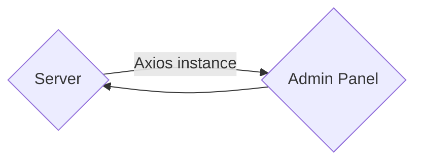

# Plugin creation and setup

To start developing a Strapi plugin, you need to:

1. create the plugin,
2. enable the plugin,
3. install dependencies, build the admin panel, and start the server(s).

:::prerequisites
You created a Strapi project.

<details>
<summary>Use the CLI to create a project:</summary>

Run the corresponding command in a terminal window, replacing `my-project` with the name of your choice:

<Tabs groupId="yarn-npm">

<TabItem value="yarn" label="Yarn">

```bash
yarn create strapi-app my-project --quickstart
```

</TabItem>

<TabItem value="npm" label="NPM">

```bash
npx create-strapi-app@latest my-project --quickstart
```

</TabItem>

</Tabs>

More details can be found in the [CLI installation guide](/dev-docs/installation/cli).

</details>
:::

## Create the plugin using the CLI generator

The fastest way to create a Strapi plugin is to use the CLI generator. To do so:

1. Navigate to the root of an existing Strapi project, or create a new one.
2. Run the following command in a terminal window to start the interactive CLI:

  <Tabs groupId="yarn-npm">
    <TabItem value="yarn" label="Yarn">

  ```sh
    yarn strapi generate plugin
  ```

    </TabItem>

    <TabItem value="npm" label="NPM">

  ```sh
  npm run strapi generate plugin
  ```

    </TabItem>
  </Tabs>

4. Choose either `JavaScript` or `TypeScript` for the plugin language.

:::callout 🚧 Experimental plugin CLI
Strapi now also offers a [plugin CLI](/dev-docs/plugins/development/plugin-cli), but use it at your own risk as it's still experimental.
:::

## Enable the plugin

Once the `strapi generate plugin` CLI script has finished running, the minimum required code for the plugin to work is created for you, but the plugin is not enabled yet.

To enable a plugin:

1. If it does not exist already, create the **plugins configuration file** <PluginsConfigurationFile /> file at the root of the Strapi project.
2. Enable the plugin by adding the following code to the plugins configuration file:

  <Tabs>
    <TabItem value="js" label="JavaScript">

    ```js title="./config/plugins.js"
    module.exports = {
      // ...
      "my-plugin": {
        // name of your plugin, kebab-cased
        enabled: true,
        resolve: "./src/plugins/my-plugin", // path to the plugin folder
      },
      // ...
    };
    ```

    </TabItem>

    <TabItem value="ts" label="TypeScript">

  ```js title=./config/plugins.ts
  export default {
    // ...
    "my-plugin": {
      enabled: true,
      resolve: "./src/plugins/my-plugin", // path to plugin folder
    },
    // ...
  };
  ```

    </TabItem>
  </Tabs>

:::tip
If you plan to use the plugin outside the Strapi project it was created in, move your plugin file outside the Strapi project and change the `resolve` value to the absolute directory path of your plugin.
:::

## Install dependencies, build the admin panel, and start servers

Once the plugin code has been generated and the plugin is enabled, the next steps slighly differ depending on whether you created a vanilla JavaScript-based plugin or a TypeScript-based plugin (see [step 3](#create-the-plugin-using-the-cli-generator) of the CLI generator instructions).

<Tabs groupId="js-ts">

<TabItem value="js" label="JavaScript-based plugin">

1. Navigate to the folder of the plugin.<br />If created from a Strapi project using the CLI generator, plugins are located in the `src/plugins` folder (see [project structure](/dev-docs/project-structure)).

2. Run the following command in the newly-created plugin directory to install plugin dependencies:

  <Tabs groupId="yarn-npm">
  <TabItem value="yarn" label="Yarn">

  ```sh
  yarn
  ```

  </TabItem>

  <TabItem value="npm" label="NPM">

  ```sh
  npm install
  ```

  </TabItem>
  </Tabs>

3. Navigate back to the Strapi project root with `cd ../../..` and run the following command to build the admin panel and start the server(s):

  <Tabs groupId="yarn-npm">
  <TabItem value="yarn" label="Yarn">

  ```sh
  yarn develop
  ```

  </TabItem>

  <TabItem value="npm" label="NPM">

  ```sh
  npm run develop
  ```

  </TabItem>
  </Tabs>

</TabItem>

<TabItem label="TypeScript-based plugin" value="ts">

1. Navigate to the folder of the plugin.<br />If created from a Strapi project using the CLI generator, plugins are located in the `src/plugins` folder (see [project structure](/dev-docs/project-structure)).

2. Run the following command in the newly-created plugin directory to install plugin dependencies:

  <Tabs groupId="yarn-npm">
  <TabItem value="yarn" label="Yarn">

  ```sh
  yarn
  ```

  </TabItem>

  <TabItem value="npm" label="NPM">

  ```sh
  npm install
  ```

  </TabItem>
  </Tabs>

3. Still in the plugin directory (e.g., `src/plugins/my-plugin`), run the following command:

  <Tabs groupId="yarn-npm">
  <TabItem value="yarn" label="Yarn">

  ```sh
  yarn build
  ```

  </TabItem>

  <TabItem value="npm" label="NPM">

  ```sh
  npm run build
  ```

  </TabItem>
  </Tabs>

  This step transpiles the TypeScript files and outputs the JavaScript files to a `dist` directory that is unique to the plugin.

4. Navigate back to the Strapi project root with `cd ../../..` and run the following command to build the admin panel and start the server(s):

  <Tabs groupId="yarn-npm">
  <TabItem value="yarn" label="Yarn">

  ```sh
  yarn develop
  ```

  </TabItem>

  <TabItem value="npm" label="NPM">

  ```sh
  npm run develop
  ```

  </TabItem>
  </Tabs>

</TabItem>
</Tabs>

You should now be ready to start developing your plugin.

:::strapi What to read next?
You can either jump to the [plugin structure](/dev-docs/plugins/development/plugin-structure) documentation or read the [servers and hot reloading](#servers-and-hot-reloading) section to learn more about different ways to start the server.
:::

### Servers and hot reloading

Strapi itself is **headless** <HeadlessCms />. The admin panel is completely separate from the server.



The server can be started in 2 different ways: you can run the backend server only or start both the server and admin panel servers.

#### Start only the backend server

To start only the backend server, run the following command:

<Tabs groupId="yarn-npm">

<TabItem label="Yarn" value="yarn">

```bash
yarn develop
```

</TabItem>

<TabItem label="NPM" value="npm">

```bash
npm run develop
```

</TabItem>

</Tabs>

This will run the server on `localhost:1337` and enable hot reloading only on the back-end server, i.e. it will only auto-reload when changes are made to the server. If you are only doing development in the `./server` directory of your plugin, this will be faster.

#### Start both the backend and admin panel servers

If you are doing development on both the `/server` and `/admin` directories of your plugin, run the following command:

<Tabs groupId="yarn-npm">

<TabItem value="yarn" label="Yarn">

```bash
yarn develop --watch-admin
```

</TabItem>

<TabItem value="npm" label="NPM">

```bash
npm run develop -- --watch-admin
```

</TabItem>
</Tabs>

This will run the server on `localhost:1337` and enable hot reloading on both the back-end and front-end servers, i.e.it will auto-reload when changes are made to the server or the admin panel of Strapi.
