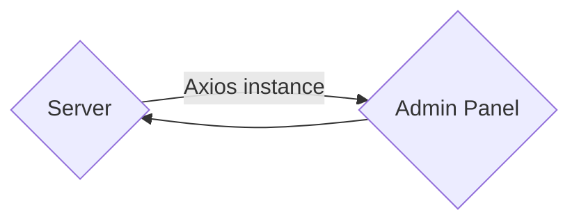

import NotV5 from '/docs/snippets/_not-updated-to-v5.md'

# How to pass data from server to admin panel with a Strapi plugin

<NotV5 />

Strapi is **headless** <HeadlessCms />. The admin panel is completely separate from the server.

When [developing a Strapi plugin](/dev-docs/plugins/developing-plugins) you might want to pass data from the `/server` to the `/admin` folder. Within the `/server` folder you have access to the Strapi object and can do database queries whereas in the `/admin` folder you can't.

Passing data from the `/server` to the `/admin` folder can be done using the admin panel's Axios instance:



To pass data from the `/server` to `/admin` folder you would first [create a custom admin route](#create-a-custom-admin-route) and then [get the data returned in the admin panel](#get-the-data-in-the-admin-panel).

## Create a custom admin route

Admin routes are like the routes that you would have for any controller, except that the `type: 'admin'` declaration hides them from the general API router, and allows you to access them from the admin panel.

The following code will declare a custom admin route for the `my-plugin` plugin:

```js title="/my-plugin/server/routes/index.js"
module.exports = {
  'pass-data': {
    type: 'admin',
    routes: [
      {
        method: 'GET',
        path: '/pass-data',
        handler: 'myPluginContentType.index',
        config: {
          policies: [],
          auth: false,
        },
      },
    ]
  }
  // ...
};
```

This route will call the `index` method of the `myPluginContentType` controller when you send a GET request to the `/my-plugin/pass-data` URL endpoint.

Let's create a basic custom controller that simply returns a simple text:

```js title="/my-plugin/server/controllers/my-plugin-content-type.js"
'use strict';

module.exports = {
  async index(ctx) {
    ctx.body = 'You are in the my-plugin-content-type controller!';
  }
}
```

This means that when sending a GET request to the `/my-plugin/pass-data` URL endpoint, you should get the `You are in the my-plugin-content-type controller!` text returned with the response.

## Get the data in the admin panel

Any request sent from an admin panel component to the endpoint for which we defined the custom route `/my-plugin/pass-data` should now return the text message returned by the custom controller.

So for instance, if you create an `/admin/src/api/foobar.js` file and copy and paste the following code example:

```js title="/my-plugin/admin/src/api/foobar.js"
import axios from 'axios';

const foobarRequests = {
  getFoobar: async () => {
    const data = await axios.get(`/my-plugin/pass-data`);
    return data;
  },
};
export default foobarRequests;
```

You will be able to use `foobarRequests.getFoobar()` in the code of an admin panel component and have it return the `You are in the my-plugin-content-type controller!` text with the data.

For instance, within a React component, you could use `useEffect` to get the data after the component initializes:

```js title="/my-plugin/admin/src/components/MyComponent/index.js"
import foobarRequests from "../../api/foobar";
const [foobar, setFoobar] = useState([]);

// …
useEffect(() => {
  foobarRequests.getFoobar().then(res => {
    setSchemas(res.data);
  });
}, [setFoobar]);
// …
```

This would set the `You are in the my-plugin-content-type controller!` text within the `foobar` data of the component's state.
