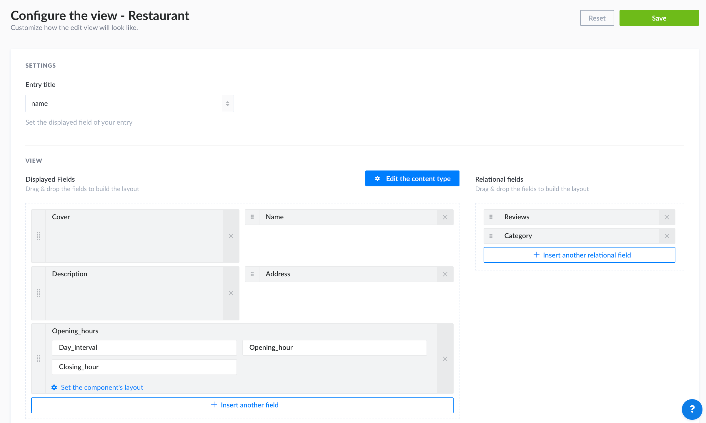

# Configuring the views of a content type

Depending on their type, content types can be divided into 2 interfaces: the list view and the edit view. Both interfaces can be configured.

## Configuring the list view

Right above the list view table, on the right side of the interface, a settings button <Fa-Cog /> is displayed. It allows to access the configurations that can be set for the list view of your collection type, and to choose which fields to display in the table.

::: tip NOTE
The configurations only apply to the list view of the collection type from which the settings are accessed (i.e. disabling the filters or search options for a collection type will not automatically also disable these same options for all other collection types).
 
Note also that the explanations below explain how to permanently configure which fields are displayed in the table of the list view of your collection type. It is also possible to configure the displayed fields temporarily (see [Introduction to content manager](../content-manager/introduction-to-content-manager.md)).
:::

To configure the list view settings:

1. In the list view, click on the settings button <Fa-Cog />.
2. Click on the **Configure the view** button.
3. Define your chosen new settings:

| Setting name           | Instructions                                                                                       |
| ---------------------- | -------------------------------------------------------------------------------------------------- |
| Enable search          | Click on **ON** or **OFF** to able or disable the search.                                          |
| Enable filters         | Click on **ON** or **OFF** to able or disable filters.                                             |
| Enable bulk actions    | Click on **ON** or **OFF** to able or disable the multiple selection boxes in the list view table. |
| Entries per page       | Choose among the drop-down list the number of entries per page.                                    |
| Default sort attribute | Choose the sorting field and type that will be applied by default.                                 |

4. Define what fields to display in the list view table, and in what order:
   - Click the add button  to add a new field.
   - Click the delete button  to remove a field.
   - Click the reorder button  and drag and drop it to the place you want it to be displayed amond the other fields.
   - Click the name of the field to edit the label and/or enable or disable sort on that field.
5. Click on the **Save** button.

::: tip NOTE
Relational fields can also be displayed in the list view. There are however some specificities to keep in mind:

- Only one field can be displayed per relational field.
- Only first-level fields can be displayed (i.e. fields from the relation of a relation can't be displayed).
- If the displayed field contains more than one value, not all its values will be displayed, but a counter indicating the number of values. You can hover this counter to see a tooltip indicating the first 10 values of the relational field.

Note also that relational fields have a couple limitations when it comes to sorting options:

- Sorting cannot be enabled for relational fields which display several fields.
- Relational fields cannot be set as default sort.
:::

## Configuring the edit view

In the edit view of a content type, in the right side of the interface, a **Configure the view** button is displayed. It allows to access the configurations that can be set for the edit view of the content type, such as the entry title, and the display of the fields of the content type, including the relational ones.

### Configuring settings

1. In the edit view, click on the **Configure the view** button.
2. In the Settings area, configure the available settings:

| Setting name    | Instructions                                                                          |
| --------------- | ------------------------------------------------------------------------------------- |
| Entry title     | Choose among the drop-down list the field that should be used as title for the entry. |

3. Click on the **Save** button.

### Configuring view display

1. In the edit view, click on the **Configure the view** button.
2. In the View area, define what fields to display in the list view table, and in what order:
   - Click the add button  to add a new field.
   - Click the delete button  to remove a field.
   - Click the reorder button  and drag and drop it to the place you want it to be displayed amond the other fields.
3. Click the name of a field to access its available settings:

| Setting name    | Instructions                                                                              |
| --------------- | ----------------------------------------------------------------------------------------- |
| Label           | Write the label to should be used for the field.                                          |
| Description     | Write a description for the field, to help other administrators fill it properly.         |
| Placeholder     | Write the placeholder that should be displayed by default in the field.                   |
| Editable field  | Click on **ON** or **OFF** to able or disable the edition of the field by administrators. |

4. Click on the **Save** button.

::: warning IMPORTANT
The settings and display of a component's fields cannot be managed and reordered through the entry's edit view configuration page. Click on the **Set the component's layout** button of a component to access the component's own configuration page. You will find the exact same settings and display options as for the entry, but that will specifically apply to your component.
:::

#### Relational fields

The Relational fields part of the View area, in the configuration page of the edit view, allows to choose what relational fields (see [Managing relational fields](managing-relational-fields.md)) of an entry should be available in the edit view, and in what order.

- Click the **Insert another relational field** button to be add another relational field to your entry. If the button remains unclickable, it means that no other relational field can be added.
- Click the delete button  to remove a relational field.
- Click the reorder button  and drag and drop it to the place you want it to be displayed amond the other relational fields.

As for regular fields, it is possible to access the available settings of the relational fields by clicking on them. Most settings are the same as for regular fields (see [Configuring the fields & display](./configuring-view-of-content-type.md#configuring-the-fields-and-display) for more information).

::: warning IMPORTANT
The only setting that is only available for relational fields is Entry title, which is usually configured at entry-level. It is recommended to choose well the entry title of relational fields as the more comprehensive it is, the easier it will be for administrators to manage the content of relational fields from the edit view.
:::