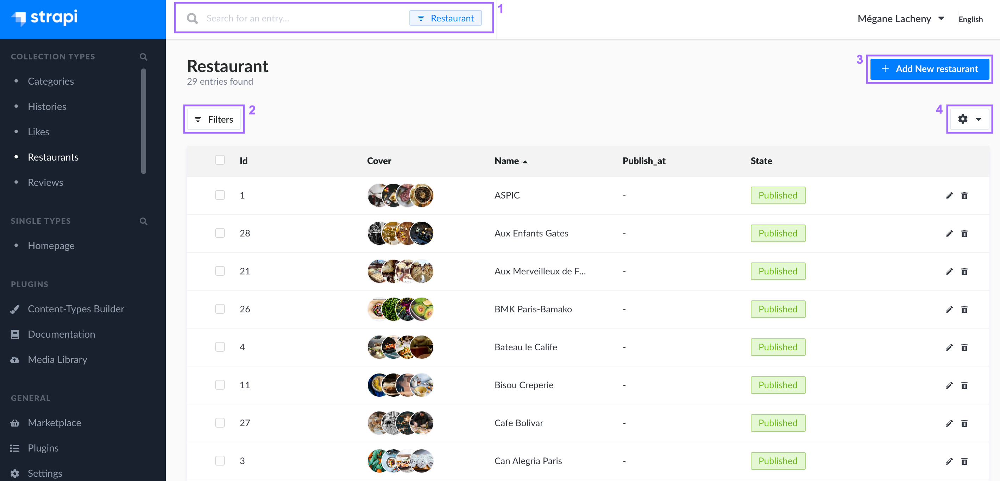
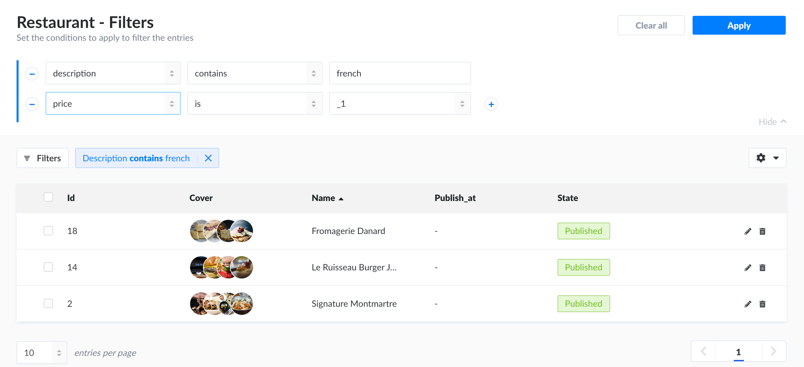
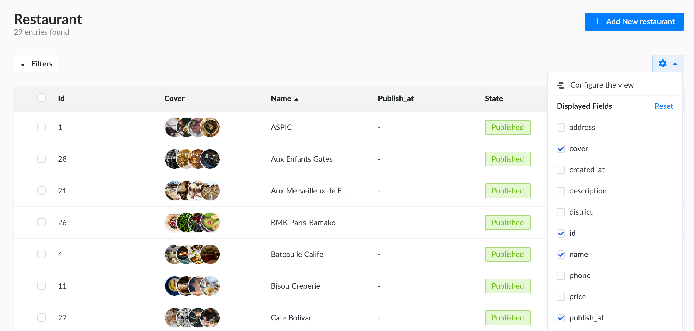
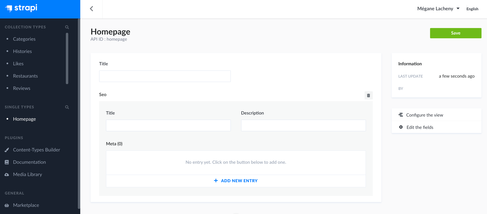

# Introduction to the Content Manager

The Content Manager is a core plugin of Strapi: its is a feature that is always activated by default and cannot be deleted. It is accessible both when the application is in environment development, and in production.

The Content Manager is divided into 2 categories, both displayed in the main navigation: *Collection types* and *Single types*. Each category contains the available collection and single content-types, which were created beforehand using the Content-Types Builder. From these 2 categories, admin panel users can create, manage and distribute content.

::: tip 💡 TIP
Click the search icon <Fa-Search /> in the main navigation to use a text search and find one of you content types more quickly!
:::

## Collection types

The *Collection types* category of the Content Manager displays the list of available collection types, which are directly accessible from the main navigation of the admin panel.

For each available collection type, multiple entries can be created, which is why each collection type is divided into 2 interfaces: the list view and the edit view (see [Writing content](writing-content.md)).

The list view of a collection type displays all entries created for that collection type.

From the list view, it is possible to:

- make a textual search (1) or set filters (2) to find specific entries,
- create a new entry (3),
- configure the fields displayed in the table of the list view (4).

### Filtering entries

Right above the list view table, on the left side of the interface, a **Filters** button is displayed. It allows to set one or more condition-based filters, which add to one another (i.e. if you set several conditions, only the entries that match all the conditions will be displayed).

To set a new filter:

1. Click on the **Filters** button.
2. Click on the 1st listbox to choose the field on which the condition will be applied.
3. Click on the 2nd listbox to choose the type of condition to apply.
4. Enter the value of the condition in the 3rd box.
5. (optional) Click on the add button  to add another condition-based filter.
6. Click on the **Apply** button.

::: tip NOTE
When active, filters are displayed next to the **Filters** button. They can be deactivated by clicking on the delete icon .
:::

### Creating a new entry

On the top right left side of the list view interface, an **Add New [collection type name]** button is displayed. It allows to create a new entry for your collection type.

Clicking on the new entry button will redirect you to the edit view, where you will be able to write the content of the newly created entry (see [Writing content](writing-content.md)).

### Configuring the table fields

Right above the list view table, on the right side of the interface, a settings button <Fa-Cog /> is displayed. It allows to access the configurations that can be set for the list view of your collection type (see [Configuring view of content type](../content-types-builder/configuring-view-of-content-type.md)), and to choose which fields to display in the table.

::: tip NOTE
Configuring the displayed field of the table in the way detailed below is only temporary: the configurations will be resetted as soon as the page is refreshed or when navigating the admin panel outside the Content Manager. For permanent configurations, please refer to [Configuring view of content type](../content-types-builder/configuring-view-of-content-type.md).
:::

To temporarily configure the fields displayed in the table:

1. Click on the settings button <Fa-Cog />.
2. In the Displayed Fields section, tick the boxes associated with the field you want to be displayed in the table.
3. Untick the boxes associated with the fields you want to remove from the table.

::: tip NOTE
Relational fields can also be displayed in the list view. There are however some specificities to keep in mind:

- Only one relational field can be displayed per relation.
- Only first-level relation fields can be displayed (i.e. we cannot display fields from the relation of a relation).
- If the displayed field contains more than one value, we will not display all values but a counter indicating the number of values. You can hover this counter to see a tooltip indicating the first 10 values of the relational field.

:::

## Single types

The *Single types* category of the Content Manager displays the list of available single types, which are directly accessible from the main navigation of the admin panel.

Unlike collection types which have multiple entries, single types are not created for multiple uses. In other words, there can only be one default entry per available single type. There is therefore no list view in the Single types category.

Clicking on a single type will directly redirect you to the edit view, where you will be able to write the content of your single type (see [Writing content](writing-content.md)).

