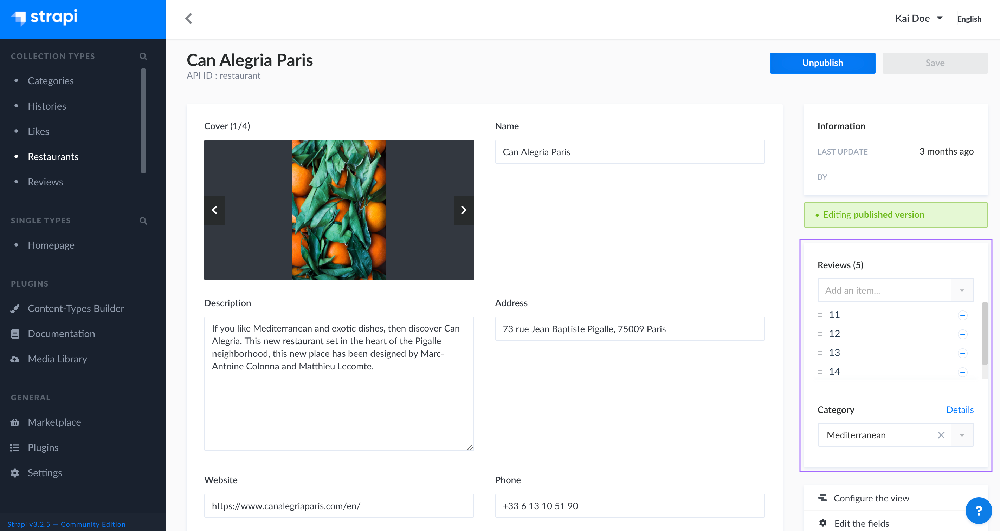
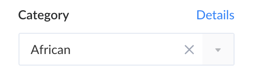
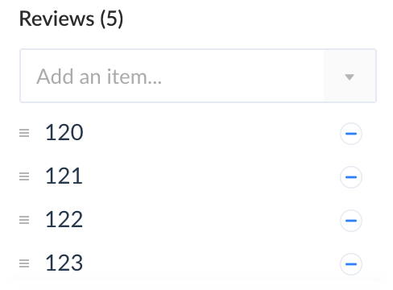

# Managing relational fields

Some fields are linked to others through relations from a content-type to another that are created from the Content-Types Builder using the "Relation" field type. Fields for which a relation was established with another content-type are called relational fields.

Relational fields are before all else regular fields, meaning that their content is written from the edit view of the content-type they belong to (see [Writing content](writing-content.md)). However, these fields may have several values, but only specific ones relevant for the other content-type with with a relation was established. This is why it is possible from the edit view of the latter to choose what values from the relational fields are relevant.

::: details Example
In my Strapi admin panel I have created 2 collection types, Restaurant (where each entry is a restaurant) and Category (where each entry is a type of cuisine). I want to assign a category to each of my restaurants, therefore I have established a relation between my 2 collection types.   In the Content Manager, from the edit view of my Restaurant entries, I can manage the Category relational field, and choose the relevant category value for my restaurant.
:::

Relational fields of a content type are managed from the Relational fields box, located in the right side of the interface. It lists the names of all available relational fields.

Under each relational field is displayed a drop-down menu which allows to choose the values of the relational field that are relevant for the content-type. Depending on the type of relation that was established, you can either choose several or only one value.

## Managing one-choice relational fields

Many-to-one and one-to-one types of relation only allow to choose one value per relational field.

To select the relevant relational field's value for your content-type:

1. In the Relational fields box of your content-type's edit view, click on the drop-down menu of the relational field.
2. Among the list of values, select the relevant one.

::: tip 💡 TIP
Click on **Details** to be redirected to the edit view of the content-type the relational field originally belongs to.
:::

## Managing multiple-choices relational fields

Many-to-many and one-to-many types of relation allow to choose several values per relational field.

To select the relevant relational field's values for your content-type:

1. In the Relational fields box of your content-type's edit view, click on the drop-down menu of the relational field.
2. Among the list of values, select the relevant one.
3. Repeat step 2 until all relevant values have been selected.

::: tip 💡 TIP
All selected values are listed right below the drop-down menu. Click on the name of a value to be redirected to the edit view of the content-type the relational field originally belongs to.
:::

To remove a value, click on the  button in the values list.