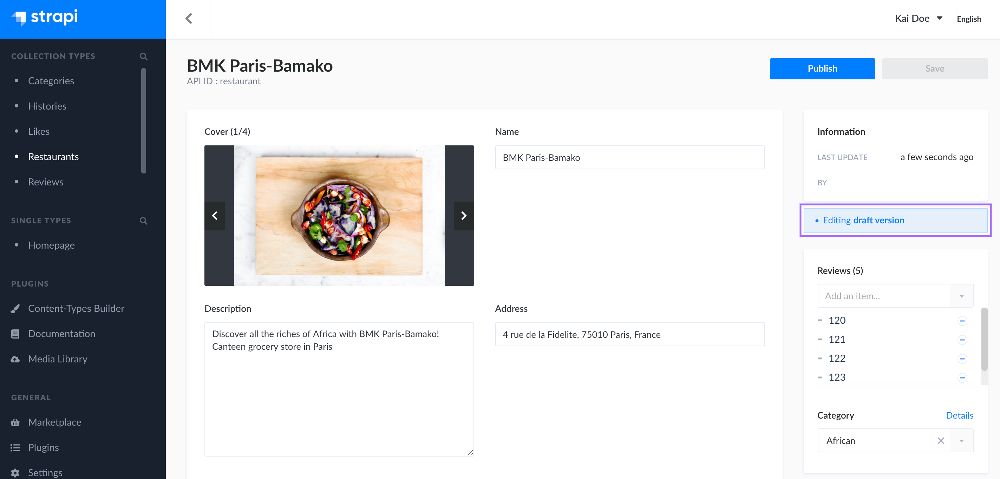
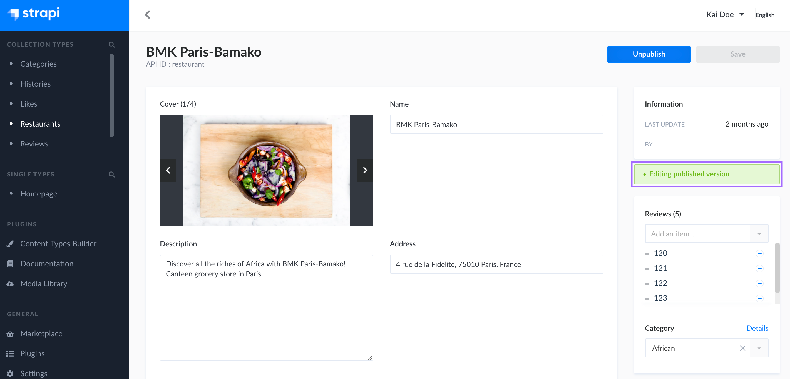

# Saving, publishing and deleting content

Strapi allows your to manage your content throughout its whole lifecycle, whether your are working on its draft version, about to finish it and share it with the world, or wanting to delete it when it's obsolete.

## Saving & publishing content

::: warning IMPORTANT
The possibility to manage drafts for contents comes from the Draft & Publish feature. This feature is activated by default, but it can be disactivated for any content type. If you disabled the Draft & Publish feature, saving your content means saving and publishing at the same time.
:::

Your contents can have 2 statuses: draft and published. You can see the current status indicated on the right of the interface, below the Information box.

By default, each newly created content is a draft. Drafts can be modified and saved at will, using the **Save** button on the top right corner of the edit view, until they are ready to be published.

### Publishing a draft

To publish a draft, click on the **Publish** button in the top right corner of the content editor.

::: warning CAUTION
Before publishing a draft, make sure it doesn't have relations with other non-published content, otherwise some of the content may not be available through the API.
:::

When a content is not a draft anymore, but has been published, it is indicated on the right of the interface, below the Information box.

### Unpublishing content

Published contents can be unpublished, switching back to being drafts again.

To unpublish content, click on the **Unpublish** button in the top right corner of the content editor.

## Deleting content

For collection types, you can delete content by deleting entries of that collection type:

1. In the edit view of the entry, click on the **Delete this entry** button.
2. In the window that pops up, click on the **Yes, confirm** button to confirm the deletion.

::: tip 💡 TIP
You can also delete entries from the list view of a collection type. To do so, select one or more entries in the table, and click the trash icon.
:::

For single types, it is not possible to delete content through the Content Manager. You must go to the Content-Types Builder and delete your single type from there.