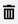

# Saving, publishing and deleting content

Strapi allows you to manage your content throughout its whole lifecycle, whether you are working on its draft version, about to finish it and share it with the world, or wanting to delete it when it's obsolete.

## Saving & publishing content

::: warning IMPORTANT
The possibility to manage drafts for contents comes from the Draft & Publish feature. This feature is activated by default, but it can be deactivated for any content type from the Content-Types Builder. If you disabled the Draft & Publish feature, saving your content means saving and publishing at the same time.
:::

Your contents can have 2 statuses: draft or published. You can see the current status indicated on the right of the interface, below the Information box.

By default, each newly created content is a draft. Drafts can be modified and saved at will, using the **Save** button on the top right corner of the edit view, until they are ready to be published.

### Publishing a draft

To publish a draft, click on the **Publish** button in the top right corner of the content editor.

::: warning CAUTION
Before publishing a draft, make sure it doesn't have relations with other non-published content, otherwise some of the content may not be available through the API.
:::

When a content is not a draft anymore, but has been published, it is indicated on the right of the interface, below the Information box.

### Unpublishing content

Published contents can be unpublished, switching back to being drafts again.

To unpublish content, click on the **Unpublish** button in the top right corner of the content editor.

## Deleting content

You can delete content by deleting any entry of a collection type, or the default entry of a single type.

1. In the edit view of the entry, click on the **Delete this entry** button, located at the bottom of the right side of the interface.
2. In the window that pops up, click on the **Yes, confirm** button to confirm the deletion.

::: tip 💡 TIP
You can delete entries from the list view of a collection type, by clicking on the trash button  on the right side of the entry's record in the table.   You also have the possibility to delete multiple entries at the same time. To do so, select your entries to delete by ticking the box on the left side of the entries' record. Then, click on **Delete selected**  located right below the header of the table.
:::
