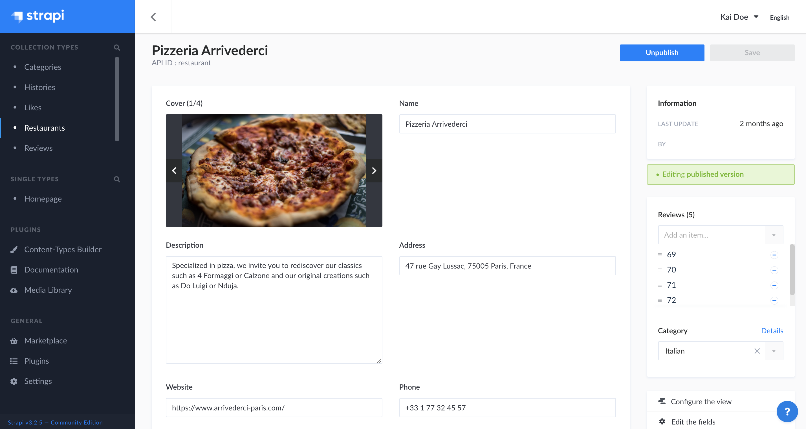
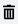
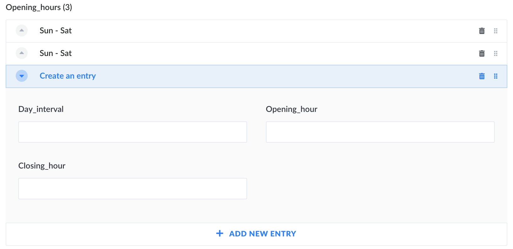
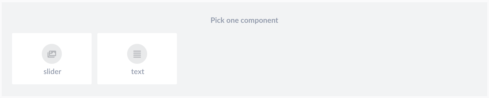
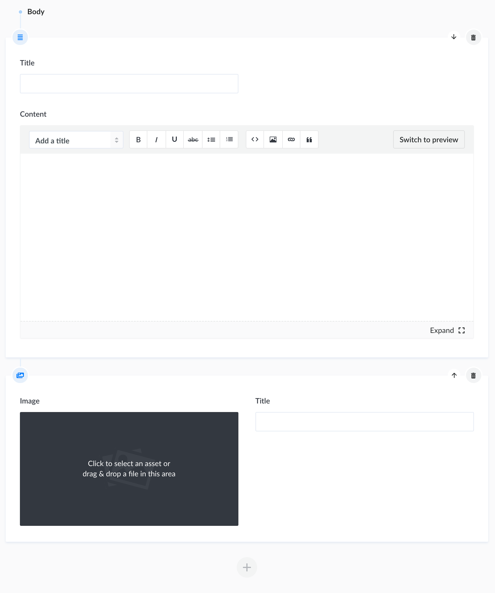

# Writing content

In Strapi, writing content consists in filling up fields, which are meant to contain specific content (e.g. text, numbers, media etc.). These fields were configured for the collection or single type beforehand, through the Content-Types Builder.

## Filling up fields

To write or edit content:

1. Access the edit view of your collection or single type.
2. Write your content, following the available field schema. You can refer to the table below for more information and instructions on how to fill up each field type.

| Field name  | Instructions                                                                                                                                                                                                                                                                                                                                                                  |
|-------------|-------------------------------------------------------------------------------------------------------------------------------------------------------------------------------------------------------------------------------------------------------------------------------------------------------------------------------------------------------------------------------|
| Text        | Write your content in the textbox.    💡 For long texts, the box can be expanded.                                                                                                                                                                                                                                                                                       |
| Rich text   | Write your content, in MarkDown, in the textbox. Formatting options are available in the top bar of the textbox, as well as a **Switch to preview** button to see the result of your content.    💡 The box can be expanded by clicking on **Expand** in the bottom bar. It displays side by side, at the same time, the textbox that you can edit and the preview.   |
| Number      | Write your number in the textbox. Up and down arrows, displayed on the right of the box, allow to increase or decrease the current number indicated in the textbox.                                                                                                                                                                                                         |
| Date        | 1. Click the date and/or time box.   2. Choose a date using the calendar and/or a time among the list.                                                                                                                                                                                                                                                                     |
| Boolean     | Click on **OFF** or **ON**.                                                                                                                                                                                                                                                                                                                                                   |
| Email       | Write a complete and valid email address.                                                                                                                                                                                                                                                                                                                                     |
| Password    | Write a password.    💡 Click the eye icon, displayed on the right of the box, to show the password.                                                                                                                                                                                                                                                                     |
| Enumeration | 1. Click the listbox.   2. Choose an item from the list.                                                                                                                                                                                                                                                                                                                  |
| Media       | 1. Click the media area.   2. Choose an asset from the Media Library, or click the **Add more assets** button to add a new file to the Media Library.    💡 It is possible to drag and drop the chosen file in the media area.                                                                                                                                        |
| JSON        | Write your content, in JSON format, in the code textbox.                                                                                                                                                                                                                                                                                                                     |
| UID         | Write a unique identifier in the textbox. A "Regenerate" button, displayed on the right of the box, allows to automatically generate a UID based on the content type name.                                                                                                                                                                                                   |

### Components

Components are a combination of several fields. Writing their content works exactly like for independant fields. They differ in their display, since the fields of a component are grouped together.

There are however 2 types of components: repeatable and non-repeatable components. Repeatable components allow to create multiple component entries, that follow the same combination of fields. These component entries can be reordered or deleted directly in the edit view, using buttons displayed on the right of the entry area.

- Use the drag & drop button  to reorder entries of your repeatable component.
- Use the trash button  to delete an entry from your repeatable component.

### Dynamic zones

Dynamic zones are a combination of components, which themselves are composed of several fields. Writing the content of a dynamic zone requires additional steps in order to access the fields.

1. Click on the  **Add to content** button.
2. Choose a component available for the dynamic zone.
3. Fill in the fields of the component.

Dynamic zones' components can also be reordered or deleted directly in the edit view, using buttons displayed in the top right corner of the component area.

- Use the arrow button  to reorder components in your dynamic zone.
- Use the trash button  to delete a component from your dynamic zone.

::: tip NOTE
Unlike regular fields, the order of the fields and components inside a dynamic field is important. It should correspond exactly to how end-users will read/see the content.
:::

## Collaborating on content writing

Contents created with Strapi may be edited by several admin panel users. Since these contents cannot be versioned, and to prevent any content loss, Strapi automatically informs users of concurrent edition situations.

When arriving on the edit view of a content type, if another user is already editing it, you will see the following window pop up on your screen.

From there, you can choose between 2 options:

- Activate the read-only mode, meaning that you access the edit view of the content type and see its content, but you cannot do any action whatsoever, until the other user has finished and saved the current editing.
- Take over the editing of the page, meaning that you can edit the content type. However, the other user will see a notification pop up to inform them of your choice, and that their modifications cannot be saved.