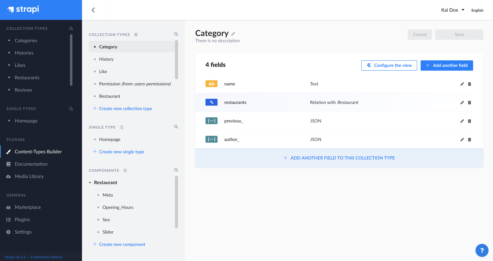

# Introduction to the Content-Types Builder

::: warning 🚧 This section of the user guide is a work in progress. Stay tuned!
 
:::

The Content-Types Builder is a core plugin of Strapi. It is a feature that is always activated by default and cannot be deleted. It is however only accessible when the application is in a development environment.

Administrators can access the Content-Types Builder from _Plugins > Content-Types Builder_ in the main navigation of the admin panel. From there, it is possible to create and manage content-types, including collection types, single types and components.

