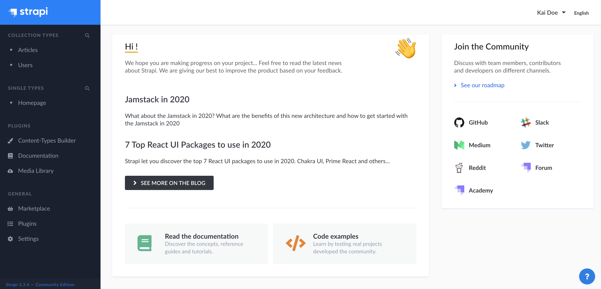

# Accessing the admin panel

The admin panel is the back office of your Strapi application. From the admin panel, you will be able to manage content types, and write their actual content. It is also from the admin panel that you will manage users, both for the admin panel and your Strapi application.

::: tip NOTE
Strapi can either be used locally, or be hosted on a server, making it available at a specific URL. No matter how you choose to use Strapi, your application will work the same way. The main difference is that, if using it locally, you will need to use your terminal to launch Strapi.
:::

To access the admin panel:

1. Launch Strapi.
2. Click on the **Open the administration** button.
3. Enter your credentials to log in.
4. Click on the **Log in** button. You should be redirected to the homepage of the admin panel.

::: tip 💡 TIP
Since the link which where to be redirected after clicking on **Log in** is customizable, it is possible to not be redirected to the homepage of the admin panel. To find that homepage, you can add `/admin` at the end of your Strapi application's URL.
:::
