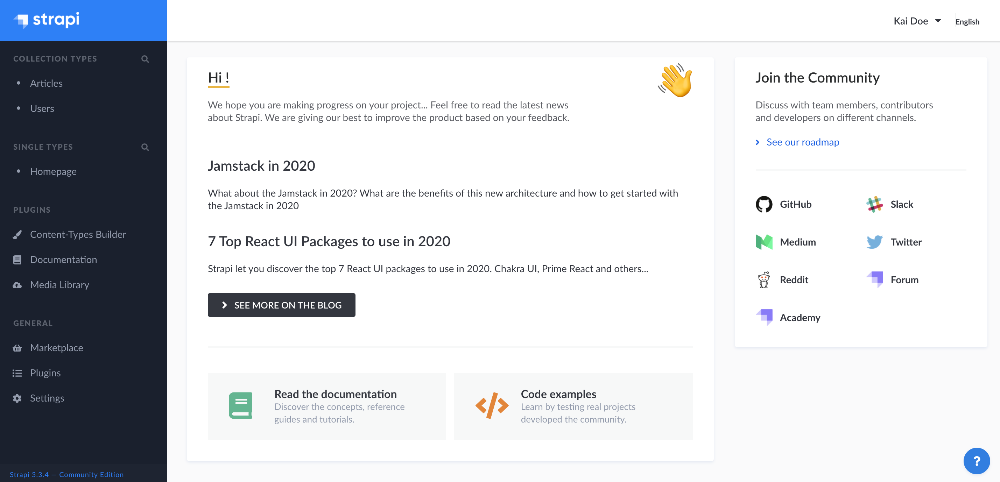
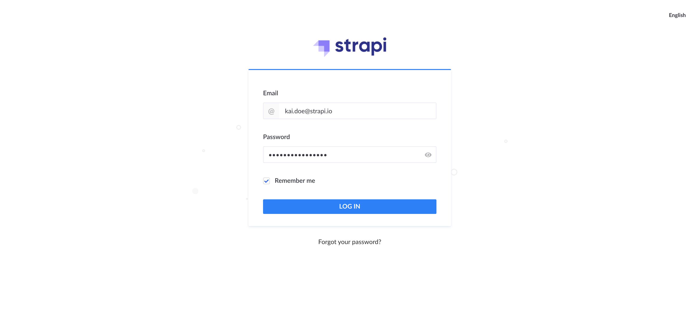
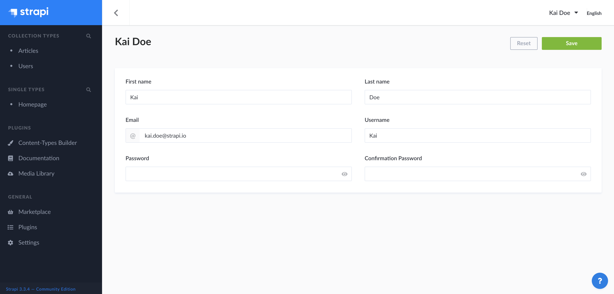

# Welcome to the Strapi user guide!

This user guide contains the functional documentation related to all features available in the admin panel of your Strapi application. 

Before going any further into this user guide, we recommend you to acknowledge the main concepts below. They will help you to understand how Strapi works, and ensure a smooth Strapi experience.

- **Development, Staging or Production Environment**   When starting working on your application, it is in a development environment, which is the status for the content structuration and application configuration phase. After deploying your application, it is in production or staging. This status change impacts how you can use your Strapi application, as some features are only available in development environment, such as the Content-Types Builder. In the user guide, the availability or not of a feature, depending on the application status, is always mentioned in the feature's introduction.

- **Versions**   Strapi is constantly evolving and growing. This implies that new releases are quite frequent, to improve what is already available but also to add new features to Strapi. For every new Strapi version, we communicate through our main channels and by sending notifications both on your terminal (when launching your Strapi application), and on your application's admin panel. We always recommend to use the latest version, especially since our documentation, including this user guide, are only aligned with the latest<!-- (see Update Strapi version or refer to our migration guides to update your Strapi application) -->. If you are on an older version of Strapi, some information in this documentation may not apply to your application. 

- **Roles and Permissions**   Some features of the admin panel, as well as the content managed with Strapi itself, are ruled by a system of permissions. From your Strapi admin panel, you have the possibility to define, at a detailed level, the roles and permissions of all administrators and end-users. In this user guide, all features and possible options are documented. It is however possible, depending on your role and permissions, that you may not be able to access all these features and options. In that case, please refer to the main Super Admin of your Strapi application.

With all this in mind, you should be ready to start your Strapi experience!

## Accessing the admin panel

The admin panel is the back office of your Strapi application. From the admin panel, you will be able to manage content types, and write their actual content. It is also from the admin panel that you will manage users, both administrators and end-users of your Strapi application.

::: tip IMPORTANT
In order to access the admin panel, your Strapi application must be launched<!-- (see Installing Strapi) -->, and you must be aware of its URL.
:::

To access the admin panel:

1. Go to the URL of your Strapi application.
2. (optional) Click on the **Open the administration** button.
3. Enter your credentials to log in.
4. Click on the **Log in** button. You should be redirected to the homepage of the admin panel.

## Setting up your user profile

If you are a new administrator, we recommend making sure your user profile is all set, before diving into your Strapi application. From your admin panel user profile, you are able to modify your user information, such as name, username, email or password.

To modify your user information:

1. Click on your user name in the top right hand corner of the admin panel.
2. In the drop-down menu, click on **Profile**.
3. Modify the information of your choice:

| User information       | Instructions                                                                                             |
| ---------------------- |----------------------------------------------------------------------------------------------------------|
| First name             | Write your first name in the textbox.                                                                    |
| Last name              | Write your last name in the textbox.                                                                     |
| Email                  | Write your complete email address in the textbox.                                                        |
| Username               | (optional) Write a username in the textbox.                                                              |
| Password               | Write a new password in the textbox. You can click on the eye icon for the password to be shown.         |
| Confirmation password  | Write the same new password in the textbox. You can click on the eye icon for the password to be shown.  |

4. Click on the **Save** button.

***

Congratulations on being a new Strapi user! You're now ready to discover all the features and options that Strapi has to offer!

::: tip 💡 TIP
If you have any trouble with your Strapi experience, you can reach us through [GitHub](https://github.com/strapi/) or our [forum](https://forum.strapi.io/)! The Strapi Community and Strapi team are always available to answer your questions or help you with anything!
:::