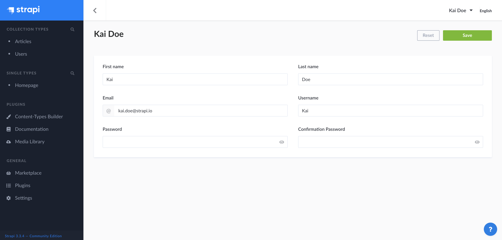

# Setting up your user profile

From your admin panel user profile, you are able to modify your user information, such as name, username, email or password.

To modify your user information:

1. Click on your user name in the top right hand corner of the admin panel.
2. Modify the information of your choice:

| User information       | Instructions                                                                                             |
| ---------------------- |----------------------------------------------------------------------------------------------------------|
| First name             | Write your first name in the textbox.                                                                    |
| Last name              | Write your last name in the textbox.                                                                     |
| Email                  | Write your complete email address in the textbox.                                                        |
| Username               | (optional) Write a username.                                                                             |
| Password               | Write a new password in the textbox. You can click on the eye icon for the password to be shown.         |
| Confirmation password  | Write the same new password in the textbox. You can click on the eye icon for the password to be shown.  |

3. Click on the **Save** button.

::: tip NOTE
All these user information can be modified by any Super Admin, from the *Settings > Administration panel > Users* section of the admin panel.
:::