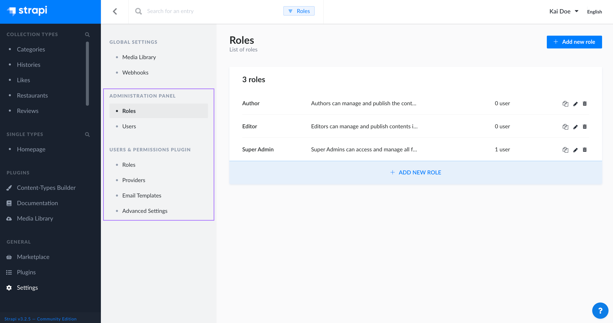

# About users, roles & permissions

::: warning 🚧 This section of the user guide is a work in progress. Stay tuned!
 
:::

Some features of the admin panel, as well as the content managed with Strapi itself, are ruled by a system of permissions. These permissions can be assigned to roles, which are associated with the users who have access to the admin panel, the administrators. But it is also possible to grant permissions more publicly, to give access to content to the end-users of your Strapi application.

Depending on what users and their roles and permissions you want to manage, you should either use the Role Based Access Control (RBAC) feature, or the Users & Permissions plugin. Both are accessible from _General > Settings_ in the main navigation of the admin panel.

